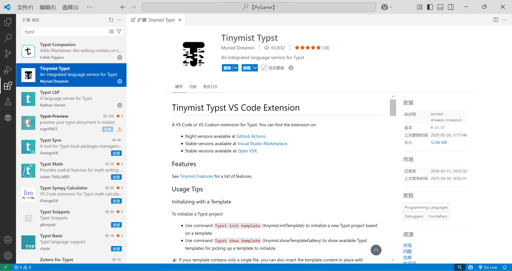
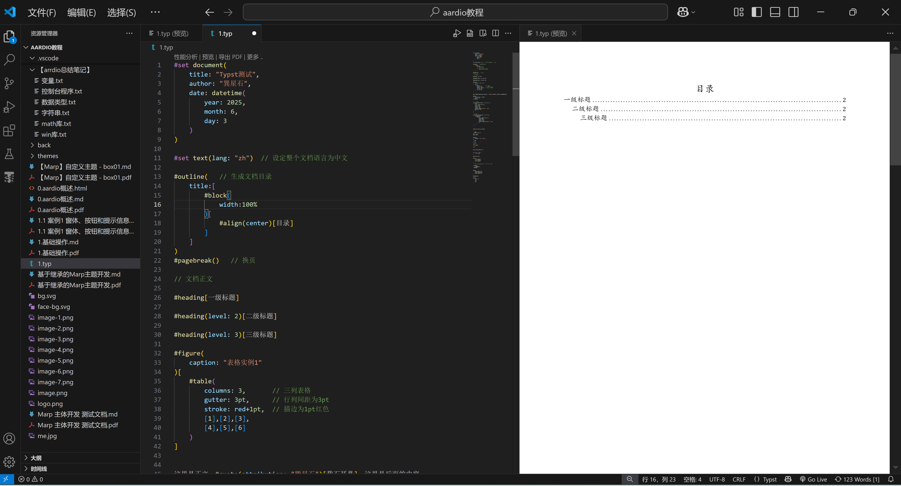

# 01Typst概述
### 概述

Typst是一种用于排版文档的标记语言，可以用于排版各种精美的论文、文章、书籍、报告和作业等。它是LaTex的精神续作，但是运行环境和编译速度都要更简单、更快捷。

它设计了一种脚本结合简单的标记语法实现复杂的排版效果。并且支持模板创建、文件包含等，可以很好的组织大型著作如书籍的排版。学习曲线相比LaTex要小一些。

如果你有一些编程语言或脚本编程的基础，Typst的脚本语法基本可以很容易上手。

为了深入掌握，笔者花费了一定的时间去学习其文档和《小蓝书》中的内容，并结合自己的形式简化和精炼，总结出了该系列的笔记，希望和大家一起学习Typst排版。

- - - - - -
### 使用方式

|配置 Typst 运行环境|你可以使用官方在线编辑器、VSCode或其他工具，推荐和比较常用的是前两者。|
|---|---|
|官方在线编辑器|需要注册账号使用，可以在线创建和存储项目。|
|VSCode|安装扩展使用。|

### 在VSCode中配置和使用

在VSCode中，首先需要安装Typst的核心插件，也就“Tinymist Typst”。

安装成功后，就可以在项目文件夹中，创建`.pyt`格式的文件，来编写Typst文档。

VSCode提供强大的语法提示和简便的文档预览。

### 参考资料

- [Typst 中文社区导航](https://typst-doc-cn.github.io/guide/)
- [The Raindrop-Blue Book (Typst中文教程)](https://typst-doc-cn.github.io/tutorial/)

# 作者

**作者：巽星石**

- [巽星石的B站](https://space.bilibili.com/98273681)

- [巽星石:Typst基础教程从入门到出书](https://blog.csdn.net/graypigen1990)