# 【Typst】2.Typst标记语法和基础样式
### 概述

本节介绍Typst的标记语法和基础样式。涉及主要的文档结构元素，包括段落、目录、表格、图片、链接、标签和引用，数学公式和代码块等等。

因为Typst只实现简单的标记语法，更多的使用脚本来控制文档元素和样式，所以本节难免遇到一些简单函数的使用。

### 系列目录
- - - - - -
### 段落

和MarkDown类似，紧邻的两行内容将会被显示为一行。而且中间用一个空格连接：

```
这是一个段落
这是第二个段落
```


通过在文本行之间添加空行，两行内容就可以分别被识别为单独的段落。

```
这是一个段落

这是第二个段落
```

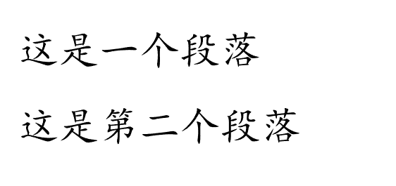

#### 强制换行

通过在行末加`\`,可以插入一个强制换行：

```
这里是新的段落 \ 
这里是强制换行。

```

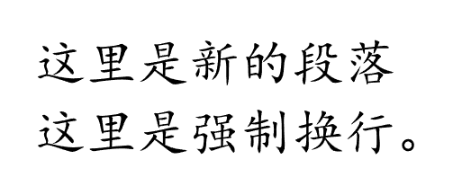

与空行法相比，强制换行只是把内容换行了，但是并不产生新的段落，所以可以看到行间距比较小。

### 标题

```
= 一级标题
== 二级标题
=== 三级标题

```

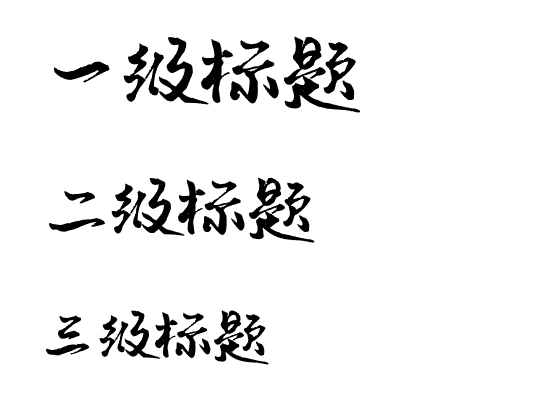

### 基础文字样式

```
*ABC*               // 粗体，快捷键：Ctrl+B
#strong[ABC]           

_AB_               // 斜体，快捷键：Ctrl+I
#emph[AB]

#underline[下划线]   // 下划线，快捷键：Ctrl+U

#overline[上划线]

#strike[中划线（删除线）]

#underline(
  offset: 1.5pt,
  underline(offset: 3pt
)[双下划线])

#highlight[高亮]

#highlight(
  fill: green,
  stroke: black,
  radius: 5pt,
)[高亮]

#text("简单文字")

#text(fill: red)[字色]

```

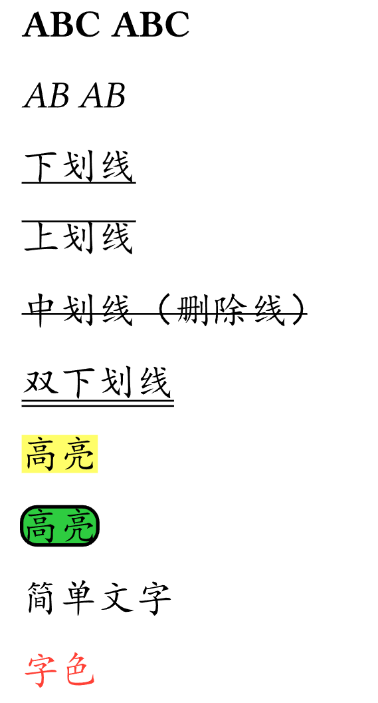

`#strong[ABC]`这样的事Typst的内置函数调用的简写法，它的完整写法是`#strong()[ABC]`。其中：
- `#`开启脚本模式，代表后面为脚本
-  `strong`为内置函数的函数名
-  `()`内可以书写参数设置，默认参数可以缺省括号
- `[]`为内容块，里面书写内容

 这里不懂的话也可以先略过，等学完脚本语法应该就能明白了。

### 上标和下标

```
22#super([2])
22#sub([2])
```

### 行内代码和代码块

这部分与MarkDown基本一样：

```
行内 `Ctrl+S`

```swift
func a():
  print()
  pass
```
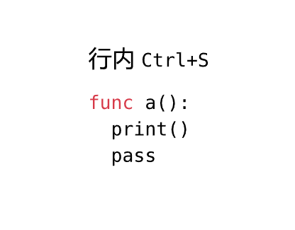

### 图片

#### 简单图片插入

```
#image("1.png",width: 30%)   // 直接插入图片

```

#### 带标题的图片

```
// 带标题的图片
#figure(
  image("1.png",width: 30%),
  caption: "图片1"
)

```

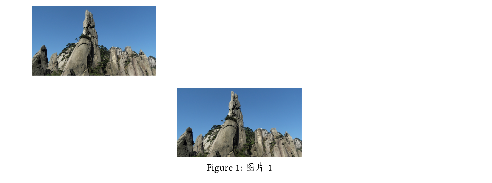

#### 多图并列

这部分对初学者超纲，可以在学习完文档元素函数和布局函数之后，回来再看。

```
#align(
  center,      // 居中
  stack( 
    dir: ltr,  // 水平排列
    spacing: 5pt,
    figure(
      image("1.png",width: 30%),
      caption: "图片1"
    ),
    figure(
      image("1.png",width: 30%),
      caption: "图片2"
    ),
    figure(
      image("1.png",width: 30%),
      caption: "图片3"
    )
  )
)

```

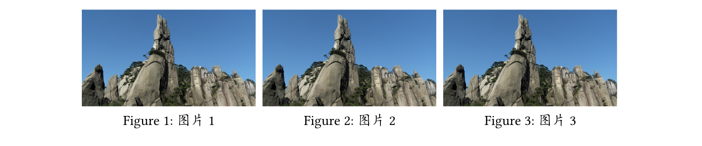

### 有序和无序列表

有序列表用`+ `开头，无序列表用`- `开头：

```
+ 有序列表项1
+ 有序列表项2
+ 有序列表项3

- 无序列表项1
- 无序列表项2
- 无序列表项3

```

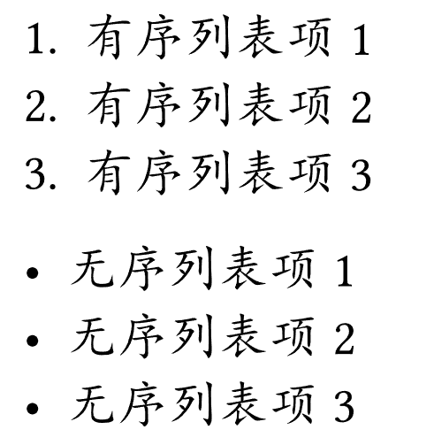

支持Tab缩进的层级形式：

```
+ 有序列表项1
    + 有序列表项2
+ 有序列表项3

- 无序列表项1
    - 无序列表项2
- 无序列表项3

```

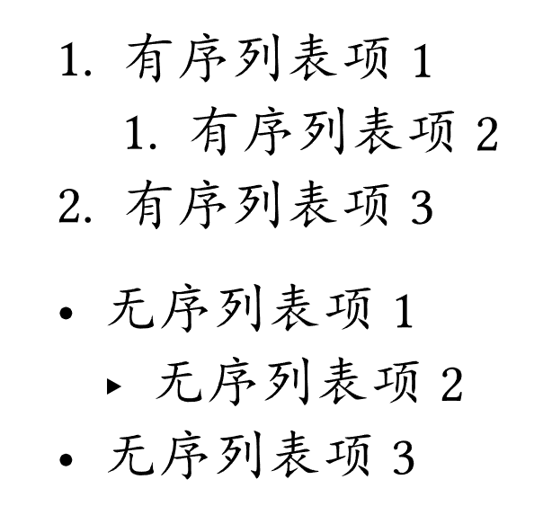

### 超链接

```
https://typst-doc-cn.github.io/

#link("https://typst-doc-cn.github.io/")

#link("https://typst-doc-cn.github.io/")[
  Typst官方文档
]

```

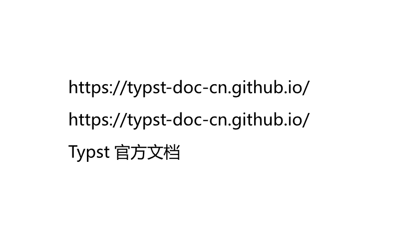

看起来像是普通文本，但是它是可以点击的。

修改显示样式：

```
#show link:underline

https://typst-doc-cn.github.io/

#link("https://typst-doc-cn.github.io/")

#link("https://typst-doc-cn.github.io/")[
  Typst官方文档
]

```

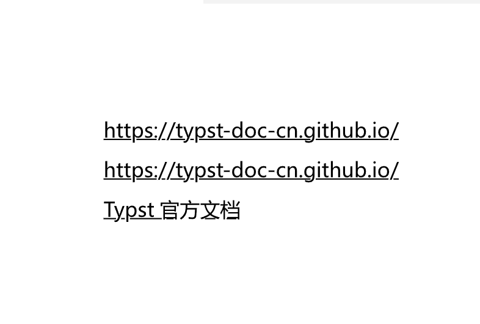

### 标签和引用

标签采用`<标签名>`或`#label("标签名")`形式，可以标记紧邻的前一元素。

```
这是一个段落。<a>
这是另一个段落。#label("b")

这还是另一个段落。

```

可以使用`@标签名`的形式进行引用。

```
#set heading(numbering: "1.")

= 第一个标题 <s1>

这是一段文本。@s1

```

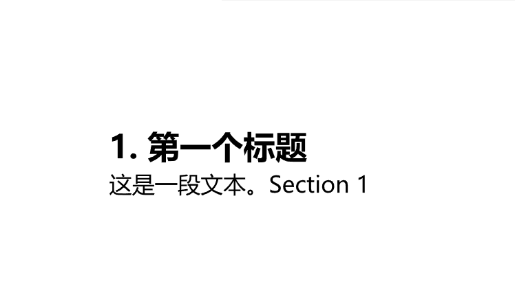

Section 1就是Typst自动生成的。点击后可以定位到标题。

### 数学公式

也支持行内公式和行间公式。行内公式用`$`符号紧密包裹，行间公式则用`$ `和` $`包裹，或者由单行的单行的`$`符号包裹：

```
行内数学公式：$a^2$

$ a^2 $

$
x^3
$

```

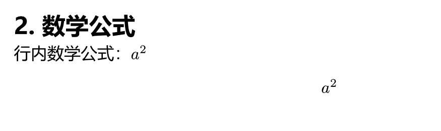

### 表格

表格采用函数`table()`:

```
#table(
  columns: (1fr,1fr,1fr),
  [姓名],[性别],[年龄],
  [张三],[男],[34],
  [李四],[女],[36],
)

```

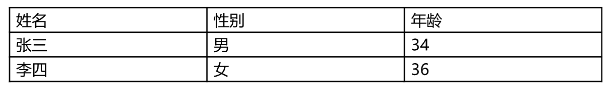

### 总结

本节只是简单介绍了一些基础的标记语法和文档元素的插入方法。涉及函数部分再学习完Typst脚本和文档结构函数、布局函数等内容后会变得更容易理解和使用，所以不必心急。
