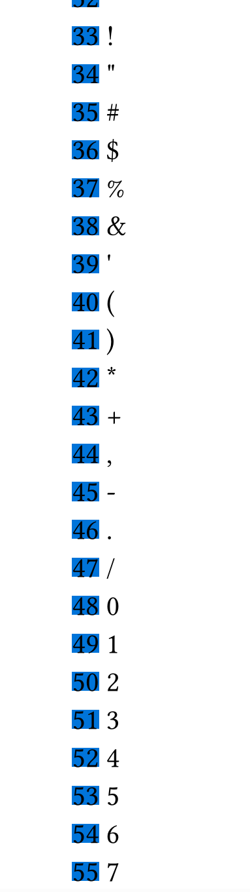
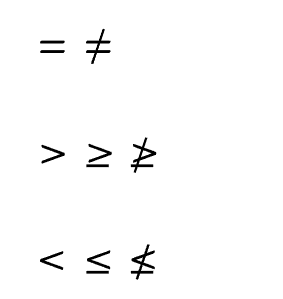
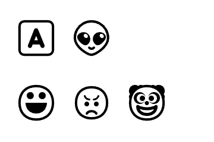
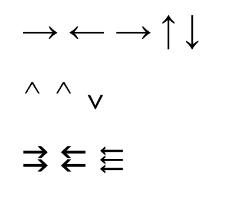
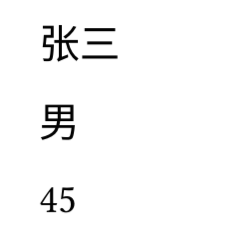

# 【Typst】3.Typst脚本语法
### 概述

Typst的核心就是它在标记语法的基础上提供了一个灵活强大的脚本语言，来支持复杂的排版操作。

本节就以一个脚本语言的角度，介绍一下Typst脚本的核心语法。

### 系列目录
- - - - - -
### 字面量

```
// 字面量
#(2)         // 整型字面量
#(3.14)      // 浮点型字面量
#("你好")    // 字符串字面量
#(true)      // 布尔类型字面量
#(none)      // 空字面量

```

### 类型判断

```
// 类型判断
#type(12)                 \ // int
#type(12.5)               \ // float
#type(1>2)                \ // bool
#type("hello")            \ // str
#type(<glacier>)          \ // label
#type([Hi])               \ // content
#type(x => x + 1)         \ // function
#type(type)               \ // type
#type(datetime.today())   \ // datetime

```

### 表达式

```
// 表达式
1+2*5 = #(1+2*5)  // 1+2*5 = 11
#(1==2)           // false

```

### 变量和函数

```
// 变量
#let a = 12    // 申明
#a // 12       // 使用

// 函数
#let add(a,b) = [#(a+b)]    // 定义
#add(12,45) // 57           // 调用

#{
  let str1 = [张三]
  let str2 = [你好]
  str1 + str2
}

```

### 控制语句

```
#for i in range(30,100) {
  box(str(i),fill:blue) + " " + str.from-unicode(i) + "\n"
  
}

```



### 注释

```
// 单行注释
/*
多行注释
*/

```

### 数字

Typst包含两种数字类型，整型`integer`和浮点型`float`:
- 整型`integer`：代表整数，可以是负数、零或正数。 由于 Typst 使用 64 位来存储整数，整数不能小于 `-9223372036854775808` 或大于 `9223372036854775807`。
- 浮点型`float`：一个实数的有限精度表示。Typst 使用 64 位来存储浮点数。
#### 数字进制和科学计算法

```
// 数字进制
#(100)    // 十进制100
#(0xFF)   // 十六进制 = 255
#(0o77)   // 八进制 = 63
#(0b11)   // 二进制 = 3
// 科学计数法
#(6e2)     // 600
#(2.3e5)   // 230000

```

#### 计算函数库calc

计算2<sup>32</sup>的值：

```
#(calc.pow(2,32))
```

### 字符串

字符串可以看做是由若干字符按顺序组成的字符数组。

所有长度和索引都以 UTF-8 字符为单位。 索引从零开始，负索引会回到字符串的末尾。

```
string{
    len() -> integer   // 字符串在UTF-8编码字节中的长度
    first() -> any     // 返回字符串中第一个字符
    last() -> any      // 返回字符串中最后一个字符
    at(                // 返回定索引位置的字符
        index：int,           // 索引
        default: any,         // 超出索引范围后返回的默认值
    ) -> any
    slice(             // 截取子字符串
        start:integer,
        end:integer,
        count: integer,
    ) -> string
    clusters() -> array    // 返回单个字符组成的数组
    codepoints() -> array  // 返回单个字符Unicode码组成的数组
    contains(pattern:string/regex) -> boolean  //判断字符串是否包含指定的模式
    starts-with(pattern:string/regex) -> boolean //判断字符串是否以指定的模式开始
    ends-with(pattern:string/regex) -> boolean //判断字符串是否以指定的模式结尾
    find(pattern:string/regex) -> string/none // 在字符串中搜索指定的模式，并以字符串形式返回第一个匹配项，如果没有匹配项，则返回 none。
    position(pattern:string/regex) -> integer/none //在字符串中搜索指定的模式，并返回第一个匹配项的索引，如果没有匹配项则返回 none。
    match(pattern:string/regex) -> dictionary/none //在字符串中搜索指定的模式，并返回一个包含第一个匹配项详细信息的字典，如果没有匹配项则返回 none。
    matches(pattern:string/regex) -> array  在字符串中搜索指定的模式，并返回一个包含所有匹配项详细信息的字典数组
    value.replace(                  // 查找并替换匹配的字符串
        pattern:string/regex,          // 查找的字符串或模式
        replacement:string/function,   // 替换的内容或处理函数
        count: integer,                // 替换指定的前几项
    ) -> string
    trim(    // 从字符串的一侧或两侧移除匹配模式的内容，并返回替换结果
        pattern:string/regex,          // 查找的字符串或模式
        at: alignment,                // 可以使用 start 或 end 来仅修剪字符串的开头或结尾。如果省略，则会修剪字符串的两侧。
        repeat: boolean,              //决定是重复移除模式的匹配项还是只移除一次。默认为 true。
    ) -> string
    split(pattern:string/regex) -> array  // 按字符串或模式进行切分，返回数组
}

```

其中，`match()`和`matches()`方法的字典形式：

```
(
    start: int,   // 匹配项的起始偏移量
    end:int,      // 匹配项的结束偏移量
    text: string  // 匹配的文本
    captures: array // 包含每个匹配的捕获组的字符串。 数组的第一项包含第一个匹配的捕获组，而不是整个匹配！除非 pattern 是带有捕获组的正则表达式，否则此项为空。
)

```

#### 转义字符

```
// 转义字符
#("\"")    // "
#("\\")    // \
#("\n")    // 换行
#("\r")    // 回车
#("\t")    // 制表符
#("\u{2665}")    // unicode字符 ❤

```

#### 基础用法

```
#("这是字符串")             // 这是字符串

#("这是字符串" + "2")       //  这是字符串2
#("这是字符串" + 2)         //  【报错】
#("这是字符串" + str(2))    //这是字符串2


#("这是字符串，" * 2)  //  这是字符串，这是字符串，

#let str1 = "这是字符串"

#str1.len()      // 15
#("123".len())   // 3
#("abc".len())   // 3


#str1.at(0)      // 这

#str1.clusters()   // ("这", "是", "字", "符", "串")
#str1.codepoints() // ("这", "是", "字", "符", "串")


#(
"
第一行
第二行
第三行
".split("\r\n")
)  // ("","第一行","第二行","第三行","")
```

### 特殊符号和表情符号

Typst提供了`sym`和`emoji`两个模块来辅助特殊字符和表情符号的书写。

```
#sym.eq         // 等于
#sym.eq.not     // 不等于

#sym.gt         // 大于
#sym.gt.eq      // 大于等于
#sym.gt.eq.not  // 不大于等于

#sym.lt         // 小于
#sym.lt.eq      // 小于等于
#sym.lt.eq.not  // 不小于等于

```



对于等于、大于、小于的缩写理解和记忆：

```
大于   greater than   //gt
小于   less than      //lt
等于   equal to       //eq

```

```
#emoji.a
#emoji.alien

#emoji.face
#emoji.face.angry
#emoji.face.clown

```



```
// 单箭头
#sym.arrow
#sym.arrow.l
#sym.arrow.r
#sym.arrow.t
#sym.arrow.b

// 帽子
#sym.arrowhead
#sym.arrowhead.t
#sym.arrowhead.b

// 多箭头
#sym.arrows
#sym.arrows.ll
#sym.arrows.lll

```



### 数组和字典

#### 数组

以下是Typst数组类型及其所有方法的总结：

```
array{
    len() -> int       // 数组的长度
    first() -> any     // 返回数组中的第一项
    last() -> any      // 返回数组中的最后一项
    at(                // 返回数组中指定索引位置的项
        int,           // 索引
        default: any,      // 默认值
    ) -> any
    push(any)          // 在数组末尾添加一个值。
    pop() -> any       // 从数组中移除并返回最后一个项
    value.insert(      // 在数组的指定索引位置插入一个值
        int,               // 插入位置
        any,               // 要插入的内容
    )
    remove(int) -> any   // 删除指定位置的值并返回
    value.slice(         // 获取数组的切片
        start:int,          // 起始索引（包括在内）
        end:int,            // 结束索引（不包括在内）
        count: inte,        // 要提取的项数。
    ) -> array
    contains(any) -> boolean  //判断数组是否包含指定的值
    /*-- 搜索 --*/ 
    // 搜索给定函数
    find(function) -> any/none     // 返回true的第一项
    position(function) -> int/none // 返回true的第一项的索引
    filter(function) -> array      // 返回true元素的新数组
    map(function) -> array         // 对所有元素操作后的新数组
    enumerate() -> array           // 返回(index,value)形式数组
    zip(array) -> array            // 合并数组
    fold(        // 使用累加器函数将所有项折叠成一个单一的值。  
        init:any,         // 初始值
        folder:function,  // 折叠函数
    ) -> any
    sum(default:any) -> any      // 所有项求和（累加）
    product(default:any) -> any  // 累乘
    any(function) -> boolean     // 数组中任意一项满足函数条件
    all(function) -> boolean     // 数组中所有项满足函数条件
    flatten() -> array     //将所有嵌套数组合并为一个扁平的数组
    rev() -> array         // 返回逆序的新数组
    join(  // 将数组中的所有项合并为一个项
        separator：any,    // 分隔符
        last: any,         // 最后两项之间的替代分隔符
    ) -> any
    sorted(function) -> array   // 按函数规则排序后的数组
}

```

#### 数组的基础用法

数组用括号包裹，以逗号分隔：

```
// 数组
#(1,2,3)                  // (1,2,3)
#("你好",12,[这里是内容])  // ("你好",12,[这里是内容])

```

像上面这样不用`let`申明数组变量，则直接原样输出。

```
#let arr2 = ("你好",12,[这里是内容])    // 申明数组变量

// 获取数组长度
#arr2.len()            // 3

// 获取元素
#arr2.at(0)           // 你好
#arr2.first()          // 你好
#arr2.last()           // 这里是内容

// 判断是否包含元素
#("你好" in arr2)      // true
#arr2.contains("你好") // true

// 特殊方法
#arr2.enumerate()  // ((0"你好"),(1,12),(2,[这里是内容]))

// 遍历
#for value in arr2 {
  [#value]
}

```

因篇幅所限，以及与GDSCript获其他脚本语言的类似性，这里不赘述其他数组方法的示例。

不声明变量直接调用方法也是可以的：

```
#(1,2,3).at(0)   // 1

```

#### 字典

```
dictionary{
    len() -> integer                     // 字典中键值对的数量
    at(key:string,default: any,) -> any  // 获取指定键的值
    insert(key:string,value:any,)        // 插入新的键值对到字典
    remove(key:string) -> any            // 从字典删除指定键的键值对
    keys() -> array                      // 字典中所有键组成的数组（按插入顺序）
    values() -> array                    // 字典中所有值组成的数组（按插入顺序）
    pairs() -> array                     // 键值对组成的数组（按插入顺序）
}

```

```
// 申明字典变量
#let dic = (
  name:"张三",
  sex:"男",
  age:12
)

// 获取字典键值对个数
#dic.len()      // 3

// 获取元素
#dic.at("name") // 张三
#dic.name       // 张三

// 获取键获值的数组
#dic.keys()     // ("name","sex","age")
#dic.values()   // ("张三","男",12)

// 特殊
#dic.pairs()    // (("name","张三"),("sex","男"),("age",12))

```

#### 数组与字典的解构赋值

```
//申明一个字典
#let pp = (
  name:"张三",
  sex:"男",
  age:45
)
//解构赋值
#let (name,sex,age) = pp

//输出成员
#name
#sex
#age

```



可以看到所谓解构赋值，就是一次性批量申明变量，然后对应字典或数组的元素。

### 日期时间

#### datetime的方法

```
datetime{
    display(pattern:string) -> string  // 给定格式显示日期时间
    year() -> integer/none             // 返回日期时间中的年，不存在返回none
    month() -> integer/none            // 返回日期时间中的月，不存在返回none
    day() -> integer/none              // 返回日期时间中的日，不存在返回none
    weekday() -> integer/none          // 返回日期时间的周几数字，不存在返回none
    hour() -> integer/none             // 返回日期时间中的小时，不存在返回none
    minute() -> integer/none		   // 返回日期时间中的分钟，不存在返回none
    second() -> integer/none           // 返回日期时间中的秒数，不存在返回none
}

```

#### datetime的构造

日期时间类型可以使用`datetime()`函数构造，可以看做是`datetime`类型的构造函数：

```
datetime(
    year：         //年份
    month：        //月份
    day：          //日期
    week_number：  //周数
    weekday：      //星期
    hour：         //小时
    minute：       //分钟
    second：       //秒数
)

```

你可以指定其中的全部或部分。

```
// 构造日期
#let date = datetime(
  year: 2025,    // 年
  month: 6,      // 月
  day: 1         // 日
)

// 构造时间
#let time = datetime(
  hour: 15,      // 时
  minute: 27,    // 分
  second: 57     // 秒
)

```

#### datetime的显示

直接调用变量并不会显示日期时间，而需要用`datetime`的`display()`方法：

```
#date // datetime( year: 2025, month: 6, day: 1)
#time // datetime( hour: 15, minute: 27, second: 57)

#date.display()       // 2025-06-01
#time.display()       // 15:27:57
#date_time.display()  // 2025-06-01 15:27:57

```

`display()`方法采用默认显示格式：
- 如果只指定了日期，格式为`[year]-[month]-[day]`。
- 如果只指定了时间，格式为 `[hour]:[minute]:[second]`。
- - 如果你同时指定了日期和时间，格式为 `[year]-[month]-[day] [hour]:[minute]:[second]`。
  可以在`display()`方法中传入自定义的显示格式：

```
#date.display("[year]年[month]月[day]日")       // 2025年06月01日

```

还可以设定显示参数：

```
#date.display("[year repr:last_two]年[month]月[day]日")       // 25年06月01日

```

##### 通用参数

`year`、`month`、`day`、`hour`、`minute`和`second`，`week_number`，都可以指定`padding`参数：

|参数|作用|可选值
|--|--|--
|padding|指定填充方式|`zero`：默认，位数不够前面补零`space` ：位数不够前面补空格`none`：位数不够不补零

```
#date.display("[year]年[month padding:none]月[day padding:none]日")   // 2025年6月1日
#date.display("[year]年[month padding:zero]月[day padding:zero]日")   // 25年06月01日
#date.display("[year]年[month padding:space]月[day padding:space]日")  // 2025年 6月 1日

```

##### year的参数

|参数|作用|可选值
|--|--|--
|repr||`full`显示完整年份`last_two`只显示最后两位
|sign|指定何时显示符号。|`automatic` `mandatory`

##### month的参数

|参数|作用|可选值|
|--|--|--|
|repr|指定月份是否以数字或单词形式显示。 不幸的是，选择单词表示时，目前仅能显示英文版本。未来计划支持本地化|`numerical long short`|

##### hour的参数

|参数|作用|可选值|
|--|--|--|
|repr|决定小时以 24 小时制还是 12 小时制显示|`24`24小时制`12`12小时制|

##### week_number的参数

|参数|作用|可选值|
|--|--|--|
|repr|周数范围|`ISO`周数范围为 1 至 53 `sunday` 周数范围为 0 至 53`monday`周数范围为 0 至 53|

##### weekday的参数

|参数|作用|可选值|
|--|--|--|
|repr|。 对于 `long` 和 `short`，会显示相应的英文名称（与月份类似，目前不支持其他语言）。 对于 `sunday` 和 `monday`，将显示数字值（分别假设星期日和星期一为一周的第一天）。|`long`星期几的英文名称`short`星期几的英文名称`sunday`星期几的数字值（以星期日为每周第一天）`monday`星期几的数字值（以星期一为每周第一天）
|one_indexed|设定周的数值表示从 0 还是 1 开始。|`true` 或 `false`。|

##### period的参数

|参数|作用|可选值|
|--|--|--|
|case|定义时间段的大小写显示。|`lower` 或 `upper`。|

