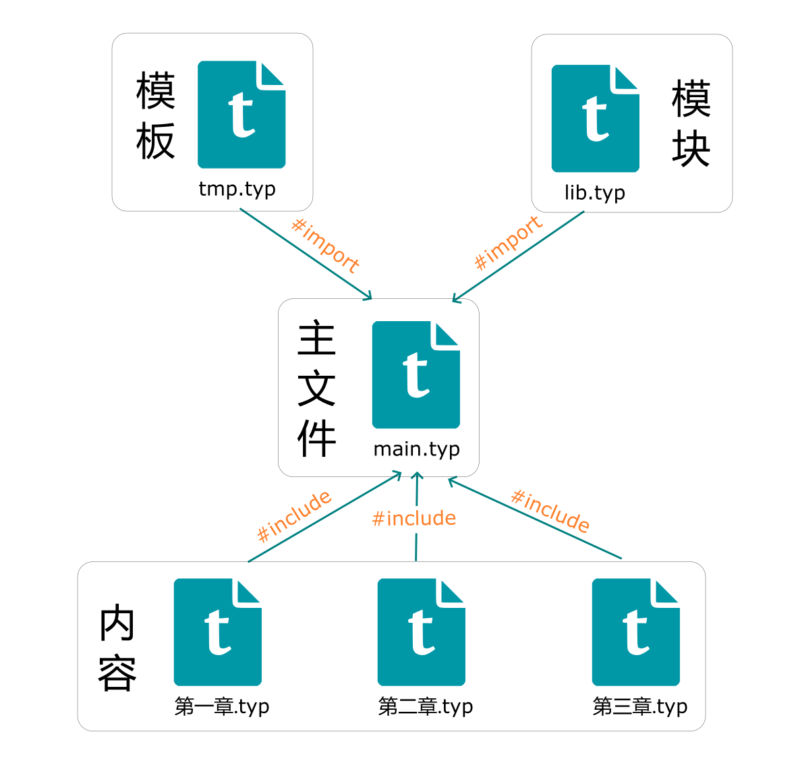
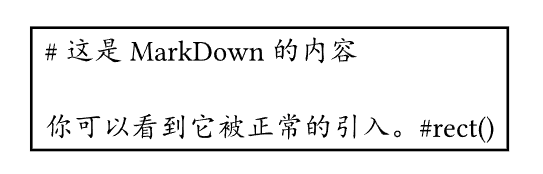
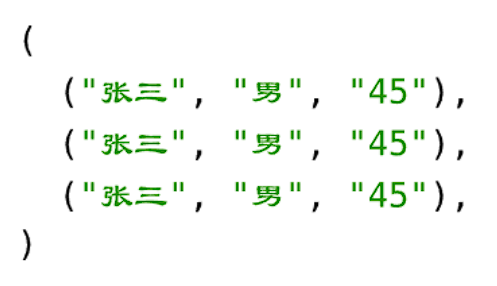
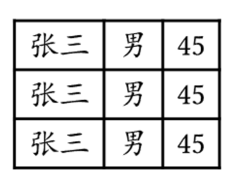

# 04导入、包含和读取
### 概述

上节概述了Typst脚本的基础语法，在此基础上，本节介绍Typst文件的导入、包含和读取的内容。你将可以更简单灵活的组织你的文件内容。

### 系列目录
- - - - - -
### 导入模块

使用`import`语句可以导入自定义模块或Typst内部模块

```
import "bar.typ"                    // 将bar.typ作为模块导入
import "bar.typ" as baz             // 将bar.typ作为模块导入,重命名为baz
import "bar.typ": a,b               // 将bar.typ作为模块导入,引入其中定义的a和b变量
import "bar.typ":a as one,b as two  // 重命名引入的a和b变量
import "bar.typ": *                 // 导入bar.typ中的所有变量

```

### 导入包

`import`除了导入模块外，也可以用于导入自己或第三方的包。

```
#import "@preview/cmarker:0.1.0"

```

关于第三包的使用将专门一节讲解。

### 导入模板

`import`还可以用于导入模板。

模板可以看做是特殊的Typst脚本文件，用于统一定制页面的格式，并调用生成相同风格的文档。

关于创建和导入模板见后节。

### 包含文件内容

可以使用`include`语句包含其他`.typ`文件的内容到当前文件。对于大体量的书写，可以将内容分散到不同的`.typ`文件中，然后在主文件中包含和排序，方便管理。

关于导入和包含以及一个成熟的Typst排版架构见下图：


- 模板中定义基础的页面、段落等样式，以及文档的基本结构，比如封面、目录
- 所谓“模块”可以看作是一个自定义函数库，通过编写函数，你可以更方便的输出一些内容
- 主文件负责内容的管理：包括模板的使用，库的导入，以及管理章节的之间的顺序等等
-  通过将内容划分为章节，可以获得更好的写作体验。
### 读取并显示文件内容

使用`read()`函数，可以读取任意文件内容，默认以字符串形式读取。

这意味着你不仅可以在.typ文件中通过`include()`包含其他`.typ`文件，也可以用`read()`读取任意纯文本文件，比如MarkDown、HTML等等。

#### 读取和显示MarkDown的内容

在Typst项目目录下创建“x.md”，内容如下：

```
# 这是MarkDown的内容

你可以看到它被正常的引入。#rect()

```

在Typst中使用`read()`函数读取并显示

```
#let md = read("x.md")//读取
#rect(md)

```



可以看到MarkDown中的内容会被原样输出，而不会处理类似typst语法的内容。

### 读取csv文件并用表格显示

读取csv文件不需要使用`read()`函数，直接使用`csv()`即可：

“a.csv”的内容如下：

```
张三,男,45
张三,男,45
张三,男,45

```

```
#csv("a.csv")
```

显示：



可以看到内容就是一个二维数组。

用表格显示：

```
#let data = csv("a.csv")

#table(columns: 3,..data.flatten())

```



### 读取JSON文件

JSON文件也可以直接使用`json()`函数读取：

“b.json”内容如下：

```
{
    "title":"JSON测试",
    "author":"巽星石"
}

```

```
#json("b.json")
```

显示： 

可以看到内容被转化为字典。因此也就可以直接通过字典的语法获取对应键的值：

```
#let data = json("33.json")

#data.title \
#data.author

```


