# 【Typst】5.文档结构元素与函数
### 概述

本节介绍Typst文档的核心文档结构元素及其对应函数，还有函数的用法。通过本节你将可以更好的使用脚本创建和控制页面元素。

- - - - - -
### set语句和show语句

#### set语句

set语句用于自定义文档元素的外观。

顶层 set 规则一直作用到文件结束，块内的set 规则只作用到块结束。

```
#set 文档元素函数(选项:值)
#set 文档元素函数(选项:值) if 条件

```

#### show语句

show 规则可以深度定制特定类型文档元素的外观。

与 set 规则类似， show 规则也一直作用到文档或者当前块的结束。

最常用的基本形式是 **show-set 规则：**

```
#show 文档元素选择器:...                   // 整个元素
#show 文档元素选择器.where(属性：值):...    // 符合属性值条件的元素

#show 文档元素选择器: set 函数(选项)   // show-set 形式
#show 文档元素选择器: 函数             // show-函数 形式

#show "文本内容":...      // 设定全文中指定文本内容的样式
#show regex("\w+"): ...  // 设定匹配正则表达式的文本

```

```
#show heading: set text(blue)   // 将所有标题设为蓝色

```

```
// show-函数 形式，将标题设置为矩形外框
#show heading: it => rect[
    #it.body
]

= 标题

```

```
#show "巽星石":set text(red)

作者巽星石，巽星石是个二百五。

```


```
#show heading.where(level: 1):set text(blue) 

```

#### with()

```
#let err = rect.with(fill:red)

#err[警告]

```


### 文档document()

`document()`代表整个文档，是文档的根元素。其包含参数定义如下：

```
document(
    title: none content,  // 文档的标题，作为PDF阅读器的窗口标题
    author: str array,    // 文档的作者
    keywords: str array,  // 文档的关键词
    date: none auto datetime,  // 文档的创建日期
) -> content

```

不能在文档中用`document()`再创建文档元素，只能用`set`语法对其进行设置。

```
#set document(
    title: "Typst测试",
    author: "巽星石",
    date: datetime(
        year: 2025,
        month: 6,
        day: 3
    )
)

```

### 页面page()

`page()`函数代表页面元素，其参数包含对页面的设置。下面是它的完整参数定义：

```
page(
    paper: str,            				// 标准纸张大小,默认："a4"
    width: auto length,    				// 页面宽度
    height: auto length,   				// 页面高度
    flipped: bool,         				// 页面是否翻转为横向，默认：false
    margin: auto relative dictionary,   // 页面的边距
    binding: auto alignment,            // 页面的装订边？
    columns: int,                       // 页面内容分栏数
    fill: none color gradient pattern,  // 页面背景色
    numbering: none str function,       // 页码格式
    number-align: alignment,            // 页码对齐方式，默认：center + bottom
    header: none content,               // 页眉内容
    header-ascent: relative,            // 标题被提升到上边距的数量,默认：30%
    footer: none content,               // 页脚内容
    footer-descent: relative,           // 页脚降低到下边距中的量，默认：30%
    background: none content,           // 页面背景内容，图片、文字水印等
    foreground: none content,           // 前景内容，覆盖在页面正文之上
    content,                            // 页面的内容
) -> content

```

#### 两种用法
- `#set page()`：统一设置页面 
- `#page()`：直接创建页面
```
// 统一设置页面
#set page(
    width:10cm,height:6cm,   // 页面宽高
    margin: (4mm)            // 统一边距
)

// 用填充矩形展示版心
#rect(
  fill: rgb("#75c5ea"),
  width: 100%,
  height:100%
)

#pagebreak()   // 强制换页

```
- `#set page()`之后会自动新开一页，其作用一直延续到后续页面，包括用`#pagebreak()`强制换页。


margin可以详细进行设置：

```
margin: (
    top：length,        // 上边距
    right：length,      // 右边距
    bottom：length,     // 下边距
    left：length,       // 左边距
    inside：length,     // 页面内侧的边距
    outsidelength,：    // 页面外侧的边距
    x：length,          // 水平边距
    y：length,          // 垂直外边距
    rest：length,       // 除字典明确设置大小的边外，所有边的边距
)

```

```
#set page(
  width:10cm,height:6cm,   // 页面宽高
  margin: (                // 页面边距
    x:10mm,                 // 水平边距
    y:2mm,                 // 垂直边距
  )
)

// 用填充矩形展示版心
#rect(
  fill: rgb("#75c5ea"),
  width: 100%,
  height:100%
)

#pagebreak()   // 强制换页

```


#### 直接创建页面

`page()`函数直接使用，可以创建页面元素：

```
// 直接创建新页面
#page(
  paper: "a4",
  margin: 2cm,
  [这是新页面]
)

```

上面的代码：
- 在代码位置创建新的A4页面，设定边距为2cm
- 页面内容为“这是新页面”
#### 强制分页

`pagebreak()`函数用于强制分页。

```
pagebreak(
    weak: bool,
    to: nonestr,
) -> content

```

一般直接以如下形式使用：

```
#pagebreak()

```

### 段落par()

`par()`函数代表文本段落元素，其参数包含对文本段落的设置选项。下面是它的完整参数定义：

```
par(
    leading: length,         // 行间距，默认：0.65em
    justify: bool,           // 是否在其行中对齐文本，默认：false
    linebreaks: auto str,    // 设定如何换行，默认：auto 为两端对齐
    first-line-indent: length,  // 首行缩进值，默认：0pt
    hanging-indent: length,     // 除首行外其他行的缩进值，默认：0pt
    body:content,                    // 段落的内容
) -> content

```

#### 设定段落样式

```
#set par(
    first-line-indent: 2em,
    hanging-indent: 3em,
    leading: 1.5em
)

```

可以看到，光用`set`语句设定会显得比较局促。因为无法设置字体、字号、字色等等的细节，所以还得使用`show...set`形式补充设定：

```
// 对段落的一般设置
#set par(
    first-line-indent: 2em,
    hanging-indent: 3em,
    leading: 1.5em
)

// 对段落的详细设置
#show par:set text(blue)   // 设定段落的文本颜色

```

```
// 进一步的设定
#show par:set text(
    font: "Microsoft YaHei",
    size: 20pt,
    fill: red
)

```

#### 创建段落

`par()`函数也可以向`page()`函数一样用来生成段落元素：

```
#par[这是一个新的段落]
#par(first-line-indent: 2em)[
    生成的段落
]

```

### 标题heading(）

```
heading(
    level: int,                       // 标题级别，默认：1
    numbering: nonestr function,       // 设定标题的编号模式
    supplement: none auto content function,  
    outlined: bool,         // 标题是否显示在目录中，默认：true
    bookmarked: auto bool,  // 标题是否在导出PDF中显示为书签
    body:content,           // 标题内容
) -> content

```

#### 设置标题样式

最常见的就是设定标题的编号模式

```
#set heading(numbering: "1.a")
= 第一章
== 第一节
=== 第一小节

```

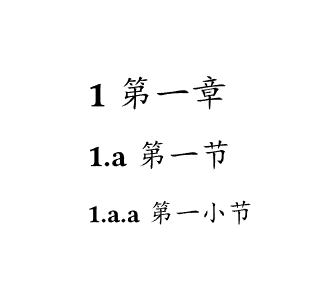

#### 创建标题

```
#heading[一级标题]
#heading(level: 2)[二级标题]
#heading(level: 3)[三级标题]

```

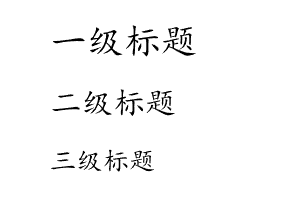

**其他页面元素**

有了`page()`和`par()`和`heading()`的经验，其他文档元素函数的用法大致类似，一个是用来设定文档元素的样式，一个是用来创建文档元素的实例。

### 目录outline()

`outline()`函数用于生成整个文档或者图表等其他元素的目录。

```
outline(
    title: none auto content,         // 目录标题
    target: label selector function,  // 目录所对应的文档元素，默认：heading.where(outlined: true)
    depth: none int,                  // 目录深度，最大标题级别 
    indent: none auto bool relative function,   // 缩进
    fill: none content,               // 条目和页码之间的填充，默认：repeat(body: [.])
) -> content

```

```
#outline()     // 生成文档目录
#pagebreak()   // 换页

// 文档正文

#heading[一级标题]

#heading(level: 2)[二级标题]

#heading(level: 3)[三级标题]

```

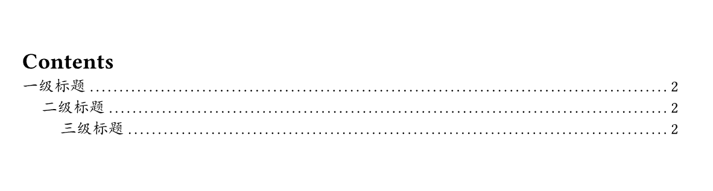

可以看到目录的默认标题为英文的“Contents”,通过设定`text()`函数的语言选项为中文，目录标题将自动切换为中文的“目录”。其他语言类似。

```
#set text(lang: "zh")  // 设定整个文档语言为中文

#outline()     // 生成文档目录
#pagebreak()   // 换页

// 文档正文

#heading[一级标题]

#heading(level: 2)[二级标题]

#heading(level: 3)[三级标题]

```

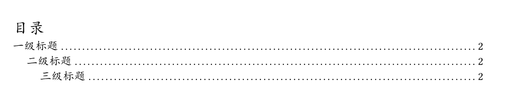

或者可以直接设定`outline()`的`title`属性。并可以基于内容块形式设定居中。

```
#outline(   // 生成文档目录
    title:[
        #block(
            width:100%
        )[
            #align(center)[目录]
        ]
    ]
)

```

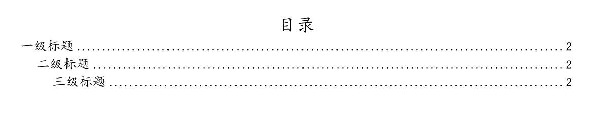

### 引用quote(）

```
quote(
    block: bool,          // 是否为块引用，默认：false
    quotes: auto bool,    // 是否为引用内容添加双引号，默认：auto，行内添加，块级不添加
    attribution: none label content,  // 引文的署名，通常是作者或来源。
    body:content,                     // 引文内容
) -> content

```

Typst将引用分为“行内引用”和“块级引用”。

```
这里是正文，#quote(attribution: "巽星石")[我石耳鼻]，这里是后面的内容。

#quote(
    attribution: "巽星石",
    block: true               // 设为块级引用
)[我石耳鼻]

```

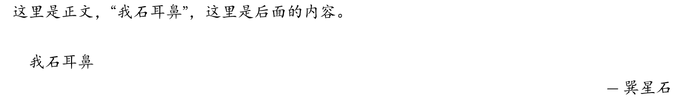

### 脚注

footnote()用于创建脚注，脚注会在每页页脚区域自动编号并显示脚注内容。

```
footnote(
    numbering: str function,   // 脚注的编号形式
    body:label content,        // 脚注内容
) -> content

```

日常使用时，脚注只需要使用`#footnote[脚注内容]`形式添加到正文任意位置即可：

```
#page(
    width: 8cm,height: 5cm
)[
这里是脚注的示例#footnote[这里是脚注的内容]
]

```

为了演示的方便，这里建了一个宽8cm，高5cm的小页面进行演示：

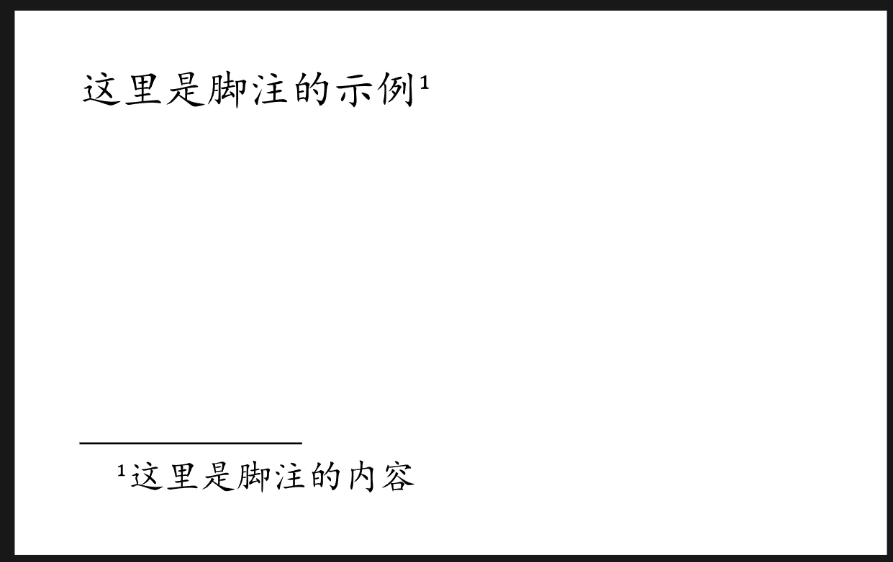

#### 自定义脚注列表

可以在文档的开头定义 `footnote.entry` 的 set 和 show 规则，对脚注的条目样式进行统一设置。

```
footnote.entry(
    note:content,         
    separator: content,   // 文档正文和脚注列表之间的分隔符，默认：1em
    clearance: length,    // 文档正文和分隔符之间的间距，默认：0.5em
    gap: length,          // 脚注条目之间的间距，默认：0.5em
    indent: length,       // 脚注条目的缩进量，默认：1em
) -> content

```

### 标签label()和引用site()

标签可以使用`&lt;标签名>`或`#label("标签名")`形式创建，需要添加到标记元素的后面，且紧邻。

```
#figure(
    caption: "typ:标记模式",
)[
```typ
= 123
== 234
=== 456
`123`
#set page()
]

```


这里是引用：#ref()

```


## 无序列表list()
```swift
list(
    tight: bool,                         // 列表项是否紧凑排列，默认：true
    marker: content array function,      // 列表项的标记
    indent: length,                      // 列表项的缩进值，默认：0pt
    body-indent: length,                 // 标记与列表项正文之间的间距，默认：0.5em
    spacing: auto relative fraction,     // 宽（非紧密）列表的项之间的间距
    children: content,                   // 具体的列表项
) -> content

```

```
list.item(
    content
) -> content

```

```
// 使用for循环创建列表
#for zm in "ABC" [
    - 字母 #zm
]

```

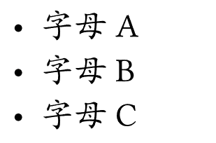

```
// 使用list()函数设定
#list[1][2][3]

```

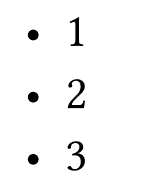

```
// 使用 list.item 设定
#list(
    list.item[1],
    list.item[2],
    list.item[3]
)

```

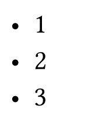

### 有序列表enum()

```
enum(
    tight: bool,                        // 列表项是否紧凑排列，默认：true
    numbering: str function,            // 设置编号的模式，默认："1."
    start: int,                         // 开始编号，默认：1
    full: bool,                         // 是否显示完整编号，包括父列表的编号
    indent: length,                     // 列表项的缩进值，默认：0pt
    body-indent: length,                // 标记与列表项正文之间的间距，默认：0.5em
    spacing: auto relative fraction,    // 宽（非紧密）列表的项之间的间距
    number-align: alignment,            // 编号的对齐方式，默认：end + top
    children：content array,            // 具体的列表项
) -> content

```

```
enum.item(
    number: none int,     // 编号   
    body: content,        // 内容
) -> content

```

```
+ 列表项1
    + 列表项1.1
+ 列表项2

```

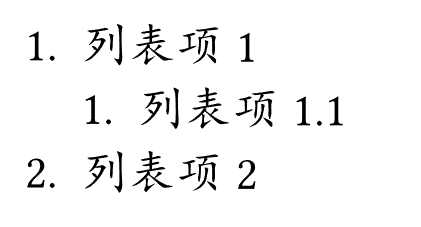

```
#enum(
    enum.item(1)[1],
    enum.item(2)[2],
    enum.item(3)[3],
)

```

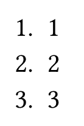

```
#enum[1][2][3]

```

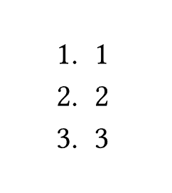

```
#enum(
    start: 3
)[1][2][3]

```

或者：

```
#enum(
    start: 3,
    [1],
    [2],
    [3]
)

```

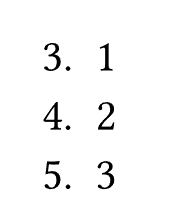

```
#set enum(numbering: "1.a",full: true)

+ 列表项1
    + 列表项1.1
+ 列表项2

```

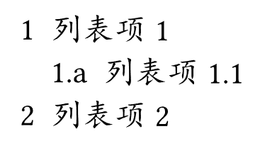

### 图片image()

```
image(
    path:str,                  // 图片文件路径
    format: auto str,          // 图片格式
    width: auto relative,      // 图片宽度，默认：aoto
    height: auto relative, 	   // 图片高度，默认：aoto
    alt: nonestr,              // 图片描述
    fit: str,                  // 图片的自适应方式，默认："cover"
) -> content

```

```
image.decode(
    data:str bytes,            // 要解码为图像的数据,可以是SVG的字符串
    format: auto str,          // 图片格式
    width: auto relative,      // 图片宽度，默认：aoto
    height: auto relative, 	   // 图片高度，默认：aoto
    alt: nonestr,              // 图片描述
    fit: str,                  // 图片的自适应方式，默认："cover"
) -> content

```

`fit`的值：

|fit值|描述|
|---|---|
|“cover”|图像应完全覆盖该区域。这是默认设置。|
|“contain”|图像应完全包含在该区域中。|
|“stretch”|应拉伸图像，使其完全填充该区域，即使这意味着图像将失真。|

### 代码raw()

`raw()`代表可以进行语法高亮或背景高亮的**行内代码**或**代码块**。

```
raw(
    text:str,            // 代码内容
    block: bool,         // 是否为代码块，默认：false
    lang: none str,      // 代码语言
    align: alignment,    // 代码块内容的对齐方式，默认：start
    syntaxes: str array, // 语法定义
    theme: none str,     // 用于语法高亮的主题，默认：none
    tab-size: int,       // 一个Tab键等于的空格数，默认：2
) -> content

```

```
```html
&lt;h1>这里是H1&lt;/h1>
&lt;hr>
这里是正文
```

#### typ和typc

Typst的代码可以使用`typ`或`typc`作为其语言名称。其中：
- `typ`为标记模式
- `typc`为脚本模式
````
```typ
= 123
== 234
=== 456
`123`
#set page()
```

````

```

```
````typc
```typc
= 123
== 234
=== 456
`123`
#set page()
```

````
```
```
两者在显示标记和Typst脚本上有所差别：

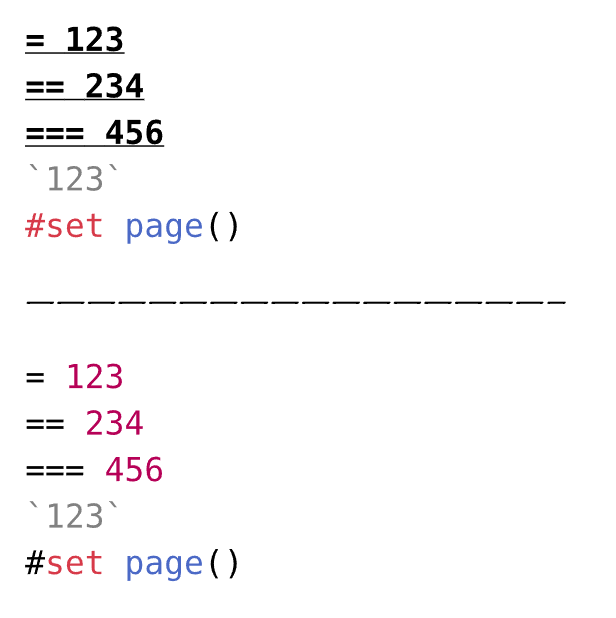

#### 为代码添加标题

代码块也可以包裹在`figure()`中，并为其创建计数和标题。

````
#figure(
    caption: "typ:标记模式"
)[
```typ
= 123
== 234
=== 456
`123`
#set page()
```

````

```

```
和图片以及表格一样，包裹`figure()`后，内容就会在行中居中显示：


#### 设定行内代码和代码块的样式

下面是我自己琢磨出来的样式：

```
// 行内代码
#show raw.where(block: false):it =>[
    #box(
    fill: rgb("#ececec"),
    inset: 2pt,
    outset: 2pt,
    radius: 2pt,
    stroke: rgb("#dcdcdc") + 1pt,
    baseline: 20%,
    it
)
]

// 代码块
#show raw.where(block: true):it =>[
    #align(left)[
        #block(
            fill: rgb("#ececec"),
            width:100%,
            inset: 10pt,
            radius: 5pt,
            stroke: rgb("#dcdcdc") + 1pt,
            it
        )
    ]
]

```

实际效果还可以：

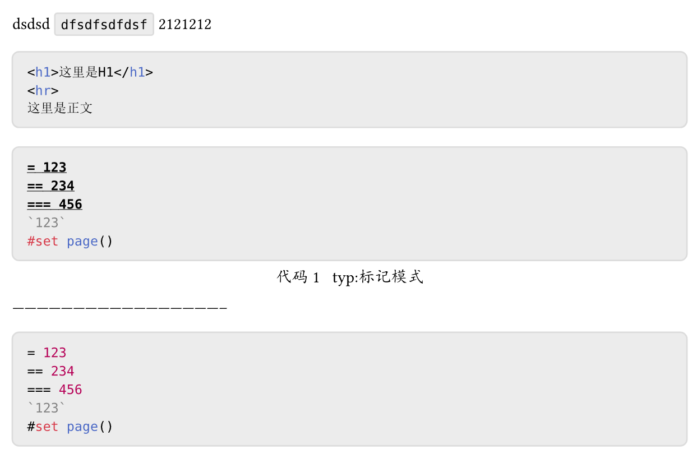

#### 代码行样式设定

文档没有示例，不太清楚具体的设定方法。

```
raw.line(
    number:int,    // 行号（从1开始）
    count:int,     // 代码块中的总行数
    text:str,      // 文本
    content,       // 高亮显示的原始文本
) -> content

```

### 表格table(）

```
table(
    columns: auto int relative fraction array,   // 列数或列设置
    rows: auto int relative fraction array,      // 行数或行设置
    gutter: auto int relative fraction array,    // 行和列间隙
    column-gutter: auto int relative fraction array,   // 行间隙
    row-gutter: auto int relative fraction array,      // 列间隙
    fill: none color gradient array pattern function,  // 单元格填充
    align: auto array alignment function,              // 单元格内容对齐方式
    stroke: none length color gradient stroke pattern dictionary,  // 边框样式，默认：1pt + black
    inset: relative dictionary,                  // 内边距 默认：5pt
    children：content,                           // 具体表格数据
) -> content

```

```
#table(
    columns: 3,
    [1],[2],[3],
    [4],[5],[6]
)

```

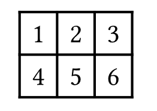

```
#table(
    columns: 3,       // 三列表格
    gutter: 3pt,      // 行列间距为3pt
    stroke: red+1pt,  // 描边为1pt红色
    [1],[2],[3],
    [4],[5],[6]
)

```

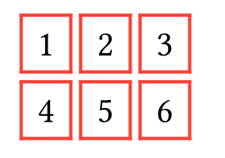

### 图表figure()

`figure()`主要用于对图片、表格或者其他内容进行标记，并自动创建序号，并且可以设定标题等。

```
figure(
    body:content,                       // 内容，通常为图片、表格
    placement: none auto alignment,     // 图片在页面上的放置位置，默认：none
    caption: none content,              // 标题，默认：none
    kind: auto str function,            // 图表的种类，相同类型共用一个计数器
    supplement: none auto content function,   // 和序号标题一起显示的图表类型名称
    numbering: none str function,
    gap: length,
    outlined: bool,
) -> content

```

```
#figure(
    caption: "表格实例1"
)[
    #table(
        columns: 3,       // 三列表格
        gutter: 3pt,      // 行列间距为3pt
        stroke: red+1pt,  // 描边为1pt红色
        [1],[2],[3],
        [4],[5],[6]
    )
]

```

`figure()`的标题默认会以“图表的类型名 类型计数：标题”形式展示。

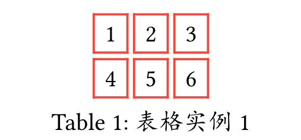

可以通过`supplement`参数指定中文形式，或者通过设定整个文档的语言为中文，实现自动的中文类型名。

```
#set text(lang: "zh")  // 设定整个文档语言为中文

```

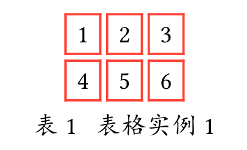

### 中文随机内容的填充

通过`lorem()`可以创建用于暂时填充的英文文本，但是有些时候，我们跟多的需要填充中文内容我们可以利用字符串的特性，给一个字符串乘以一个倍数来重复它：

```
#("这是一段用作填充的文字。" *5)

```


我们可以简单的编写一个函数来重复调用。

```
#let lorem_zh(time) = {"这是一段用作填充的文字。" * time}

#lorem_zh(5)

```
