# 【Typst】6.布局函数
### 概述

上节我们介绍了文档结构元素的函数，本节介绍一些控制布局使用的函数，掌握他们之后你可以更进一步的控制页面元素的布局。

**提示**
- 在学习布局函数之前可以先学习一下一文，明确Typst支持的长度、分数、比例等，方便实际布局中使用。
- 此文已于2025年6月29日重新更新内容
- - - - - -
### 绝对定位place()

`place()`用于将内容放置在父容器（页面）的指定位置。

```
place(
    alignment: auto alignment,    // 位置，默认：start
    float: bool,       // 是否浮动布局，默认：false
    clearance: length, // 放置的元素在浮动布局中的间隙量。默认：1.5em
    dx: relative,      // 水平偏移
    dy: relative,      // 垂直偏移
    content,           // 定位的内容
) -> content

```

#### 设定放置位置

`alignment`可能的值为：
- `start`：在文本方向的开头对齐。

- `end`：在文本方向的末尾对齐。

-  `left`：左对齐。

-  `center`：水平居中。

-  `right`：右对齐。

-  `top`：垂直顶部对齐。

-  `horizon`：垂直居中对齐。

-  `bottom`：在底部对齐。

`alignment`指定相对于父容器中的哪个位置放置内容。

- 如果 `float` 是 `false`，那么可以是除 `auto` 之外的对齐方式。
-  如果 `float` 是 `true`，那么必须是 `auto`、`top` 或 `bottom`。
```
#rect(width:100%,height: 200pt)[
  #place(start)[top/start]
  #place(center)[center]
  #place(right)[right/end]
  #place(horizon)[horizon]
  #place(center+horizon)[center+horizon]
  #place(right+horizon)[right(/end)+horizon]
  #place(bottom)[bottom]
  #place(bottom+center)[bottom+center]
  #place(bottom+right)[bottom+right(/end)]
]

```

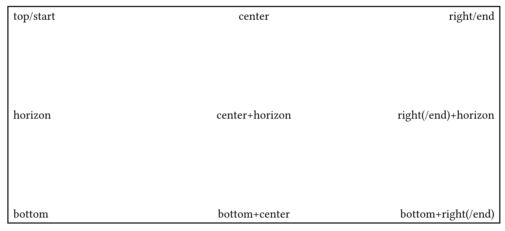

#### 设定浮动和scope

默认情况下，`place()`定位的内容已经脱离了文档流式布局，它们会按先后顺序和内容重叠。

```
#set page(columns: 2)
#place(
  top + center,
  rect(width: 100%, height: 100pt, fill: aqua),
)

#lorem(400)

```

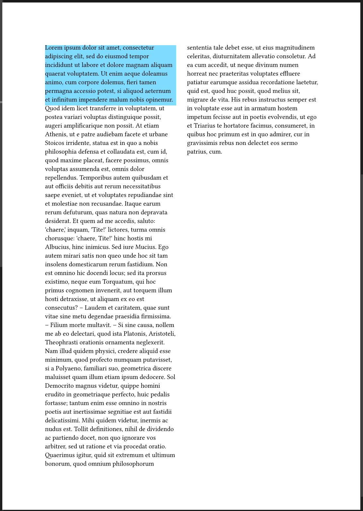

开启浮动后，`place()`定位的内容会占据其所在的位置。

```
#set page(columns: 2)
#place(
  top + center,
  float: true,   // 开启浮动
  rect(width: 100%, height: 100pt, fill: aqua),
)

#lorem(400)

```

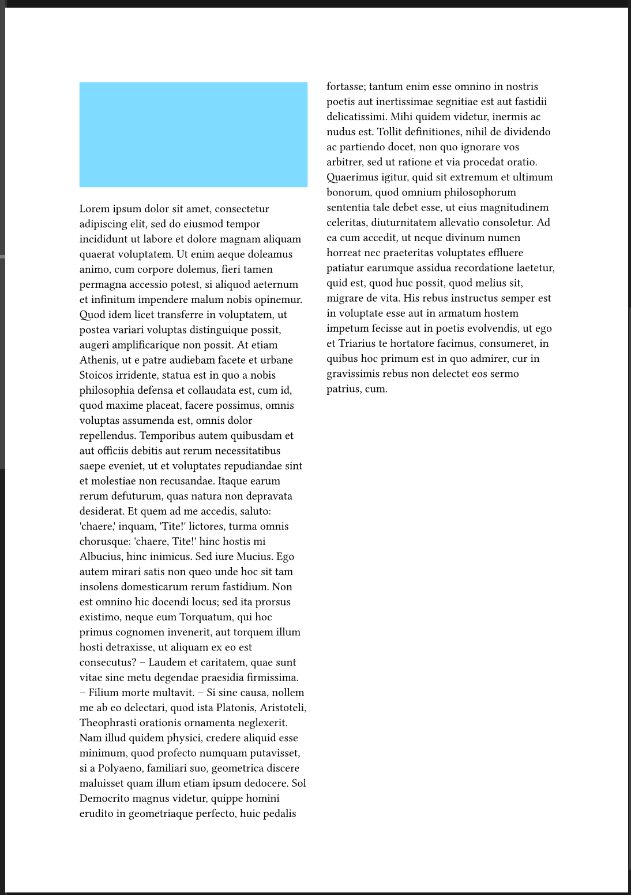

`scope`的默认值是`"column"`，如果页面级别设定了分栏，则绝对定位的内容会显示在当前栏内。

|值|含义|
|---|---|
|`"column"`|放置到当前列中。|
|`"parent"`|相对于父元素定位，允许内容跨越所有列。需要启用float。|

通过将`scope`的值设为`"parent"`，可以实现跨栏效果。

```
#set page(columns: 2)
#place(
  top + center,
  scope: "parent",
  float: true,
  rect(width: 100%, height: 100pt, fill: aqua),
)

#lorem(400)

```

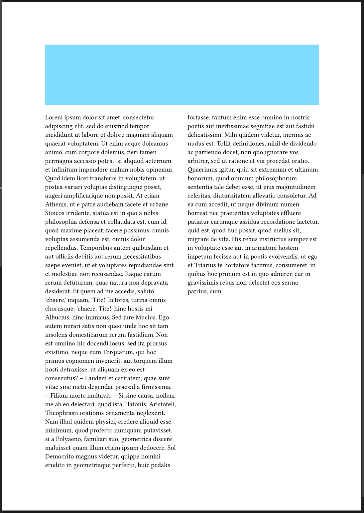

`clearance`可以设定浮动内容与周围内容的间距。

```
#set page(columns: 2)
#place(
  top + center,
  scope: "parent",
  float: true,
  clearance: 3em,
  rect(width: 100%, height: 100pt, fill: aqua),
)

#lorem(400)

```

#### 设定偏移值

在指定`alignment`的基础之上，可以使用`dx`和`dy`设定偏移值。

```
#rect(width:100%,height: 200pt)[
  #place(start,dx:2cm,dy:1cm)[top/start + (2cm,1cm)]
  #place(center+horizon,dx:2cm,dy:1cm)[center+horizon + (2cm,1cm)]
  #place(bottom+right,dx:-2cm,dy:-1cm)[bottom+right(/end)- (2cm,1cm)]
]

```

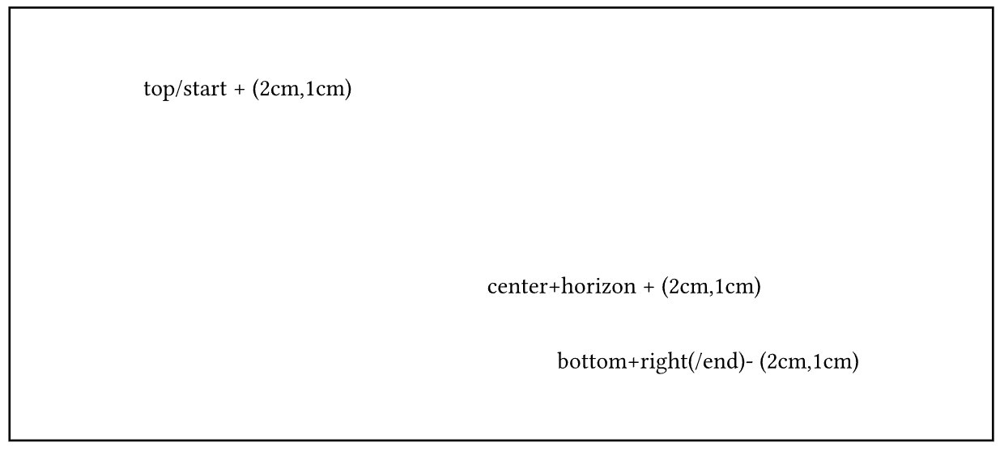

```
#page(height: 200pt)[
#lorem(150)

#figure(
  rect(width: 100%, height: 50pt),
  placement: auto,
  caption: [A rectangle],
)

This text appears after the figure.
]


```

#### place.flush()

`<font style="color:rgb(25, 24, 31);background-color:rgb(253, 253, 253);">place.flush()</font>`指示布局算法在继续处理内容之前先放置待处理的浮动元素。

这有助于防止浮动图片溢出到下一节。

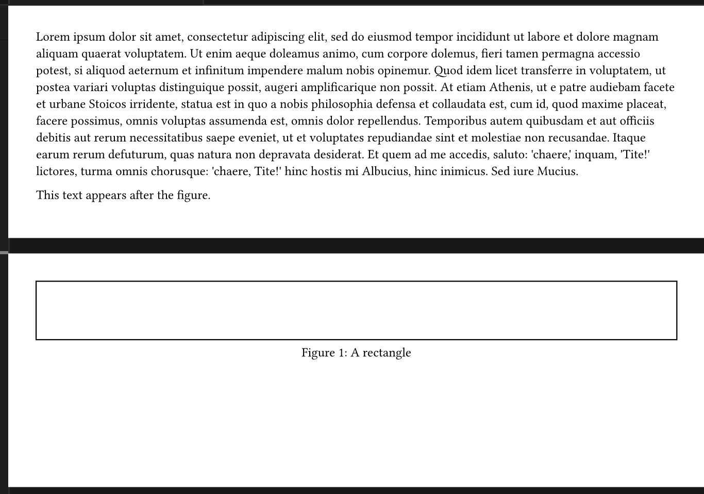

```

#page(height: 200pt)[
#lorem(150)

#figure(
  rect(width: 100%, height: 50pt),
  placement: auto,
  caption: [A rectangle],
)

#place.flush()

This text appears after the figure.
]

```

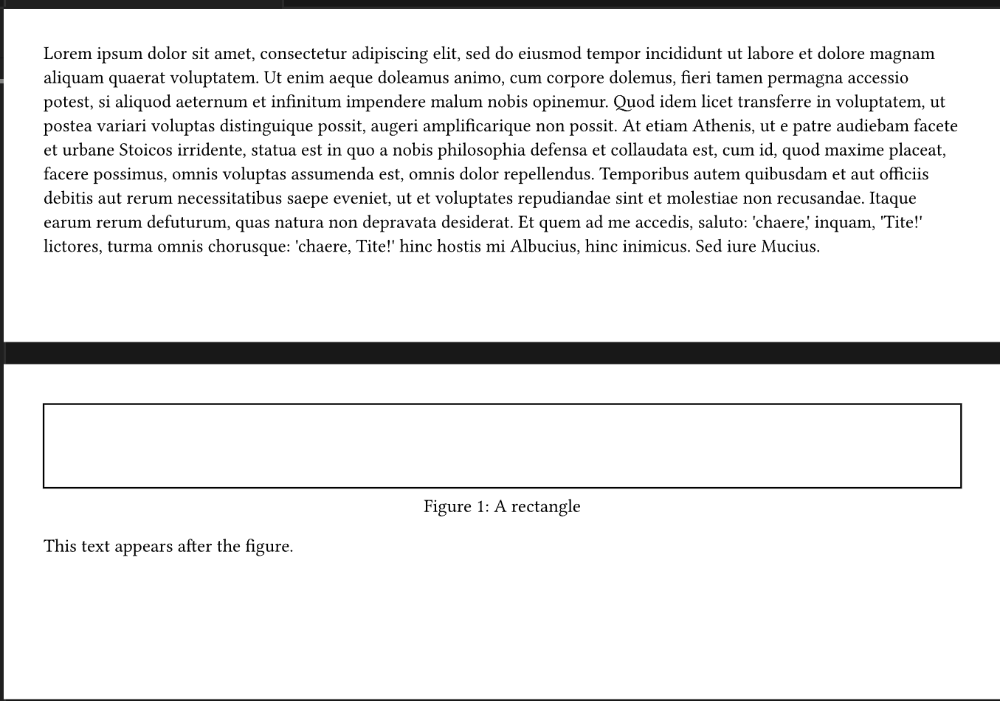

### 对齐align()
- `align()`和`place()`很像，都是基于设定`alignment`，来定位内容的位置
- 不过`align()`只涉及元素的定位，但不会脱离文档流
```
align(
    alignment, // 沿两个轴的对齐方式。默认：start + top
    content,   // 要对齐的内容。
) -> content

```

整体使用：

```
#set align(center)
这是第一段 \
这是第二段 \
这是第三段 \

```


局部使用：

```
#align(left)[左对齐]
#align(center)[居中对齐]
#align(right)[右对齐]

```

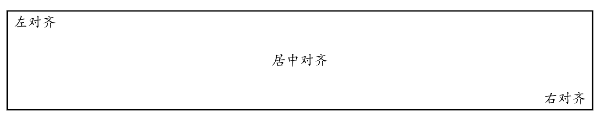

在容器中使用：

```
#rect(
  width: 100%,
  height: 200pt
)[
  #align(left+top)[left+top]
  #align(center+horizon)[center+horizon]
  #align(right+bottom)[right+bottom]
]

```

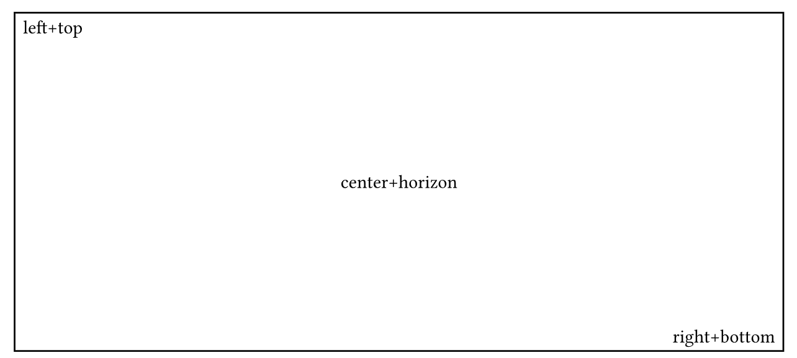

### 内容变换

可以对内容施加位移、旋转、缩放、倾斜等变化。这些变换只针对内容本身，并不会让其脱离文档流。

#### 旋转rotate(）

```
rotate(
    angle:angle,   		// 旋转量，角度或弧度，默认为0deg
    origin: alignment,  // 旋转变换的原点，默认center + horizon
    reflow: bool,       // 旋转是否影响布局。
    body:content,       // 要旋转的内容
) -> content

```

angle可以赋予：
- 角度值：如120deg，代表120°
- 弧度值：如1.57rad，代表1/2弧度，也就是90°
```
// 以默认旋转中心，顺时针旋转45°
#rotate(45deg)[
  #rect()[旋转的内容]
]

```

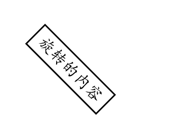

```
// 以默认旋转中心，逆时针旋转45°
#rotate(-45deg)[
  #rect()[旋转的内容]
]

```

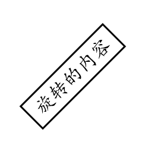

```
// 以默认旋转中心，顺时针旋转1.57弧度
#rotate(1.57rad)[
  #rect()[旋转的内容]
]

```

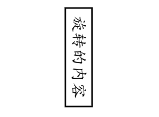

```
// 以左上角为旋转中心，顺时针旋转30°
#rotate(30deg,origin: top+left)[
  #rect()[旋转的内容]
]

```

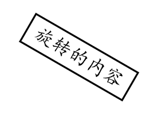

##### 设定reflow

默认旋转后的内容，其占据的位置仍然是以其未旋转之前的边界框计算的。

```
#lorem(25)
#rotate(45deg)[
  #rect()[旋转的内容]
]

#move
#lorem(25)

```

效果就是旋转后的内容，可能与前后的内容产生视觉上的重叠：

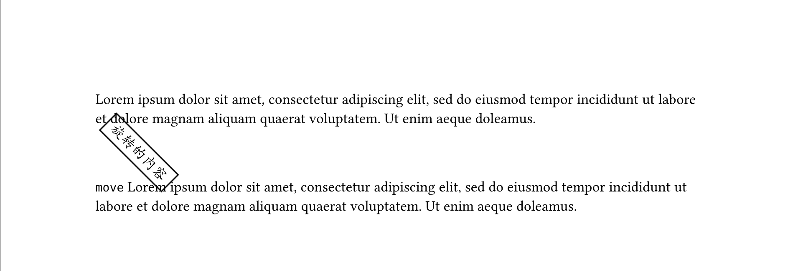

设定`reflow: true`后，旋转后的内容边界框将重新计算。

```
#lorem(25)
#rotate(45deg,reflow: true)[
  #rect()[旋转的内容]
]

#move
#lorem(25)

```

这样，旋转的内容就不会与前后内容发生视觉上的重叠：

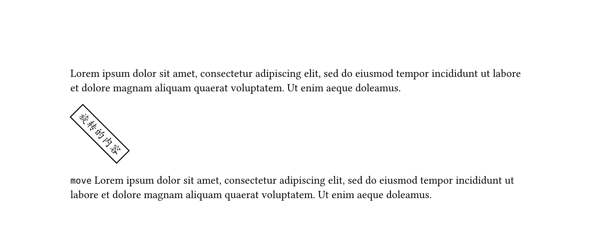

`reflow`的设置在缩放和扭曲中也一并适用。

#### 缩放scale()

```
scale(
    factor: auto length ratio,  // 两个轴的缩放因子
    x: autolengthratio,         // 水平缩放因子,默认：100%
    y: autolengthratio,         // 垂直缩放因子,默认：100%
    origin: alignment,          // 缩放变换的原点，默认：center + horizon
    reflow: bool,               // 缩放是否影响布局，默认：false
    body：content,              // 要缩放的内容
) -> content

```

```
#rect(
  width:100%,
)[
  #set align(center)
  这里是原始效果
  // 水平翻转
  #scale(x:50%)[这里是水平压缩50%]
  #scale(x:150%)[这里是水平拉伸150%]
  #scale(x:-100%)[这里是水平翻转]
  // 垂直翻转
  #scale(y:50%)[这里是垂直压缩50%]
  #scale(y:450%)[这里是垂直拉伸450%]
  #scale(y:-100%)[这里是垂直翻转]
]

```

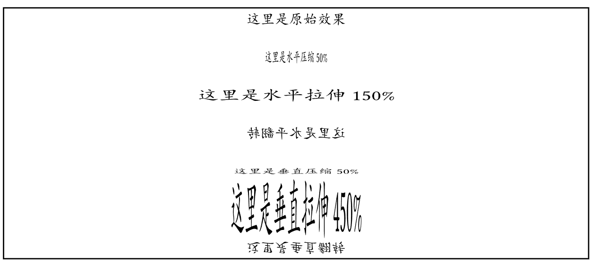

#### 位移move()

`move()`用于将内容放置到页面指定位置：

```
move(
    dx: relative,       // 水平位移值
    dy: relative,       // 垂直位移值
    body:content,       // 要移动的内容
) -> content

```

```
#move(dx:100pt,dy:100pt)[#image("1.png",width: 200pt)]

```

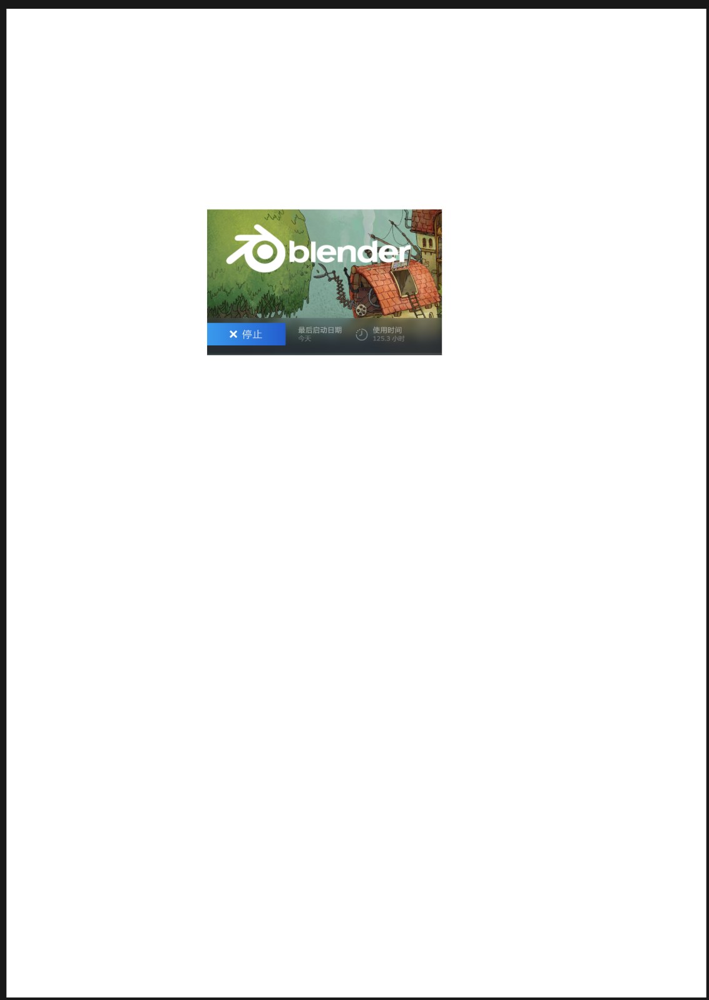

`move()`本身只是对内容进行位移变换，但是并不会让内容脱离文档流。

```
#lorem(225)
#move(dx:100pt,dy:100pt)[#image("1.png",width: 200pt)]

#move
#lorem(225)

```

当位移变换的前后都有内容时，可以看到`move()`只是对内容进行了偏移，但是其在文档流中占据的位置不发生变化。

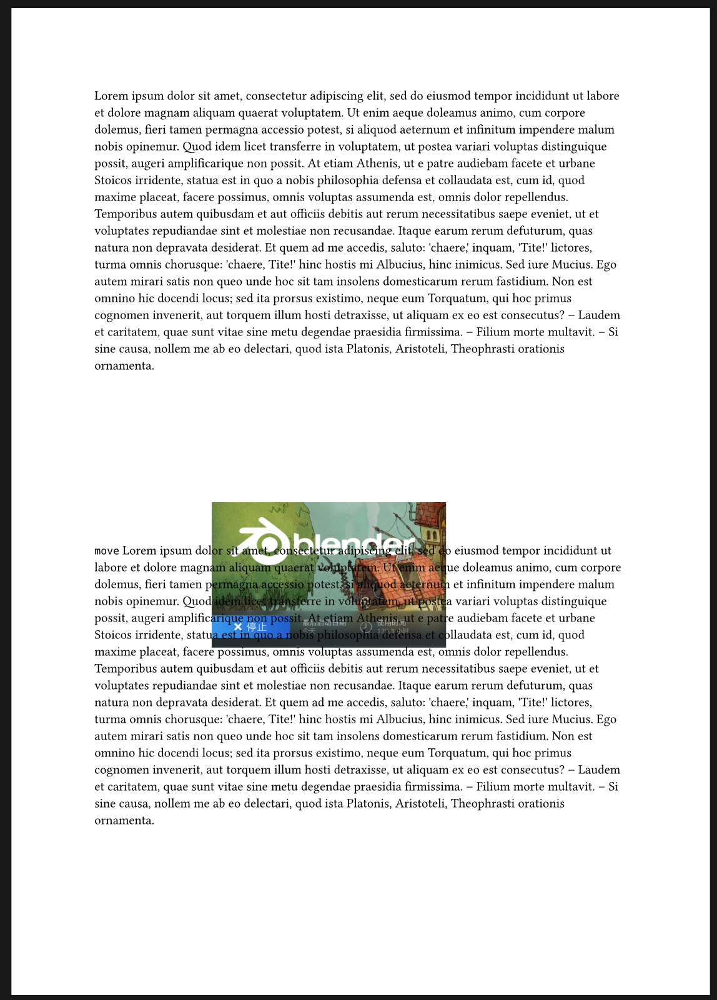

##### 矩形套矩形的特殊效果

```
#rect(inset: 0pt, move(
  dx: 6pt, dy: 6pt,
  rect(
    inset: 8pt,
    fill: white,
    stroke: black,
    [这里是内容]
  )
))

```

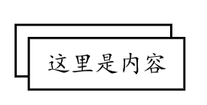

#### 扭曲**skew()**

`skew()`用于对内容实行倾斜变换。

```
skew(
    ax: angle,         // 水平倾斜角度，默认：0deg
    ay: angle,         // 垂直倾斜角度，默认：0deg
    origin: alignment, // 倾斜变换的原点,默认：center + horizon
    reflow: bool,      // 倾斜变换是否影响布局
    body:content,      // 要倾斜的内容
) -> content

```

```
#skew(ax:-12deg)[文本的倾斜]

#skew(ax:-12deg)[#rect()]

```

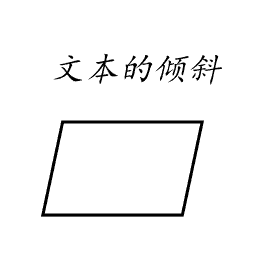

### block和box

`block`和`box`都可以看作是一个容器，只不过：
- `block`是块级元素，无论宽度是否撑满页面宽度，始终是独占一行- `box`是行内元素，可以在行内与文字进行混排
#### block

```
block(
    width: auto relative,   // 宽度，默认：auto
    height: auto relative,  // 高度，默认：auto
    breakable: bool,        // 是否可以在换页时，打碎，分布到下一页，默认：true
    fill: none color gradient pattern,     // 背景填充
    stroke: none length color gradient stroke pattern dictionary,   // 边框样式
    radius: relative dictionary,  // 圆角
    inset: relative dictionary,   // 内边距
    outset: relative dictionary,  
    spacing: relative fraction,   // 块周围的边距
    above: relative fraction,     // 与上方内容的边距
    below: relative fraction,     // 与下方内容的边距
    clip: bool,                   // 是否裁切内容
    sticky: bool,
    body：none content,           // 块中的内容
) -> content

```

使用`block()`可以构造一个块级元素：

```
#block()[123]1212

```

可以看到block()中的内容不管多少，都独占一行：

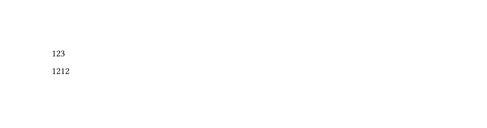

#### box

```
box(
    width: auto relative fraction,   // 宽度，默认：auto
    height: auto relative,           // 高度，默认：auto
    baseline: relative,        // 基线偏移量，默认：0% + 0pt
    fill: none color gradient pattern,   // 背景填充，默认：none
    stroke: none length color gradient stroke pattern dictionary,
    radius: relative dictionary,
    inset: relative dictionary,
    outset: relative dictionary,
    clip: bool,
    body:none content,        // 盒子中的内容
) -> content

```

### 分栏

Typst中的分栏可以使用`columns()`进行局部的分栏，也可以在`page()`函数中设定页面的整体分栏。

#### 整页分栏

```
#set page(columns: 2)   // 设置当前页面整体分为两栏
#lorem(100)
#colbreak()  // 强制分栏
#lorem(55)

```

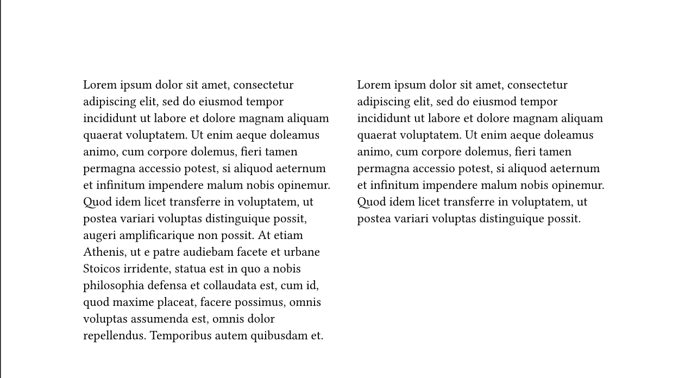

强制分栏可以用`colbreak()`:

```
colbreak(
    weak:bool   //如果为 true，则如果当前列已为空，则跳过列分隔符。默认：false
) -> content

```

#### 局部分栏columns()

```
columns(
    count:int,                // 分栏数，默认为2
    gutter: relative,         // 栏间距，默认：4% + 0pt
    body:content,             // 要分栏的内容
) -> content

```

使用`columns()`可以更自由的在页面中控制分栏和不分栏，而不是整页都分栏。

```
= 前面的内容
#lorem(100)
= 局部分栏
#columns(2)[
  #lorem(100)
  #colbreak()  // 强制分栏
  #image("1.png")
  #lorem(35)
]
= 后面的内容
#lorem(55)

```

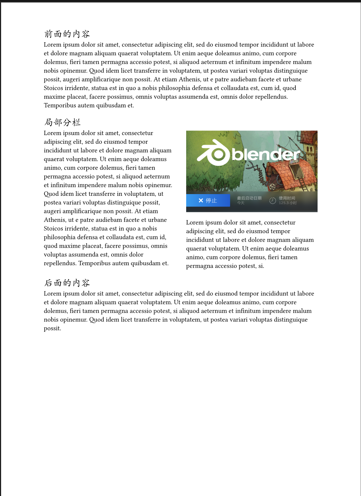

### 水平和垂直分布

#### 堆叠stack()

```
stack(
    dir: direction,                  // 内容的排列方向,默认：ttb
    spacing: none relative fraction, // 内容间距
    body: content,                   // 要排列的内容
) -> content

```

`dir`可能的值为：
- `ltr`：从左到右。
-  `rtl`：从右到左。
-  `ttb`：从上到下。
-  `btt`：从下到上。
##### 默认使用

默认方向从上到下，依次排列：

```
#stack(
  rect[第1个],
  rect[第2个],
  rect[第3个],
)

```

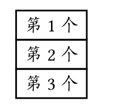

##### 从左到右排列

```
#stack(
  dir:direction.ltr,   // 由左向右排列
  rect[第1个],
  rect[第2个],
  rect[第3个],
)

```

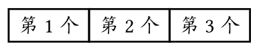

##### 设定间距

```
#stack(
  dir:direction.ltr,
  spacing: 5pt,         // 设定水平间距
  rect[第1个],
  rect[第2个],
  rect[第3个],
)

```

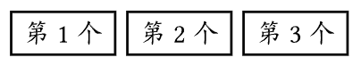

### 水平和垂直间距

`h()`和`v()`函数用于设定内容之间的水平或垂直间距。

```
// 水平间距
h(
    relative fraction,   // 间距值
    weak: bool,
) -> content

```

```
// 垂直间距
v(
    relativefraction,    // 间距值
    weak: bool,
) -> content

```

#### 设定水平间距

```
随便写点什么 #h(2em) 后续的内容。

```

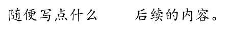

##### 使用分数

```
随便写点什么 #h(1fr) 后续的内容。\
随便写点什么2 #h(1fr) 后续的内容。

```

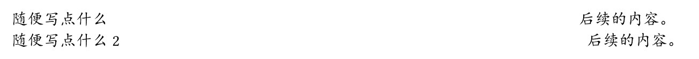

#### 设定垂直间距

```
随便写点什么3 #v(1em) 后续的内容。

```

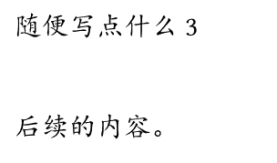

### 网格布局

`grid()`用于实现网格布局：

```
grid(
    columns: auto int relative fraction array, // 列数或列设置
    rows: auto int relative fraction array,    // 行数或行设置
    gutter: auto int relati vefraction array,  // 行列间距
    column-gutter: auto int relative fraction array,  // 列间距，优先于 gutter
    row-gutter: auto int relative fraction array,     // 行间距，优先于 gutter
    content,    // 布局的子项
) -> content

```

#### 基础使用

```
#grid(
  columns: 2,
  rect[12],
  rect[12],
  rect[12],
  rect[12]
)

```

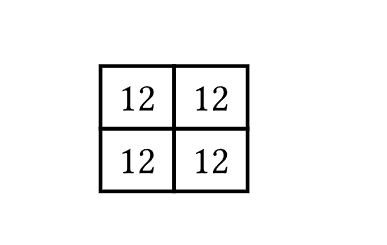

#### 设定每列的宽度

```
// 统一设置rect的样式
#set rect(
  width: 100%,
  height: 100pt
)

#grid(
  columns: (100pt,1fr),  // 左侧宽100pt，右侧为页面剩余宽度
  rect[1],
  rect[2],
  rect[3],
  rect[4]
)

```

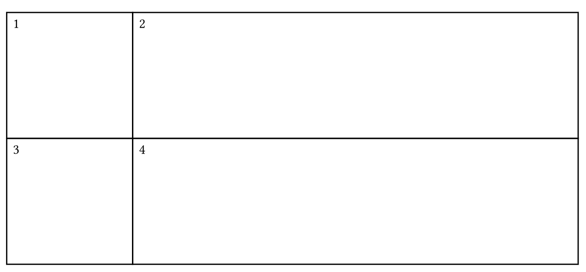

#### 设定间距

```
#set rect(
  width: 100%,
  height: 100pt
)

#grid(
  columns: (100pt,1fr),
  gutter: 5pt,           // 统一设置行列间距
  rect[1],
  rect[2],
  rect[3],
  rect[4]
)

```

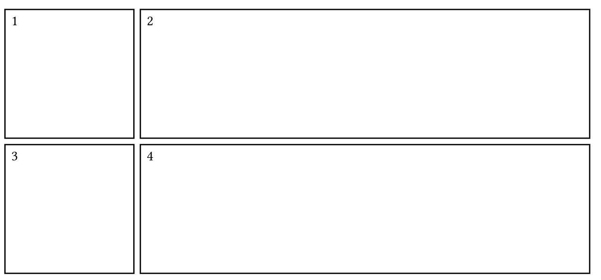

### 隐藏

```
hide(
    body: content    // 要隐藏的内容
) -> content

```

### 重复

```
repeat(
    body: content,  // 要重复的内容
    gap: length,    // body 的每个实例之间的间，默认：0pt
    justify: bool,  // 是否增加实例之间的间隙以完全填充可用空间。默认值：true
) -> content

```

```
 #repeat[.]

```

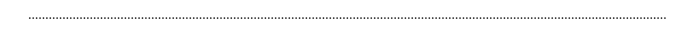

```
#repeat(gap:1em)[\#]

```

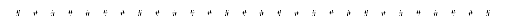

```
#repeat()[#emoji.flower]

```

#### 内容花边效果

```
#repeat()[#emoji.flower]
#lorem(225)
#repeat()[#emoji.flower]

```

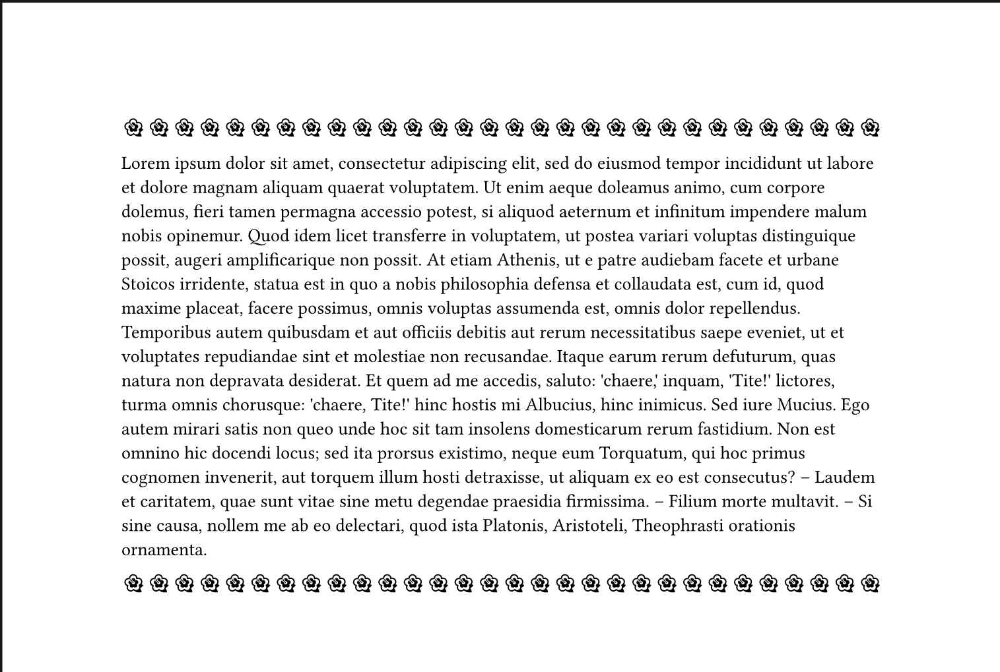

### 内容边距

```
pad(
    left: relative,   
    top: relative,
    right: relative,
    bottom: relative,
    x: relative,
    y: relative,
    rest: relative,
    content,
) -> content

```

```
#rect()[    // 外部矩形
  #pad(     
    left:100pt,     // 左侧边距100pt
    rect(           // 内部矩形
      width: 100%,
      height: 100pt,
      fill: rgb("#eee"),
      [左侧边距100pt]
    )
  )
]

```

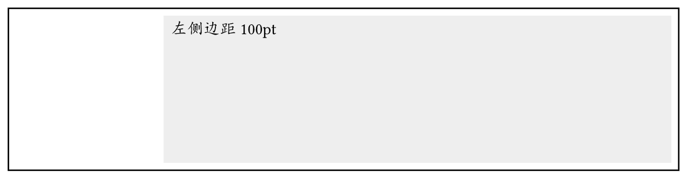

```
#rect()[    // 外部矩形
  #pad(     
    rest:100pt,     // 统一边距100pt
    rect(           // 内部矩形
      width: 100%,
      height: 100pt,
      fill: rgb("#eee"),
      [统一边距100pt]
    )
  )
]

```

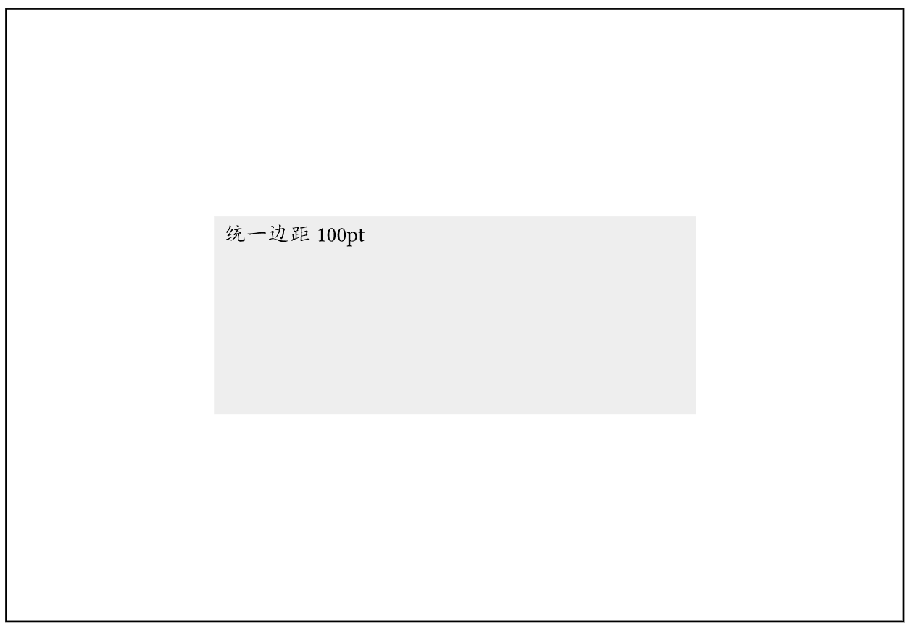

```
#rect()[    // 外部矩形
  #pad(     
    x:100pt,        // 左右边距100pt
    rect(           // 内部矩形
      width: 100%,
      height: 100pt,
      fill: rgb("#eee"),
      [左右边距100pt]
    )
  )
]

```

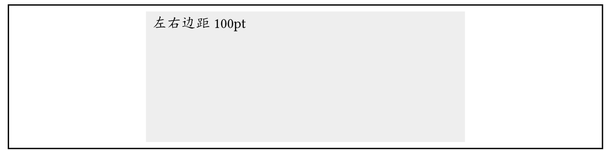
