# 【Typst】封面和内页设计函数库PageLib
### 概述

前天（6月26日）编写了一些Tytpst的页面函数，用于方便的创建诸如纯色背景页面、图片背景页面等的基本函数，并希望基于它们创建更复杂的封面和内页排版效果。

函数已经打包为了Typst模块`PageLib.typ`，具体使用时可以使用如下形式引入，并直接使用其中的函数。

```
#import "PageLib.typ":*  // 导入页面函数库

```

完整的模块代码见本文最后。

今天花点时间整理本文，补充了设计思路和具体的函数实现以及使用方法，对部分函数做了改进，希望对使用Typst排版内容的朋友们有点用处。

### 纯色背景页面函数

自定义函数如下：

```
#let color_page =  page.with(fill:white)

```
- `color_page()`被定义为内置页面函数`page()`的变种，设定其填充为纯白色。


使用：

可以直接使用`color_page()`：

```
#color_page()[]         // 一个纯白色背景的页面

```

可以用`fill`参数设定页面的背景色：

```
#color_page(fill:blue)[]  // 一个纯蓝色背景的页面

```

方括号中输入页面的具体内容即可。

说是纯色背景，其实使用渐变或纹理也是可以的。这里以渐变为例：

```
#color_page(fill:gradient.linear(..color.map.crest))[]

```


**使用with()的好处**

- 使用`with()`可以创建函数的变体，尤其基于已经存在的页面元素函数，可以更方便的构造函数的变体。
- 而且类似继承，你可以在新函数中继续使用原函数的所有参数，而不是自己重新写一遍这些参数


**使用bg_page()函数取代color_page()**

- 其实`color_page()`完全可以由`bg_page()`取代
- 但是为了介绍`with()`这种思路还是保留了下来


### 背景页面函数

这是今日新增页面函数，但是更突出设定背景内容和背景色。

```
// 背景页面
#let bg_page(
  bg_content,            // 背景内容
  fill:white,            // 背景颜色或渐变、纹理
  body                   // 页面正文
) =  page(
  background: [#bg_content],
  fill:fill,
)[#body]

```
- `bg_content`背景内容可以是任意内容
#### 基础使用

```
#bg_page(fill:red)[背景内容][页面内容]

```

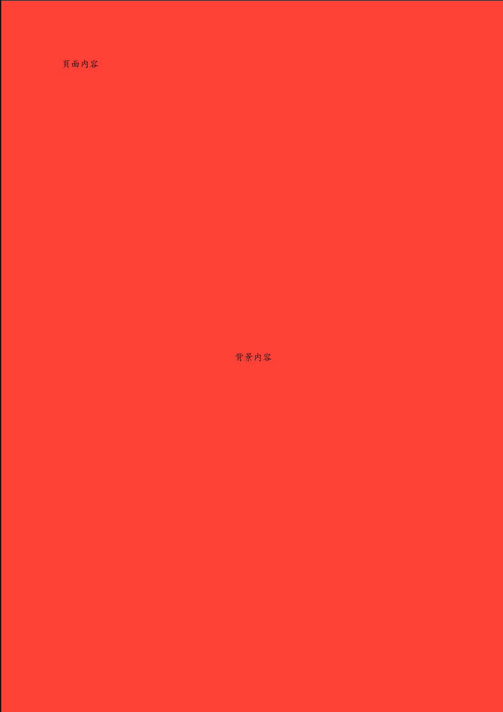

#### 背景水印效果

```
#bg_page(fill:blue.lighten(70%))[
  #set text(gray,size: 35pt)
  #rotate(30deg)[巽星石出品，盗版必究]
][
= 这里是页面正文
#lorem(255)

= 页面正文2
#lorem(255)
]

```

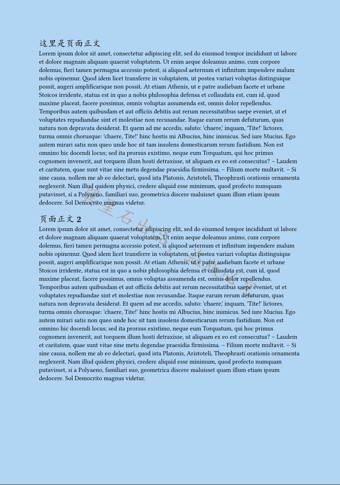

### 图片背景页面函数

图片背景页面函数`pic_page()`基于基于背景页面函数`bg_page()`，专门用于创建页面背景是图片的效果，并且提供对背景图片的变换（定位，旋转、缩放、尺寸等）的控制。
- `pic_page()`目前只支持一张背景图。
```
// 图片背景页面
#let pic_page(
  img_path,              // 图片路径
  fill:white,            // 背景颜色或渐变、纹理
  // ----------- 定位与变换 ----------- 
  pos:(0pt,0pt),         // 左上角位置
  size:(100%,100%),      // 尺寸
  angle:0deg,            // 旋转角度
  scales:(100%,100%),    // 缩放
  // ---------------------- 
  body                   // 页面正文
) =  bg_page(fill:fill,)[
      #place(top,dx:pos.at(0),dy:pos.at(1))[
        #rotate(angle)[
          #scale(x:scales.at(0),y:scales.at(1))[
            #image(img_path,width:size.at(0),height: size.at(1))
          ]
        ]
      ]
    ][#body]

```

#### 基础使用

默认背景图会自适应整个页面尺寸。

```
#pic_page("me.jpg")[这里是正文]

```


#### 控制背景图片的位置和尺寸

可以通过pos和size参数方便的控制背景图的尺寸和位置。

```
#pic_page("me.jpg",size: (100%,50%))[这里是正文]

```

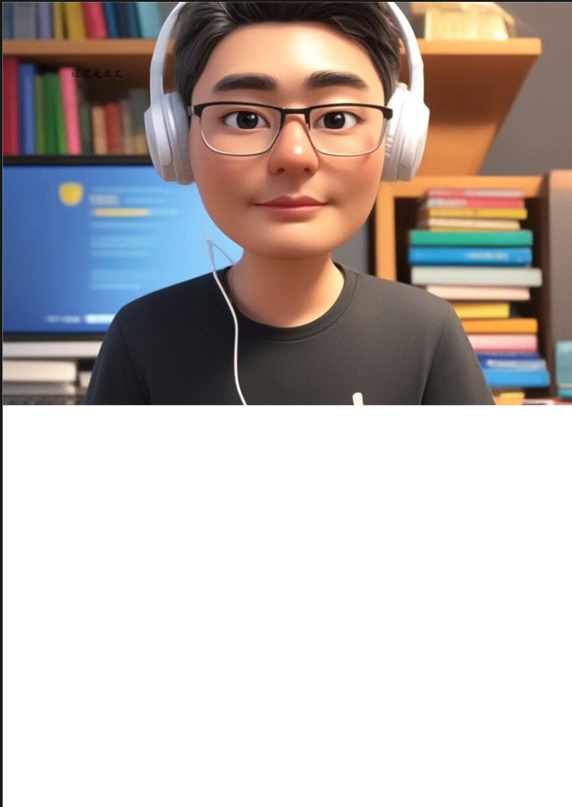

```
#pic_page("me.jpg",size: (100%-2cm,30%),pos:(1cm,1cm))[这里是正文]

```

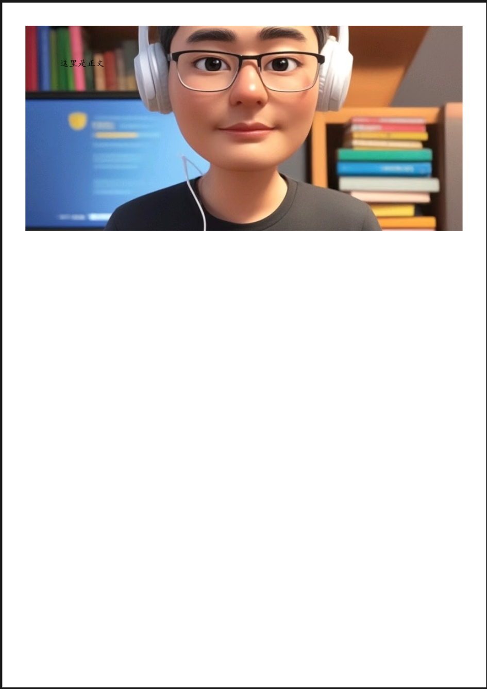

旋转也不在话下：

```
#pic_page("me.jpg",size: (100%-2cm,30%),pos:(1cm,2cm),angle: -4deg)[这里是正文]

```

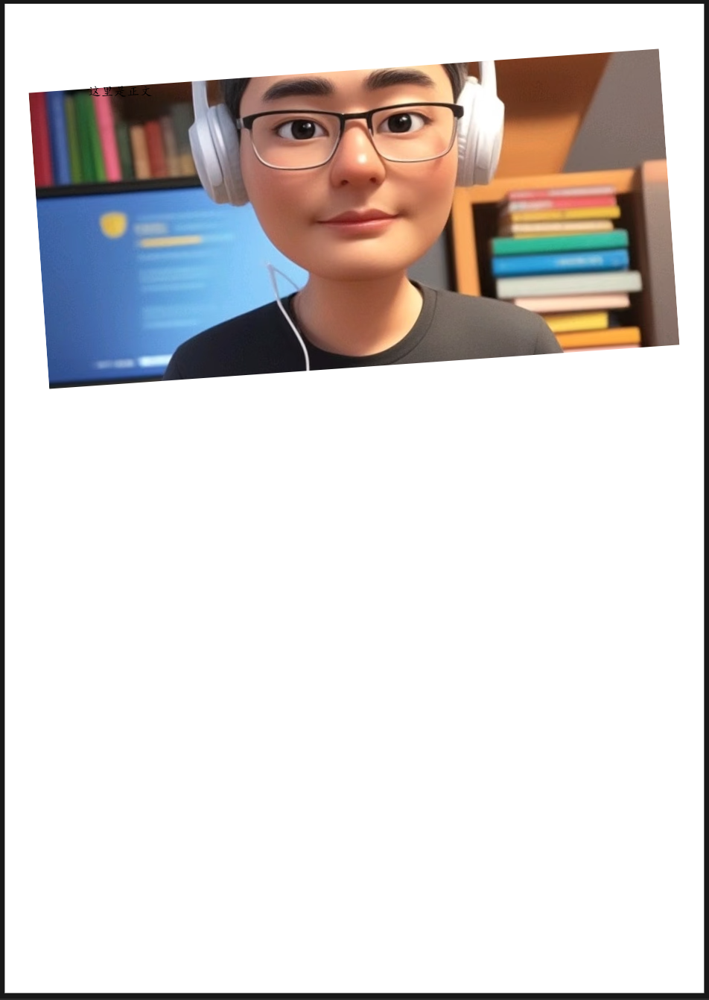

### 绝对定位内容函数

绝对定位内容函数，是对内置的定位函数`place()`、旋转函数`rotate()`以及缩放函数`scale()`的整体封装，实现对任意内容在当前页面中的绝对定位和变换。

```
// 绝对定位的内容
#let place_content(
  pos:(0pt,0pt),       // 左上角位置
  size:(auto,auto),    // 尺寸
  angle:0deg,          // 旋转角度
  scales:(100%,100%),  // 缩放
  body                 // 具体内容
) = [
  #place(top,dx:pos.at(0),dy:pos.at(1))[
    #rotate(angle)[#scale(x:scales.at(0),y:scales.at(1))[
        #body
      ]
    ]
  ]
]

```

#### 结合绝对定位内容的封面排版

这里只做简单演示，具体设计时封面元素可以更丰富。

```
#pic_page("me.jpg",size: (100%,32%))[
  #place_content(pos:(60%,20%))[
    #text(white,size: 36pt,font: "FZCuHeiSongS-B-GB")[绝对定位标题]
  ]
  #place_content(pos:(0% - 2cm,20%))[
    #image("me.jpg",width: 30%,height: 100%)
  ]
  #place_content(pos:(75%,20%+3cm))[
    #text(blue,size: 20pt,font: "FZCuHeiSongS-B-GB")[绝对定位副标题]
  ]
  #place_content(pos:(40%,100%))[
    #text(gray,size: 30pt,font: "FZCuHeiSongS-B-GB")[底部信息]
  ]
]

```

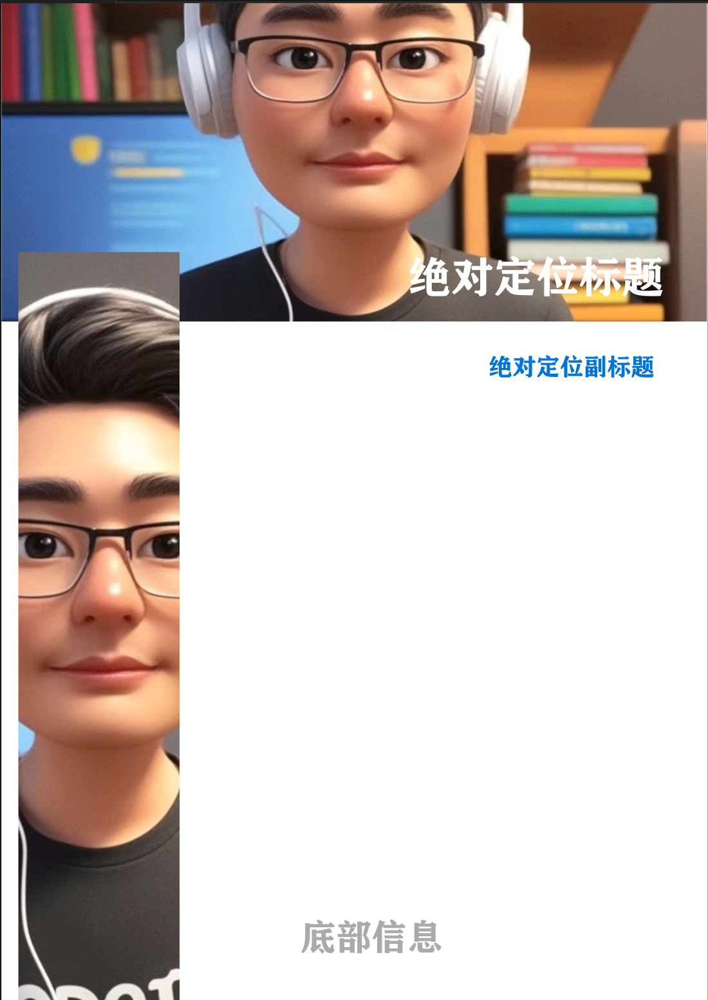

### 一些特殊背景页面函数

#### 正文区矩形框页面

```
// 正文区矩形框页面
#let rect_page(
  margin:2cm,                  // 页边距
  bg_fill:luma(220),         // 背景填充
  fill:white,                  // 矩形填充
  inset: 10pt,                 // 矩形内容边距
  radius: 5pt,                 // 矩形圆角
  // ----------- 阴影设置 ----------- 
  has_shadow:false,            // 是否有阴影
  shadow_offset:(5pt,5pt),     // 阴影偏移
  shadow_fill:luma(200),     // 阴影填充
  // ----------- 副矩形设置 -----------
  show_bg_rects:false,         // 是否显示副矩形
  bg_rects_count:1,            // 副矩形数量
  bg_rects_deg:2deg,           // 副矩形旋转角度
  bg_rects_start_deg:-4deg,           // 副矩形旋转角度
  bg_rects_fill:luma(200),   // 副矩形基础色
  // ----------- 其他自定义背景内容 -----------
  bg_contents:none,                 // 其他自定义背景内容
  // ---------------------- 
  body                         // 页面正文
) = bg_page(fill: bg_fill)[
  #let p = 100% - margin * 2  // 版心宽度和高度
  #let top_left = (margin+ shadow_offset.at(0),margin+ shadow_offset.at(1))
  // 版心副矩形
  #if show_bg_rects [
    #has_shadow = false  // 强制关闭阴影
    #for i in range(bg_rects_count) {
      let opt = eval("-" + str(i / bg_rects_count * 100) + "%")
      let ang = bg_rects_start_deg + bg_rects_deg * i
      place_content(pos:(margin,margin),angle:ang)[
        #rect(fill:bg_rects_fill.opacify(opt),width: p,height: p,radius: radius)
      ]
    } 
  ]
  // 其他自定义背景内容
  #if bg_contents != none [#bg_contents] 
  // 版心阴影
  #if has_shadow and show_bg_rects == false [
    #place_content(pos:top_left)[
      #rect(fill:shadow_fill,width: p,height: p,radius: radius)
    ]
  ]
  // 版心
  #place_content(pos:(margin,margin))[
    #rect(fill:fill,width: p,height: p, inset: inset,radius: radius)
  ]
][#body]

```

##### 基础效果

```
#rect_page()[
= 测试
#lorem(225)
= 测试
#lorem(225)
= 测试
#lorem(100)
]

```

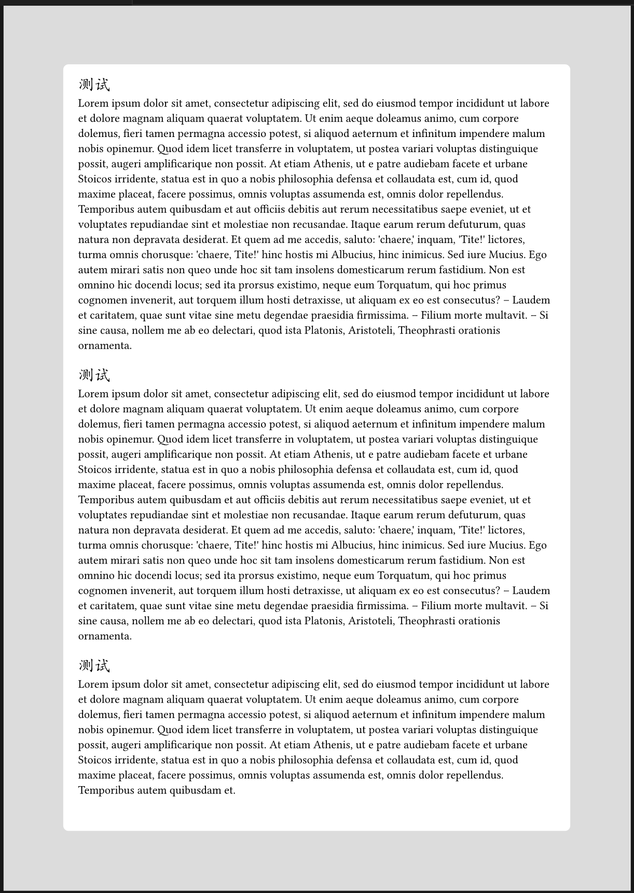

##### 背景和矩形填充控制

```
#rect_page(
  bg_fill:gradient.linear(..(red,blue)),   // 背景填充设定为渐变
  fill:orange.lighten(70%)                 // 矩形填充设定为浅橘红色
)[
= 测试
#lorem(225)
= 测试
#lorem(225)
= 测试
#lorem(100)
]

```

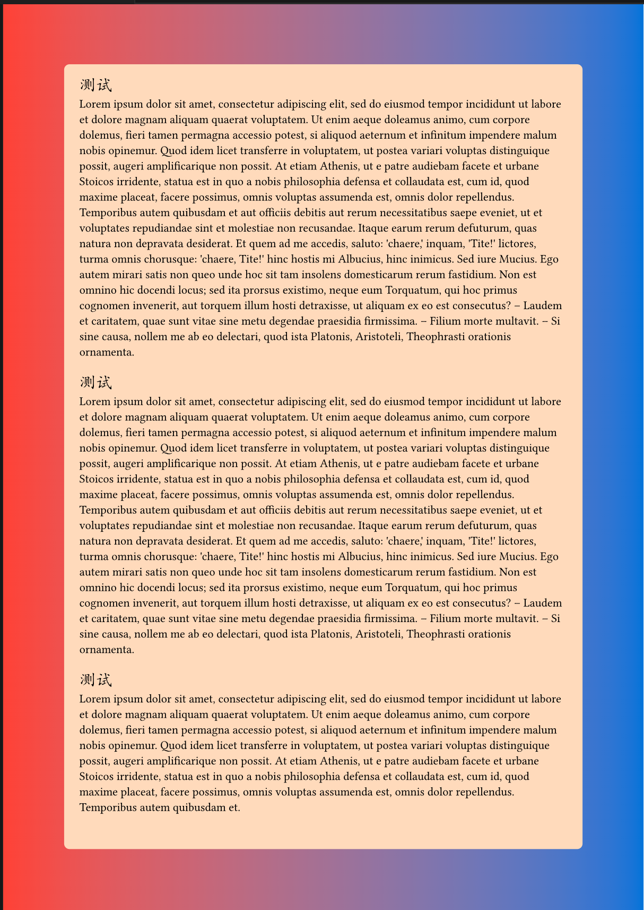

##### 设定阴影

```
#rect_page(
  bg_fill:gradient.linear(..(red,blue)),   // 背景填充设定为渐变
  fill:orange.lighten(70%),                // 矩形填充设定为浅橘红色
  has_shadow: true,                        // 开启阴影
  shadow_fill:orange.darken(70%),          // 设定阴影颜色
)[
= 测试
#lorem(225)
= 测试
#lorem(225)
= 测试
#lorem(100)
]

```

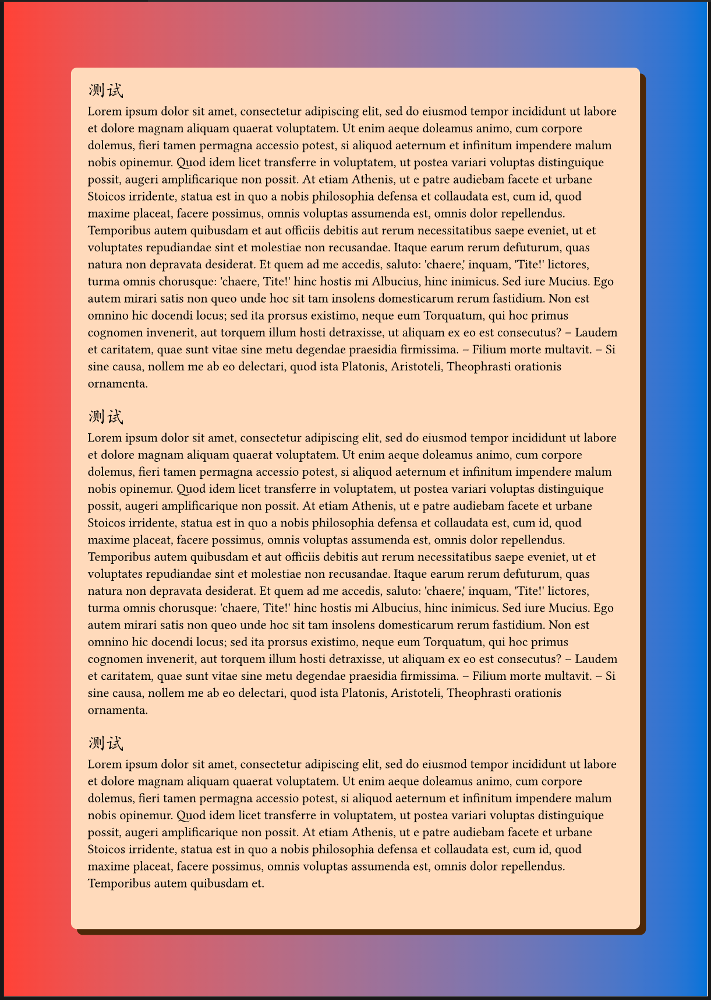

##### 开启副矩形

```
#rect_page(
  bg_fill:gradient.linear(..(red,blue)),   // 背景填充设定为渐变
  fill:orange.lighten(70%),                // 矩形填充设定为浅橘红色
  has_shadow: true,                        // 开启阴影
  shadow_fill:orange.darken(70%),          // 设定阴影颜色
  show_bg_rects: true,                     // 显示副矩形                  
  bg_rects_count: 5                        // 副矩形数量
)[
= 测试
#lorem(225)
= 测试
#lorem(225)
= 测试
#lorem(100)
]

```

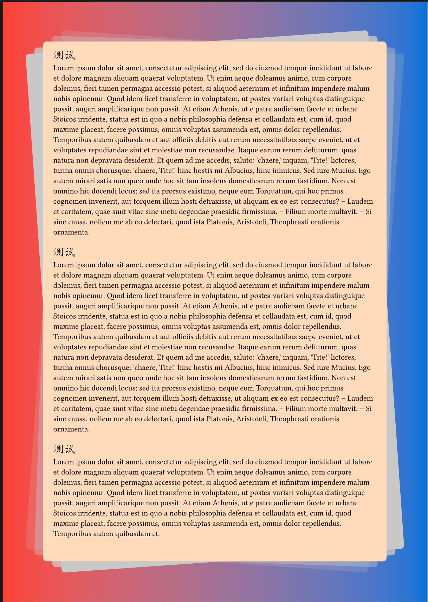


**提示：**

副矩形开启情况下会强制关闭阴影的绘制。


##### 绘制其他内容

包括绘制在主矩形之下，副矩形之前的`bg_contents`和绘制在主矩形之上的`fg_contents`。

```
#rect_page(
  bg_fill:gradient.linear(..(red,blue)),   // 背景填充设定为渐变
  fill:orange.lighten(70%),                // 矩形填充设定为浅橘红色
  has_shadow: true,                        // 开启阴影
  shadow_fill:orange.darken(70%),          // 设定阴影颜色
  show_bg_rects: true,                     // 显示副矩形                  
  bg_rects_count: 5,                       // 副矩形数量
  bg_contents: [
    #place(top,dx:-1cm,dy:2cm)[
        #circle(radius: 50pt,fill: white.opacify(-50%),stroke: none)
    ]
    #place(top,dx:70%,dy:-1cm)[
        #circle(radius: 100pt,fill: white.opacify(-50%),stroke: none)
    ]
    #place(top,dx:2cm,dy:2cm)[
      #rotate(2deg)[
        #rect(fill:white.opacify(-50%),width: 100% - 4cm,height: 100%- 4cm, inset: 10pt,radius: 10pt)
      ]
    ]
    
  ],
  fg_contents: [
    #place(top,dx:2cm,dy:2cm)[
      #rotate(0deg)[
        #rect(fill:white.opacify(-10%),width: 100% - 4cm,height: 100%- 4cm, inset: 10pt,radius: 10pt)
      ]
    ]
    #place(top,dx:1%,dy:70%)[
        #circle(radius: 40pt,fill:blue.opacify(-50%),stroke: none)
    ]
    #place(top,dx:70%,dy:70%)[
        #circle(radius: 100pt,fill: orange.opacify(-50%),stroke: none)
    ]
  ]
)[
= 测试
#lorem(225)
= 测试
#lorem(225)
= 测试
#lorem(100)
]

```

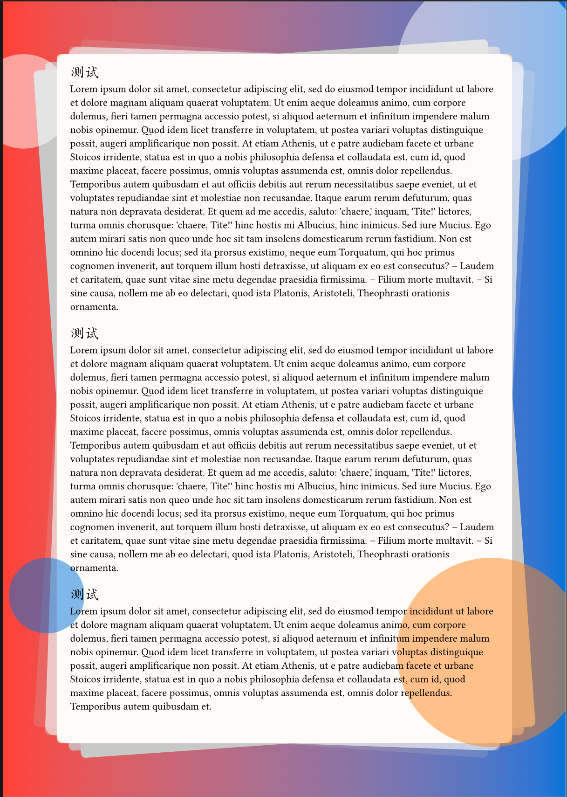

#### Mac风格背景页面

```
// Mac风格背景页面
#let mac_page(
  margin:2cm,                  // 背景页边距
  title_bar_height:20pt,       // 标题栏高度
  title_fill:gradient.linear(angle:-90deg,..(gray,gray.lighten(70%))), // 标题栏填充
  bg_fill:luma(220),         // 背景填充
  fill:gray.lighten(70%),      // 窗口填充
  border: gray,                // 窗口边线
  inset: 10pt,                 // 内容区内边距
  radius: 5pt,                 // 窗口圆角
  // ----------- 阴影设置 ----------- 
  has_shadow:false,            // 是否有阴影
  shadow_offset:(5pt,5pt),     // 阴影偏移
  shadow_fill:luma(200),     // 阴影填充
  // ----------- 其他自定义背景内容 -----------
  bg_contents:none,            // 其他自定义背景内容
  fg_contents:none,            // 其他自定义前景内容
  // ---------------------- 
  body                         // 页面正文  
) = page(
  fill: bg_fill,
  background: [
    #let w = 100% - margin * 2  // 版心宽度
    #let h = 100% - margin * 2 - title_bar_height  // 版心高度
    #let top_left = (margin+ shadow_offset.at(0),margin+ shadow_offset.at(1))
    // 其他自定义背景内容
    #if bg_contents != none [#bg_contents] 
    // 版心阴影
    #if has_shadow [
      #place_content(pos:top_left)[
        #rect(fill:shadow_fill,width: w,height: h,radius: radius)
      ]
    ]
    // 版心区域
    #place_content(pos:(margin,margin))[
      #let tile_rd = (top-left: radius,top-right: radius,rest: 0pt)  // 标题圆角
      // MAC窗口矩形
      #rect(width: w,height: h,inset:0pt,stroke: border,fill: fill,radius: radius)[
        // 标题区
        #rect(width:100%,height:title_bar_height,fill:title_fill,radius: tile_rd)[
          // 三个圆点
          #let r = title_bar_height/4.0
          #align(left)[
            #set circle(radius: r)
            #stack(dir: ltr,spacing: 5pt)[#align(horizon)[#circle(fill: red)]][#align(horizon)[#circle(fill: yellow)]][#align(horizon)[#circle(fill:green)]]
          ]
        ]
      ]
    ]
    // 其他自定义前景内容
    #if fg_contents != none [#fg_contents] 
  ],
  margin: (x:margin+inset,y:margin + title_bar_height +inset)
)[#body]

```

```
#mac_page()[
= 测试
#lorem(225)
= 测试
#lorem(225)
= 测试
#lorem(100)
]

```

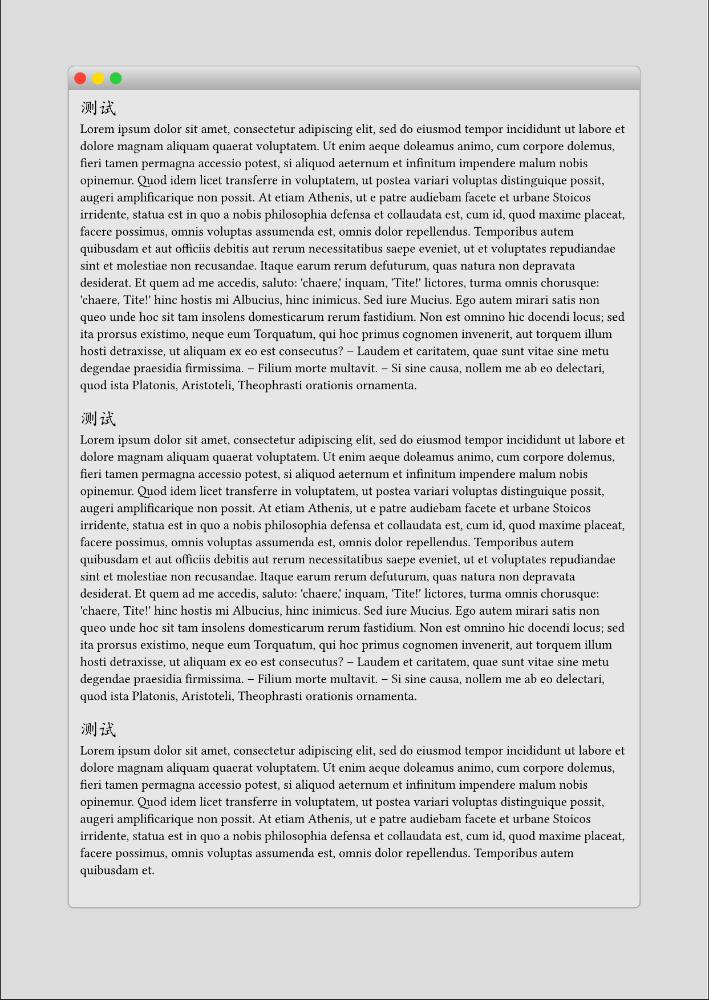

##### 开启阴影

```
#mac_page(has_shadow: true,bg_fill: blue,shadow_fill: blue.darken(70%))[
= 测试
#lorem(225)
= 测试
#lorem(225)
= 测试
#lorem(100)
]

```

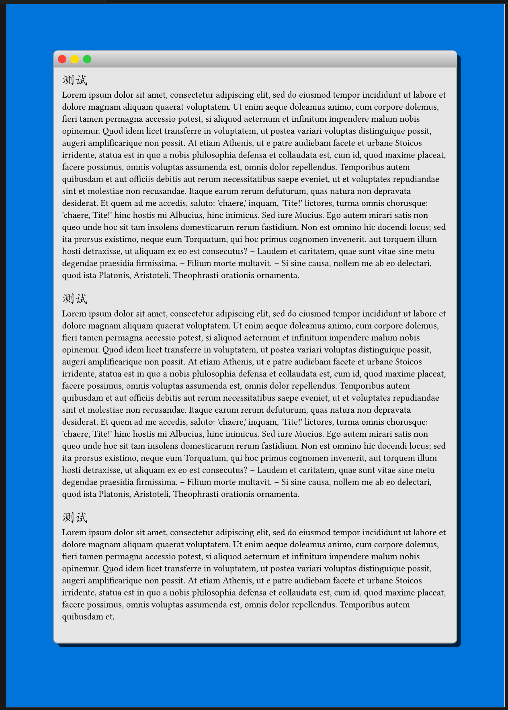

##### 标题区放大

```
#mac_page(
  has_shadow: true,
  bg_fill: blue,
  shadow_fill: blue.darken(70%),
  title_bar_height: 40pt
)[
= 测试
#lorem(225)
= 测试
#lorem(225)
= 测试
#lorem(100)
]

```

##### 综合效果

```
#mac_page(
  has_shadow: true,
  // bg_fill: blue,
  shadow_fill: blue.darken(70%),
  title_bar_height: 40pt,
  radius: 10pt,
  bg_contents: [
    #let base_color= gray
    #place_content(pos:(0pt,10%))[
      #circle(radius: 1cm,fill: base_color.lighten(40%))
    ]
    #place_content(pos:(100%-2cm,0%))[
      #circle(radius: 0.5cm,fill: base_color.lighten(20%))
    ]
    #place_content(pos:(0pt,10%))[
      #circle(radius: 20cm,fill: base_color.lighten(20%).opacify(-50%))
    ]
    #place_content(pos:(0pt,12%))[
      #circle(radius: 20cm,fill: base_color.lighten(20%).opacify(-50%))
    ]
    #place_content(pos:(0pt,13%))[
      #circle(radius: 20cm,fill: base_color.lighten(10%).opacify(-50%))
    ]
  ],
  fg_contents: [
  ]
)[
= 测试
#lorem(225)
= 测试
#lorem(225)
= 测试
#lorem(100)
]

```

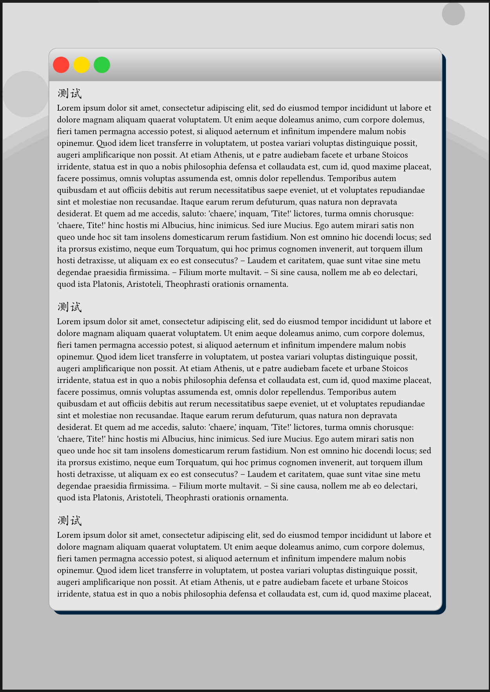

### 明信片

为了模仿明信片的效果，编写了一个函数。

```
// 明信片
#let post_card(pos:(0pt,0pt),size:(100%,20cm),angle:0deg,img_uri,title,sub_title) = place(top,dx:pos.at(0),dy:pos.at(1))[
    #rotate(angle)[
      #rect(fill:white,inset: 10pt,width: size.at(0)+20pt)[
        #set par(spacing: 6pt,linebreaks: "simple")
        #image(img_uri,width: size.at(0),height:size.at(1)) 
        #text(font: "FZCuHeiSongS-B-GB",size: 30pt)[#title]
        #text(font: "KaiTi",size: 20pt)[/#sub_title]
      ]
    ]
]

```

```
#color_page(fill:gradient.linear(angle:45deg,..(green.lighten(20%),blue.lighten(20%))))[
  #rotate(-2deg)[
    #post_card("face.jpg")[剪刀手爱德华][Edward Scissorhands]
  ]

]

```

```
#color_page(fill:gradient.linear(angle:45deg,..(green.lighten(20%),blue.lighten(20%))))[
  
  #post_card("kxgr.jpg",angle: 4deg,size:(300pt,400pt),pos: (100pt,250pt))[科学怪人1994][Mary Shelleys Frankenstein]
  #post_card("face.jpg",angle: -10deg,size:(300pt,200pt))[剪刀手爱德华][Edward Scissorhands]
]

```

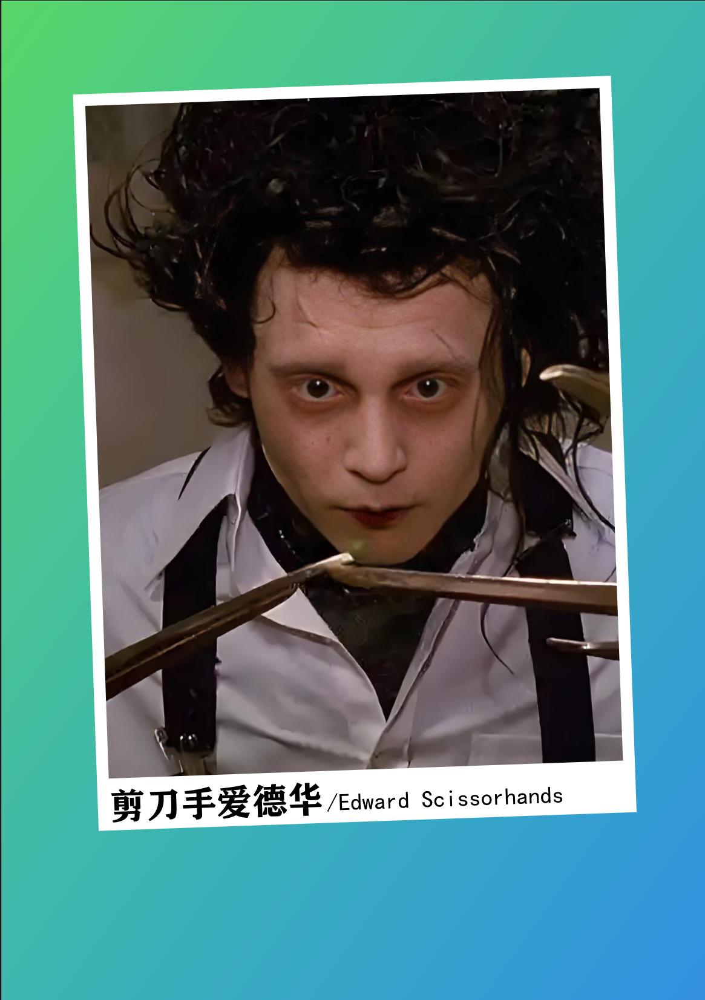
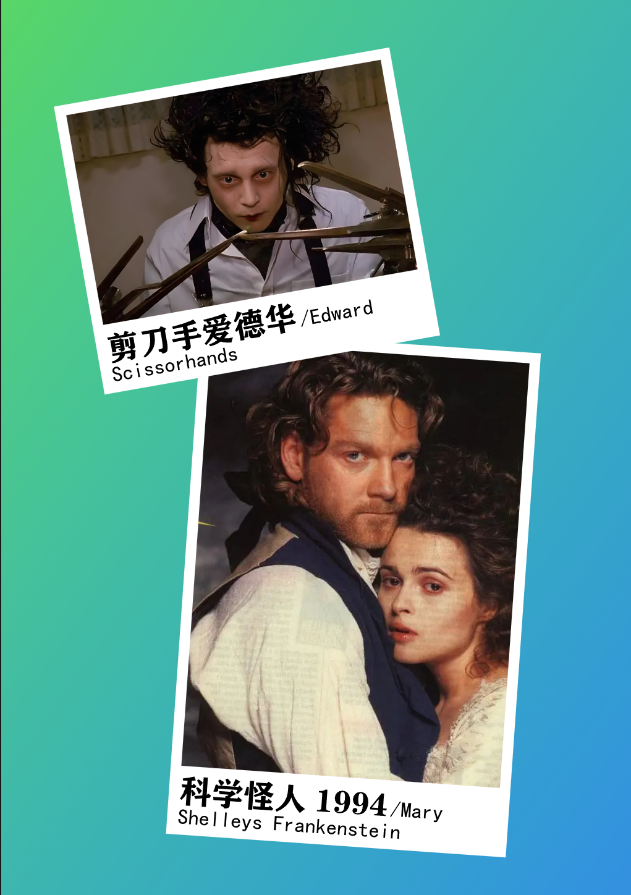

### 带透明渐变的单色渐变填充

```
// 带透明渐变的单色渐变填充(单向)
#let color_op_grad(base_color) = {
  let arr = ()
  arr.push(base_color.opacify(-60%))
  arr.push(base_color.opacify(-100%))
  return arr
}

// 带透明渐变的单色渐变填充(双面)
#let color_op_grad2(base_color) = {
  let arr = ()
  arr.push(base_color.opacify(-100%))
  arr.push(base_color.opacify(-60%))
  arr.push(base_color.opacify(-60%))
  arr.push(base_color.opacify(-100%))
  return arr
}

```

```
#color_page(fill:color.aqua)[
  #place_rect(pos:(0pt,200pt),fill:gradient.linear(..color_op_grad(white)))[
    #title(fill:blue)[这是一个绝对定位的标题]
  ]
  #place_rect(pos: (100%-150pt,500pt),fill:gradient.linear(..color_op_grad(white)))[
    #sub_title(fill:red)[巽星石]
  ]
]

```

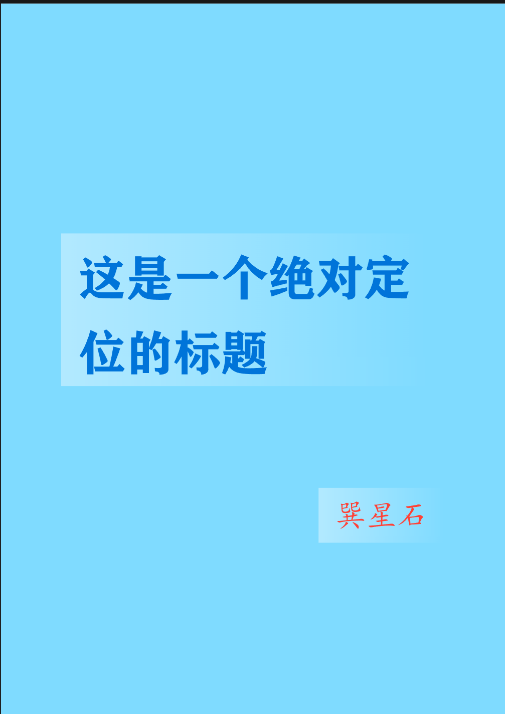
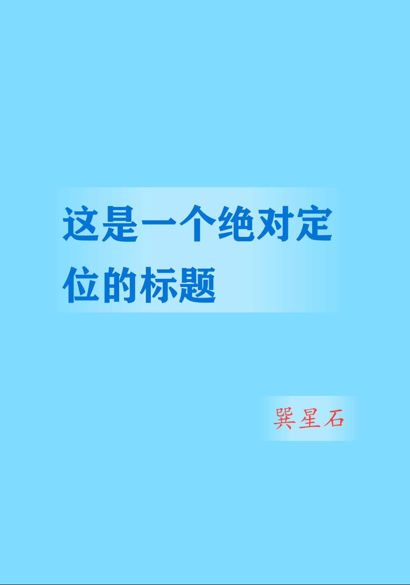

### 彩条线

```
// 彩条线
#let color_rect_line(colors,width:100%,height:4pt) = [
  #let w = width / colors.len()
  #stack(
    dir:ltr,
    ..colors.map(
      c => [
        #rect(fill:c,width:w,height:height)
      ]
    )
  )
]

```

```
#color_rect_line((red,blue,orange,green,aqua,yellow))

```

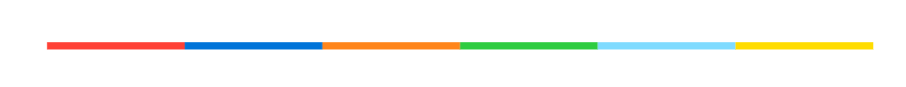
```
/*
* 名称：PageLib
* 描述：用于创建特殊封面或背景效果的自定义模块
* 作者：巽星石
* 创建时间：2025年6月26日
* 最后修改：2025年6月28日
*/ 

// -------------------------- 基础页面函数 --------------------------
// 纯色背景页面
#let color_page =  page.with(fill:white)

// 背景页面
#let bg_page(
  bg_content,            // 背景内容
  fill:white,            // 背景颜色或渐变、纹理
  body                   // 页面正文
) =  page(
  background: [#bg_content],
  fill:fill,
)[#body]

// 图片背景页面
#let pic_page(
  img_path,              // 图片路径
  fill:white,            // 背景颜色或渐变、纹理
  // ----------- 定位与变换 ----------- 
  pos:(0pt,0pt),         // 左上角位置
  size:(100%,100%),      // 尺寸
  angle:0deg,            // 旋转角度
  scales:(100%,100%),    // 缩放
  // ---------------------- 
  body                   // 页面正文
) =  bg_page(fill:fill,)[
      #place(top,dx:pos.at(0),dy:pos.at(1))[
        #rotate(angle)[
          #scale(x:scales.at(0),y:scales.at(1))[
            #image(img_path,width:size.at(0),height: size.at(1))
          ]
        ]
      ]
    ][#body]

// -------------------------- 基础绝对定位函数 --------------------------
// 绝对定位的内容
#let place_content(
  pos:(0pt,0pt),       // 左上角位置
  size:(auto,auto),    // 尺寸
  angle:0deg,          // 旋转角度
  scales:(100%,100%),  // 缩放
  body                 // 具体内容
) = [
  #place(top,dx:pos.at(0),dy:pos.at(1))[
    #rotate(angle)[#scale(x:scales.at(0),y:scales.at(1))[
        #body
      ]
    ]
  ]
]


// -------------------------- 具体背景页面函数 --------------------------
// 正文区矩形框页面
#let rect_page(
  margin:2cm,                  // 页边距
  bg_fill:luma(220),         // 背景填充
  fill:white,                  // 矩形填充
  inset: 10pt,                 // 矩形内容边距
  radius: 5pt,                 // 矩形圆角
  // ----------- 阴影设置 ----------- 
  has_shadow:false,            // 是否有阴影
  shadow_offset:(5pt,5pt),     // 阴影偏移
  shadow_fill:luma(200),     // 阴影填充
  // ----------- 副矩形设置 -----------
  show_bg_rects:false,         // 是否显示副矩形
  bg_rects_count:1,            // 副矩形数量
  bg_rects_deg:2deg,           // 副矩形旋转角度
  bg_rects_start_deg:-4deg,    // 副矩形旋转角度
  bg_rects_fill:luma(200),   // 副矩形基础色
  // ----------- 其他自定义背景内容 -----------
  bg_contents:none,            // 其他自定义背景内容
  fg_contents:none,            // 其他自定义前景内容
  // ---------------------- 
  body                         // 页面正文
) = bg_page(fill: bg_fill)[
  #let p = 100% - margin * 2  // 版心宽度和高度
  #let top_left = (margin+ shadow_offset.at(0),margin+ shadow_offset.at(1))
  // 版心副矩形
  #if show_bg_rects [
    #has_shadow = false  // 强制关闭阴影
    #for i in range(bg_rects_count) {
      let opt = eval("-" + str(i / bg_rects_count * 100) + "%")
      let ang = bg_rects_start_deg + bg_rects_deg * i
      place_content(pos:(margin,margin),angle:ang)[
        #rect(fill:bg_rects_fill.opacify(opt),width: p,height: p,radius: radius)
      ]
    } 
  ]
  // 其他自定义背景内容
  #if bg_contents != none [#bg_contents] 
  // 版心阴影
  #if has_shadow and show_bg_rects == false [
    #place_content(pos:top_left)[
      #rect(fill:shadow_fill,width: p,height: p,radius: radius)
    ]
  ]
  // 版心
  #place_content(pos:(margin,margin))[
    #rect(fill:fill,width: p,height: p, inset: inset,radius: radius)
  ]
  // 其他自定义前景内容
  #if fg_contents != none [#fg_contents] 
][#body]


// Mac风格背景页面
#let mac_page(
  margin:2cm,                  // 背景页边距
  title_bar_height:20pt,       // 标题栏高度
  title_fill:gradient.linear(angle:-90deg,..(gray,gray.lighten(70%))), // 标题栏填充
  bg_fill:luma(220),         // 背景填充
  fill:gray.lighten(70%),      // 窗口填充
  border: gray,                // 窗口边线
  inset: 10pt,                 // 内容区内边距
  radius: 5pt,                 // 窗口圆角
  // ----------- 阴影设置 ----------- 
  has_shadow:false,            // 是否有阴影
  shadow_offset:(5pt,5pt),     // 阴影偏移
  shadow_fill:luma(200),     // 阴影填充
  // ----------- 其他自定义背景内容 -----------
  bg_contents:none,            // 其他自定义背景内容
  fg_contents:none,            // 其他自定义前景内容
  // ---------------------- 
  body                         // 页面正文  
) = page(
  fill: bg_fill,
  background: [
    #let w = 100% - margin * 2  // 版心宽度
    #let h = 100% - margin * 2 - title_bar_height  // 版心高度
    #let top_left = (margin+ shadow_offset.at(0),margin+ shadow_offset.at(1))
    // 其他自定义背景内容
    #if bg_contents != none [#bg_contents] 
    // 版心阴影
    #if has_shadow [
      #place_content(pos:top_left)[
        #rect(fill:shadow_fill,width: w,height: h,radius: radius)
      ]
    ]
    // 版心区域
    #place_content(pos:(margin,margin))[
      #let tile_rd = (top-left: radius,top-right: radius,rest: 0pt)  // 标题圆角
      // MAC窗口矩形
      #rect(width: w,height: h,inset:0pt,stroke: border,fill: fill,radius: radius)[
        // 标题区
        #rect(width:100%,height:title_bar_height,fill:title_fill,radius: tile_rd)[
          // 三个圆点
          #let r = title_bar_height/4.0
          #align(left)[
            #set circle(radius: r)
            #stack(dir: ltr,spacing: 5pt)[#align(horizon)[#circle(fill: red)]][#align(horizon)[#circle(fill: yellow)]][#align(horizon)[#circle(fill:green)]]
          ]
        ]
      ]
    ]
    // 其他自定义前景内容
    #if fg_contents != none [#fg_contents] 
  ],
  margin: (x:margin+inset,y:margin + title_bar_height +inset)
)[#body]

// -------------------------- 其他函数 --------------------------
// 明信片
#let post_card(pos:(0pt,0pt),size:(100%,20cm),angle:0deg,img_uri,title,sub_title) = [
  #place(top,dx:pos.at(0),dy:pos.at(1))[
    #rotate(angle)[
      #rect(fill:white,inset: 10pt,width: size.at(0)+20pt)[
        #set par(spacing: 6pt,linebreaks: "simple")
        #image(img_uri,width: size.at(0),height:size.at(1)) 
        #text(font: "FZCuHeiSongS-B-GB",size: 30pt)[#title]
        #text(font: "KaiTi",size: 20pt)[/#sub_title]
      ]
    ]
  ]
]


// 带透明渐变的单色渐变填充(单向)
#let color_op_grad(base_color) = {
  let arr = ()
  arr.push(base_color.opacify(-60%))
  arr.push(base_color.opacify(-100%))
  return arr
}

// 带透明渐变的单色渐变填充(双面)
#let color_op_grad2(base_color) = {
  let arr = ()
  arr.push(base_color.opacify(-100%))
  arr.push(base_color.opacify(-60%))
  arr.push(base_color.opacify(-60%))
  arr.push(base_color.opacify(-100%))
  return arr
}

// 彩条线
#let color_rect_line(colors,width:100%,height:4pt) = [
  #let w = width / colors.len()
  #stack(
    dir:ltr,
    ..colors.map(
      c => [
        #rect(fill:c,width:w,height:height)
      ]
    )
  )
]

// 水平分割线
#let hr = line.with(length: 100%,stroke: luma(200))
// 水平分割线 - 虚线
#let dash_hr = line.with(
  length: 100%,
  stroke: (
    paint:luma(200),dash: "dashed"
  )
)

// 无序列表
#let rect_list(body) = rect(fill: luma(230),width: 100%,inset: 20pt,radius: 5pt)[
  #set list(marker: "👉")
  #body
]

```
