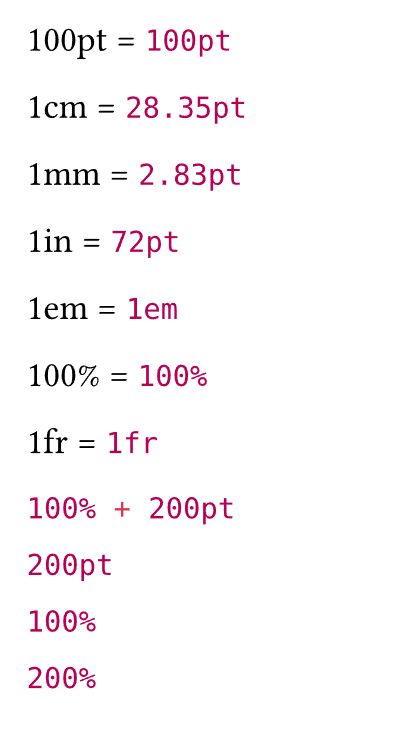
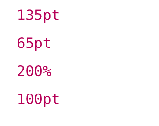
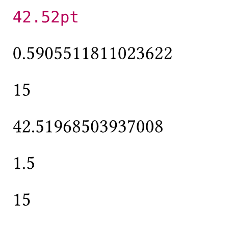
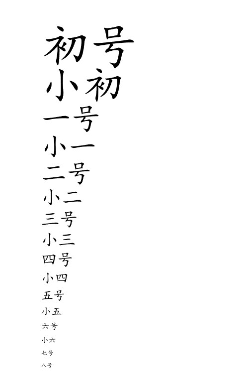

# Typst中的长度
### 长度、比例和相对长度以及分数
- 长度(length)：数字带长度单位的组合
- 比例(ratio)：数字带百分号
- 相对长度：比例和长度的组合
- 分数(fraction)：代表剩余空间中的份数
```
// 长度 - length
100pt = #100pt

1cm = #1cm

1mm = #1mm

1in = #1in

1em = #1em

// 比例 - ratio
100% = #100%

// 分数 - fraction
1fr = #1fr

// 相对长度, ratio和length的组合
#(100% + 200pt)

#(100% + 200pt).length // 获取其length部分

#(100% + 200pt).ratio  // 获取其ratio部分

```



```
#(1em+30pt).em     // 1，获取长度组合的em部分

#(1em+30pt).abs    // 30pt，获取长度组合的非em部分

#context {<!-- -->(1em+30pt).to-absolute()}     // 41pt,获取长度组合或相对长度的绝对长度，需要在context中使用

```

**缺憾**

目前貌似没有办法获取比例以及比例和长度的组合（相对长度）的绝对长度。
- `#context {(100%+30pt).to-absolute()}` 将会报错

- `#100%.to-absolute()`也会提示比例中不存在此方法

  

Typst 支持的长度单位：

|单位|中文名|说明|
|--|--|--|
|pt|点/磅|全称point，可叫做点，又叫"磅"：是一个物理长度单位，指的是72分之一英寸。|
|mm|毫米||
|cm|厘米||
|in|英寸|1in = 72pt|
|em||**em(相对长度单位，相对于当前对象内文本的字体尺寸)：**是一个相对长度单位，最初是指字母M的宽度，故名em。现指的是字符宽度的倍数，用法类似百分比，如：0.8em, 1.2em,2em等。通常1em=16px。|

### 长度的运算

长度可以进行加减乘除运算：

```
#(100pt + 35pt)

#(100pt - 35pt)

#(100% * 2)

#(200pt / 2)

```



### 单位换算

只要带长度单位的数字都是`length`类型，就可以使用`length`类型的函数构造和转换单位。

```
#1.5cm

#1.5cm.inches()

#1.5cm.mm()

#1.5cm.pt()

#length.cm(15mm)

#length.mm(1.5cm)

```



**注意**

可以看到`inches()`、`mm()`、`cm()`等传入的是`length`类型，返回的则是数字类型，数字和长度不是同一种东西。

### 字号

**字号：**是中文字库中特有的一种单位，以中文代号表示特定的磅值pt，便于记忆、表述。

Typst本身没有字号的说法，以下是字号的实际尺寸对照表：

|字号|pt|em|
|--|--|--|
|初号|42pt|3.5em|
|小初|36pt|3em|
|一号|26pt|2.2em|
|小一|24pt|2em|
|二号|22pt|1.8em|
|小二|18pt|1.5em|
|三号|16pt|1.4em|
|小三|15pt|1.3em|
|四号|14pt|1.2em|
|小四|12pt|1em|
|五号|10.5pt|0.875em|
|小五|9pt|0.75em|
|六号|7.5pt|0.625em|
|小六|6.5pt|0.5em|
|七号|5.5pt|0.4375em|
|八号|5pt|0.375em|

在Typst中实现字号：

```
#let fsize = (
  "初号":42pt,"小初":36pt,
  "一号":26pt,"小一":24pt,
  "二号":22pt,"小二":18pt,
  "三号":16pt,"小三":15pt,
  "四号":14pt,"小四":12pt,
  "五号":10.5pt,"小五":9pt,
  "六号":7.5pt,"小六":6.5pt,
  "七号":5.5pt,"八号":5pt,
)


#for (key,val) in fsize [
  #text(size: fsize.at(key))[#key] \
]

```


