# 07几何图形绘制
### 概述

Typst内置了一些简单的几何图形绘制函数，它们也是我们用来创建精美排版所必须掌握的内容。尤其是矩形函数rect()，几乎是排版必需品。

### 系列目录
- - - - - -
### 矩形rect()

```
rect(
    width: auto relative,              // 宽度，默认：auto
    height: auto relative,             // 高度，默认：auto
    fill: none color gradient pattern, // 填充，默认：none
    stroke: none auto length color gradient stroke pattern dictionary,  // 描边样式
    radius: relative dictionary,       // 圆角半径
    inset: relative dictionary,        // 内边距
    outset: relative dictionary,       // 外边距
    body: none content,                // 内容
) -> content

```

#### 默认绘制

```
#rect()

```

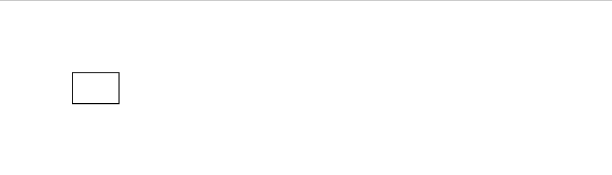

#### 内容

可以在矩形中放置任意文字或内容，因此`rect()`不是一个简单的绘图函数，而是结合内容排版的。

```
#rect[]

#rect[123]

#rect[这里是内容]

#rect(width:100%)[这里是内容]

#rect[
    任意内容
    #image("1.png")
]

```


#### 块级

`rect()`绘制的矩形是一个块级元素。

```
前面的文字，#rect[这里是内容]后面的文字。

```

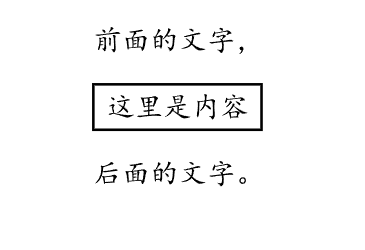

#### 综合效果

```
#rect(
    width:100%,
    height: 30%,
    fill: luma(220),
    radius: 5pt,    // 圆角
    inset: 10pt,    // 内容边距
    outset: 10pt,   // 向外扩展
    stroke: 1pt +red 
)[这里是内容]

```

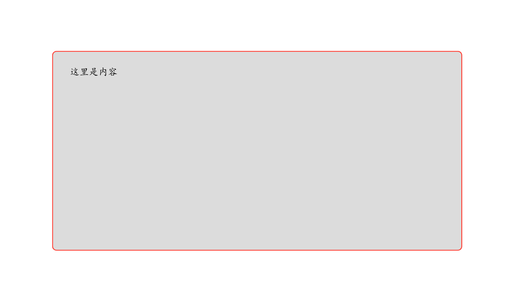

#### stroke的字典形式

```
stroke:(
    top：     // 顶部描边
    right：   // 右侧描边
    bottom：  // 底部描边
    left：    // 左侧描边
    x：       // 水平描边
    y：       // 垂直描边
    rest：除字典明确设置大小的边外的所有边的笔画。
)

```

另外还可以使用2pt+blue这样的形式。

#### radius的字典形式

```
radius(
    top-left：    // 左上角半径
    top-right：   // 右上角的半径
    bottom-right：// 右下角半径
    bottom-left： // 左下角半径
    left：        // 左上角和左下角半径
    top：         // 左上角和右上角的半径
    right：       // 右上角和右下角的半径
    bottom：      // 左下角和右下角半径
    rest：        // 除字典明确设置大小的角之外的所有角的半径
)

```

### 正方形square(）

```
square(
    size: auto length,             // 边长
    width: auto relative,          // 宽度
    height: auto relative,         // 高度
    fill: none colorg radientpattern,   // 填充
    stroke: none auto length color gradient stroke pattern dictionary, // 边线样式
    radius: relative dictionary,   // 圆角半径
    inset: relative dictionary,    // 内容边距
    outset: relativ edictionary,   // 向外扩充距离
    body: none content,            // 内容
) -> content

```
- `size`和`width`、`height`指定一个即可
- `size`和`width`或`height`不能同时指定，`width`和`height`可以同时指定- `width`和`height`同时指定时，谁大谁做边长
- 其他与`rect()`类似
```
#square()

#square[123]

#square(width: 100pt)[
    #place(center+horizon)[123]  // 居中内容
]

```

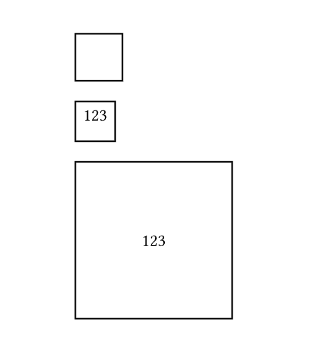

### 圆circle(）

```
circle(
    radius: length,        // 半径
    width: auto relative,  // 宽度
    height: auto relative, // 高度
    fill: none color gradient pattern,   // 填充
    stroke: none auto length color gradient stroke pattern dictionary,  // 边线样式
    inset: relative dictionary,   // 内容边距
    outset: relative dictionary,  // 向外扩展距离
    body: none content,    // 内容
) -> content

```
- 与正方形之于矩形类似，`circle()`也只能绘制圆而不能绘制椭圆。想要绘制椭圆，需使用`ellipse()`函数。
- `radius`和`width/height`，不能同时指定
```
#circle()

#circle[123]

#circle(width:2cm,fill: orange,stroke: 1pt)[
    #place(center+horizon)[123]
]

```

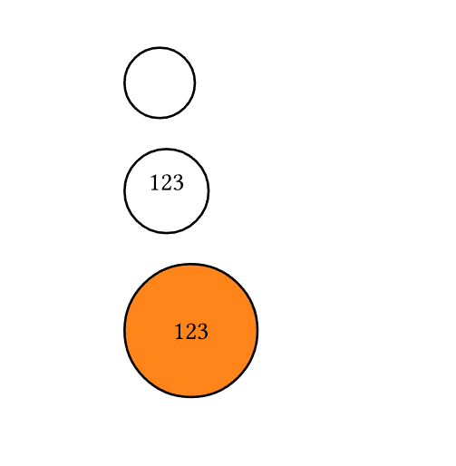

### 椭圆ellipse(）

```
ellipse(
    width: auto relative,      // 宽度
    height: auto relative,     // 高度
    fill: none color gradient pattern,   // 填充
    stroke: none auto length color gradient stroke pattern dictionary,  // 边线
    inset: relative dictionary,  // 内边距
    outset: relative dictionary, // 向外扩充距离
    body: none content,          // 内容
) -> content

```

```
#ellipse()

#ellipse[]

#ellipse[123]

#ellipse(width: 2cm,height: 1.5cm)[
    #place(center+horizon)[123]
]

```

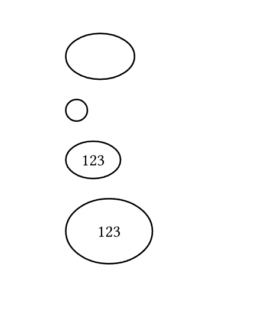

### 直线段line(）

```
line(
    start: array,       // 线段起点，默认：(0pt, 0pt)
    end: none array,    // 线段终点，默认：none
    length: relative,   // 线段长度，仅当end为none时，才会考虑此参数
    angle: angle,       // 末端点指向的方向，仅当end为none时，才会考虑此参数
    stroke: length colorg radient stroke pattern dictionary,
) -> content

```

```
#line()

#line(length: 100%)

#line(angle: 90deg)

#line(end: (100pt,100pt),stroke: 1pt+red)

#line(end: (100pt,100pt),stroke:(dash: "dashed"))

```

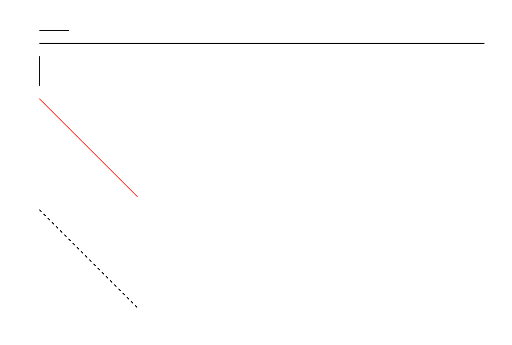

### 路径path(）

`path()`可以通过指定顶点列表绘制简单的折线、多边形或贝塞尔曲线。

```
path(
    fill: none color gradient pattern,  // 填充
    stroke: none autolength colorg radient stroke pattern dictionary,  // 描边样式
    closed: bool,                       // 是否闭合路径
    vertices:array,                     // 顶点列表
) -> content

```

每个顶点可以通过 3 种方式定义：
- 一个常规点
- 一个包含两个点的数组，第一个点是顶点，第二个点是控制点。控制点相对于顶点表示，并进行镜像以获得第二个控制点。给定的控制点是影响**进入**此顶点的曲线的控制点（即使对于第一个点也是如此）。镜像的控制点会影响从此顶点流出的曲线。
- 三个点的数组，第一个是顶点，第二个是控制点（分别是传入和传出的曲线的控制点）。
```
#path(
    closed: true,
    (100pt,100pt),
    (200pt,200pt),
    (100pt,200pt),
)

```

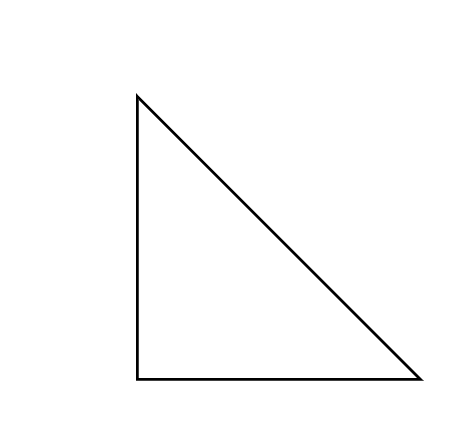

### 曲线curve()

`curve()`是新版本中替代`path()`的函数。

```
let curve(
    ..components: content,
    fill: color = none,   // 填充
    fill-rule: str = "non-zero",   // 填充规则
    stroke: stroke = auto,  // 边线样式
);

```

```
#curve(
    fill: blue.lighten(80%),
    stroke: blue,
    curve.move((0pt, 50pt)),
    curve.line((100pt, 50pt)),
    curve.cubic(none, (90pt, 0pt), (50pt, 0pt)),
    curve.close(),
)

```

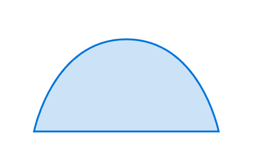

### 多边形polygon(）

```
polygon(
    fill: none color gradient pattern,
    stroke: none auto length color gradient stroke pattern dictionary,
    vertices:array,    // 顶点列表
) -> content

```

### 样式相关函数

#### stroke(）

```
stroke(
    paint: auto color gradient pattern,  // 描边样式
    thickness: auto length,              // 描边粗细
    cap: auto str,                       // 描边末端的渲染方式
    join: auto str,                      // 拐角渲染方式
    dash: none auto str array dictionary,  // 虚线样式
    miter-limit: auto float,               // 
) -> stroke

```

cap值指定端点样式：

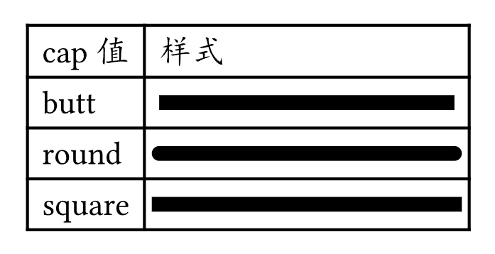

join值，指定拐点样式：

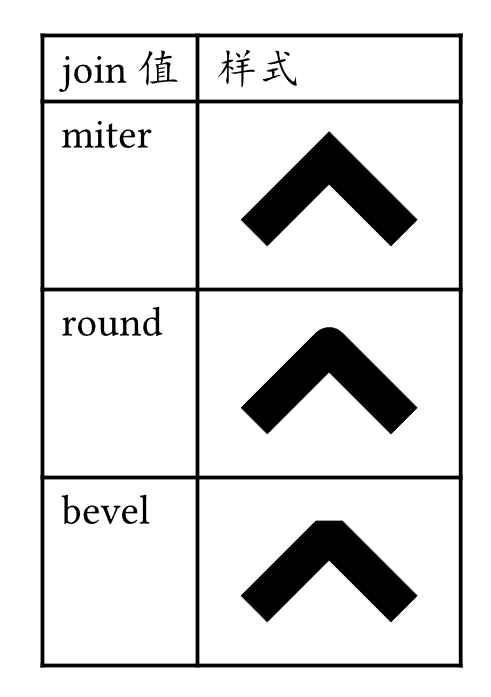

dash值，指定虚线样式：

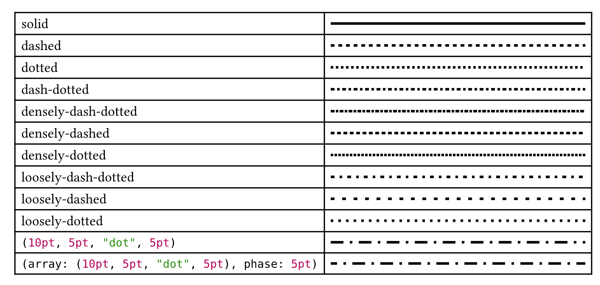

|值|描述|
|---|---|
|dash: (10pt,5pt,“dot”,5pt)|定义了“虚线长度10pt，间隔5pt，绘制点，间隔5pt”的模式，用于虚线的重复样式。字符串 `"dot"` 表示一个点。|
|dash: (array:(10pt,5pt,“dot”,5pt),phase: 5pt))|一个字典：+ `array`指定和上述类似的数组+ `phase`指定开始绘制的位置|

### 颜色

```
// ----------- 使用内置颜色名称 ---------------
color.green                   // 颜色名称

// ----------- 灰度色 ---------------
color.luma(100)      // 指定亮度的灰色 0~255

// ----------- 各种颜色空间颜色构造 ---------------
color.rgb(255,45,255,100)     // RGBA
color.rgb("#ccc")             // 十六进制颜色字符串
color.linear-rgb(200,200,200,200)
color.hsl(100deg, 100, 100, 100)
color.hsv(90deg,100,100,100)
color.oklab()
color.oklch()
color.cmyk()

```

#### 内置颜色名称

Typst 内置了一些颜色，可以直接通过其名称使用。

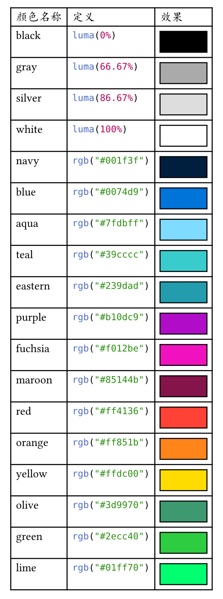

```
#rect(fill:red)
#rect(fill:blue)
#rect(fill:green)

```


#### 灰度色luma()

`luma()`用于构造灰度色：

```
color.luma(
    lightness: int ratio,   // 亮度,0~255之间的整数，或者0%~100%之间的比例
    alpha: ratio,           // Alpha分量。
    color,                  // 要转换为灰度的颜色。
) -> color

```

```
#rect(fill:luma(200))
#rect(fill:luma(90%))

```


#### RGB颜色构造

```
#rect(fill:rgb(255,45,255,100))     // RGBA
#rect(fill:rgb("#ccc"))             // 十六进制颜色值

```


#### 其他颜色空间函数

除了RGB之外，Typst还支持其他颜色空间的函数。可以自行实验。

```
color.linear-rgb(200,200,200,200)
color.hsl(100deg, 100, 100, 100)
color.hsv(90deg,100,100,100)
color.oklab()
color.oklch()
color.cmyk()

```

#### 预定义的颜色映射表

Typst 内置许多可用于渐变的预设颜色映射。

可以使用如下形式指定：

```
fill:gradient.linear(..color.map.xxx))

```

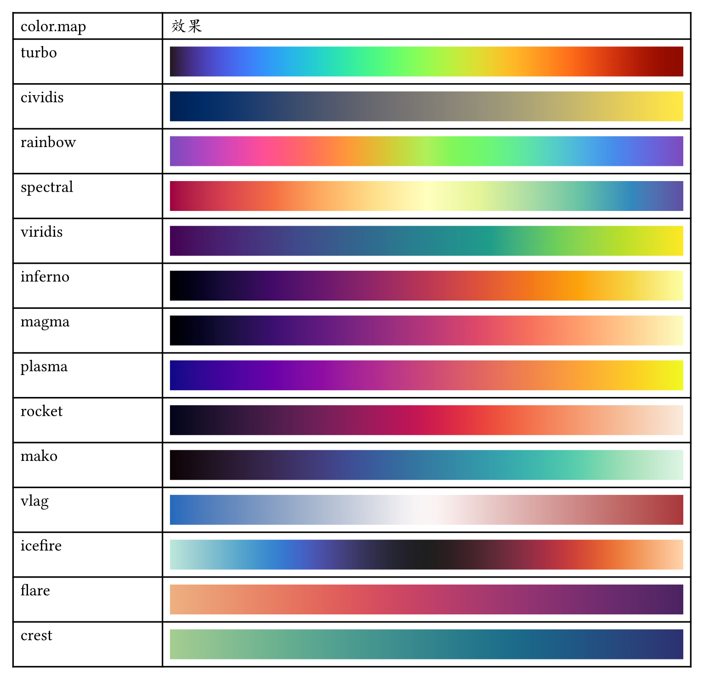

#### 颜色函数

color类型或者叫模块，提供了诸多方法，也可以通俗的叫做“颜色函数”。来实现一些颜色相关的操作。

##### components

components()用于获取颜色分量组成的数组。

```
components(
    alpha:bool  // 是否包含 Alpha 分量。
) -> array

```

```
#rgb(100,100,100).components()  // (39.22%,39.22%,39.22%,100%)
#rgb("#ccc").components()       // (80%,80%,80%,100%)

```

##### **space**

space()获取颜色值的构造函数名。

```
#let color = cmyk(1%, 2%, 3%, 4%)
#(color.space())   // cmyk

```

##### to-hex

返回颜色的 RGB（A） 十六进制表示形式（如 `#ffaa32` 或 `#020304fe`）。如果 alpha 分量等于 `ff` （255 / 100%），则省略 alpha 分量（`#020304fe` 中的最后两位数字）。

```
#rgb(100,100,100).to-hex()  // #646464
#blue.to-hex()              // #00749

```

##### lighten和darken

`lighten()`和`darken()`用于获得已有颜色的更量或更暗的版本。

```
blue.lighten(x%)   // 获取更亮的蓝色
blue.darken(x%)    // 获取更暗的蓝色

```

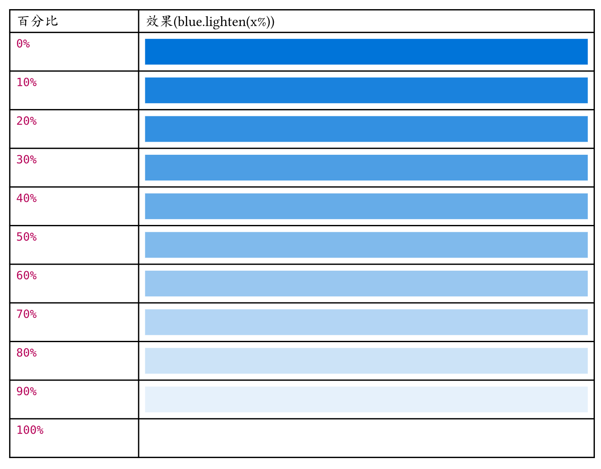

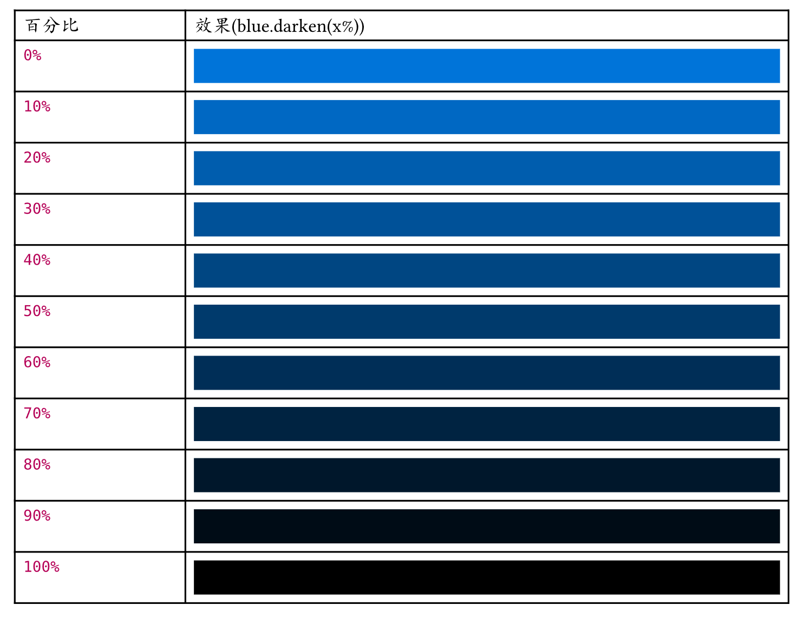

##### saturate和desaturate

增加或减少饱和度。

```
blue.desaturate(x%)

```


##### negate

使用提供的色彩空间生成互补色。您可以将其视为色轮上的另一侧。

```
self.negate(space:any) -> color

```

##### rotate

将颜色的色相旋转给定的角度。

```
self.rotate(
angle,
space: any,
) -> color

```

##### mix

通过混合两种或多种颜色来创建颜色。

在具有色相分量（hsl、hsv、oklch）的色彩空间中，一次只能混合两种颜色。在这样的空间中混合两种以上的颜色将导致错误！

```
color.mix(
..colorarray,
space: any,
) -> color

```

实现类似两种颜色之间插值的效果：

```
color.mix(
    (blue,10% * i),
    (red,100% - 10% * i),
)

```

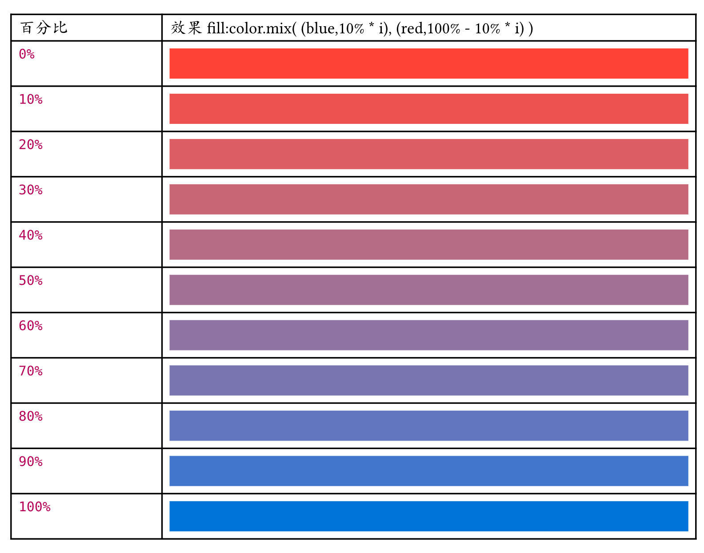

##### transparentize和opacify
- `transparentize()`设定颜色的透明度
- `opacify()`设定颜色的不透明度


### 渐变

包括线性渐变、径向渐变和锥形渐变。

```
#square(fill: gradient.linear(..color.map.rainbow))   \\ 线性渐变
#square(fill: gradient.radial(..color.map.rainbow))   \\ 径向渐变
#square(fill: gradient.conic(..color.map.rainbow))    \\ 锥形渐变

```

#### 线性渐变

```
gradient.linear(
    stops: color array,    // 停止点
    space: any,            // 要在其中对渐变进行插值的色彩空,默认为oklab
    relative: auto str,    // 渐变的相对位置
    dir: direction,        // 渐变方向
    angle: angle,          // 渐变角度
) -> gradient

```

##### 双色线性渐变

```
#set rect(width:100%,height: 100pt)

#let gds = (
    gradient.linear(red,blue),   // 最简单的用法，指定两个颜色
    gradient.linear(red,blue,angle:45deg),   // 渐变角度45°
    gradient.linear(red,blue,dir:ttb),       // 渐变方向上到下
)

#for gd in gds [
    #gd
    #rect(fill:gd)
]

```

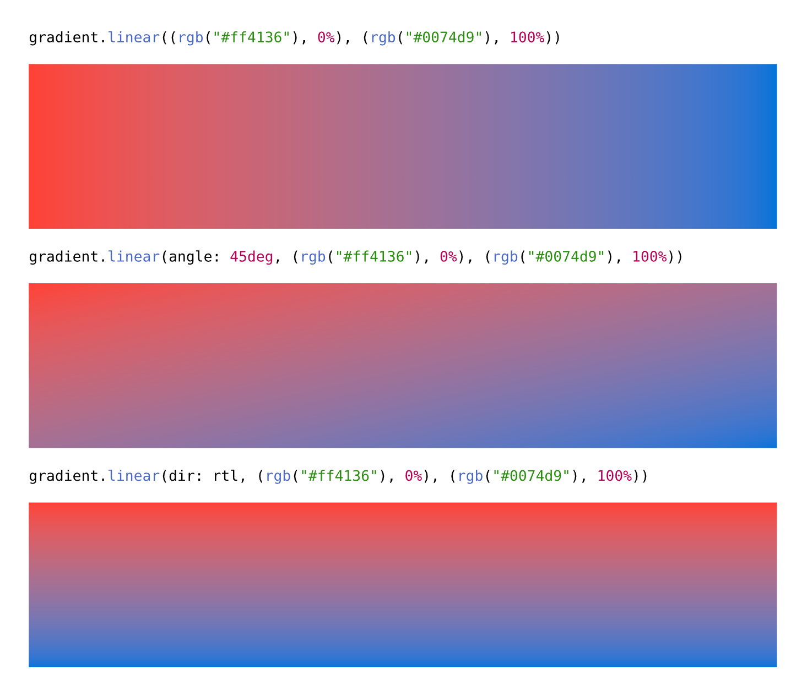

#### 径向渐变

```
gradient.radial(
    colorarray,
    space: any,
    relative: autostr,
    center: array,
    radius: ratio,
    focal-center: autoarray,
    focal-radius: ratio,
) -> gradient

```

#### 锥形渐变

```
gradient.conic(
    colorarray,
    angle: angle,
    space: any,
    relative: autostr,
    center: array,
) -> gradient

```

渐变可用于以下目的：
- 作为填充来绘制形状的内部： `rect(fill: gradient.linear(..))`
- 作为描边来绘制形状的轮廓： `rect(stroke: 1pt + gradient.linear(..))`
- 作为文本的填充： `set text(fill: gradient.linear(..))`
- 作为色图，您可以从以下位置取样： `gradient.linear(..).sample(0.5)`
### 纹理

旧版本叫`pattern`，新版版叫`tiling`。

```
tiling(
    size: auto array,   // 尺寸
    spacing: array,     // 间距
    relative: auto str,
    body: content,      // 纹理要平铺的内容
) -> pattern

```

```
#let pat = tiling(size: (30pt, 30pt))[
  #rect(width: 30pt,height: 30pt)
]

#rect(fill: pat, width: 100%, height: 120pt, stroke: 1pt)

```

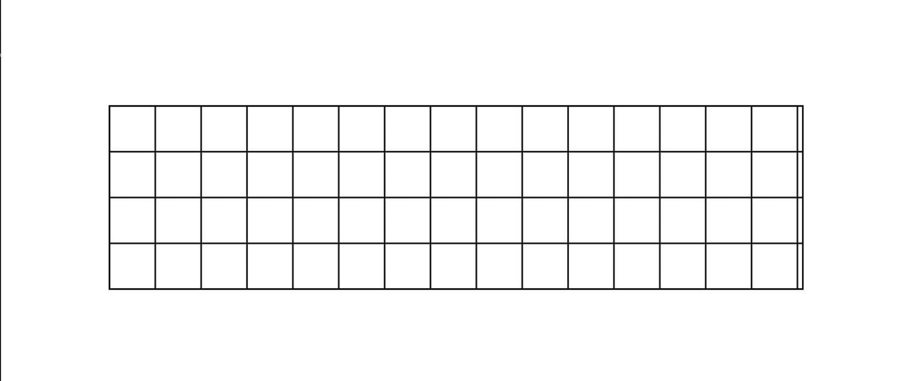

```
#let pat = tiling(size: (30pt, 30pt))[
    #place(line(start: (0%, 0%), end: (100%, 100%)))
    #place(line(start: (0%, 100%), end: (100%, 0%)))
]

#box(fill: pat,width:30pt,height: 30pt)

#rect(fill: pat, width: 100%, height: 120pt, stroke: 1pt)

```

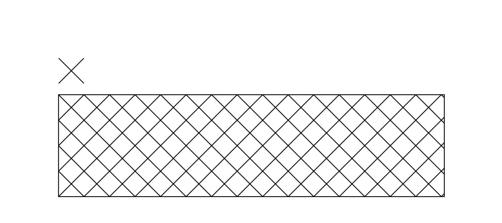

```
#let pat = tiling(size: (30pt, 30pt))[
    #line()
]
#rect(fill: pat, width: 100%, height: 120pt, stroke: 1pt)

```

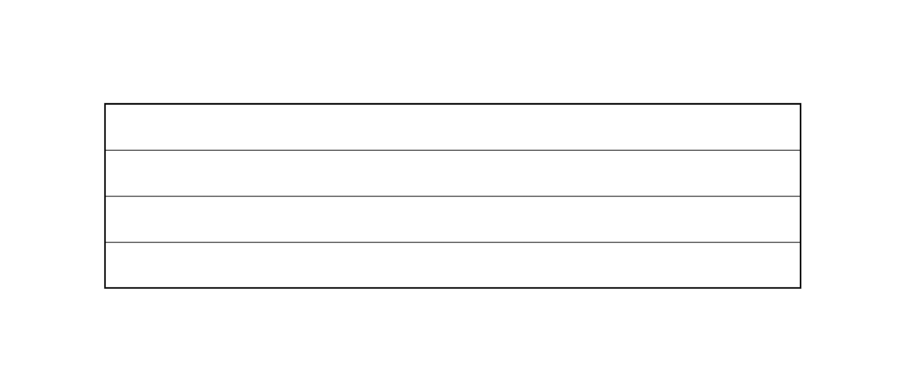

```
#let pat = tiling(size: (10pt, 10pt))[
    #place( line())
    #place( line(angle: 90deg))

]
#rect(fill: pat, width: 100%, height: 120pt, stroke: 1pt)

```

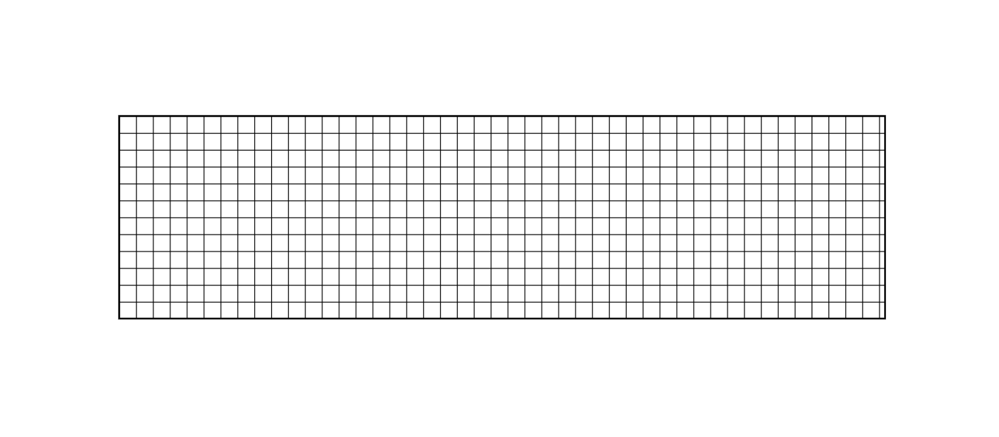

```
#let pat = tiling(size: (30pt, 30pt))[
    #set rect(width: 50%,height: 50%,fill: red)
    #place()[#rect(width: 50%,height: 50%)]
    #place(dx:15pt,dy:15pt)[#rect()]
]

#box(fill: pat,width:30pt,height: 30pt)

#rect(fill: pat, width: 100%, height: 120pt, stroke: 1pt)

```

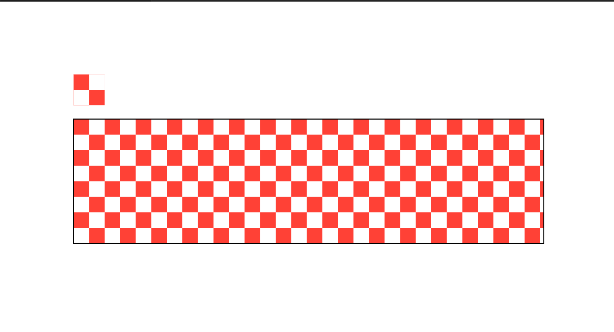

