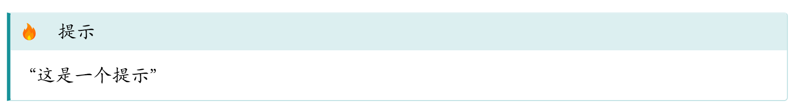
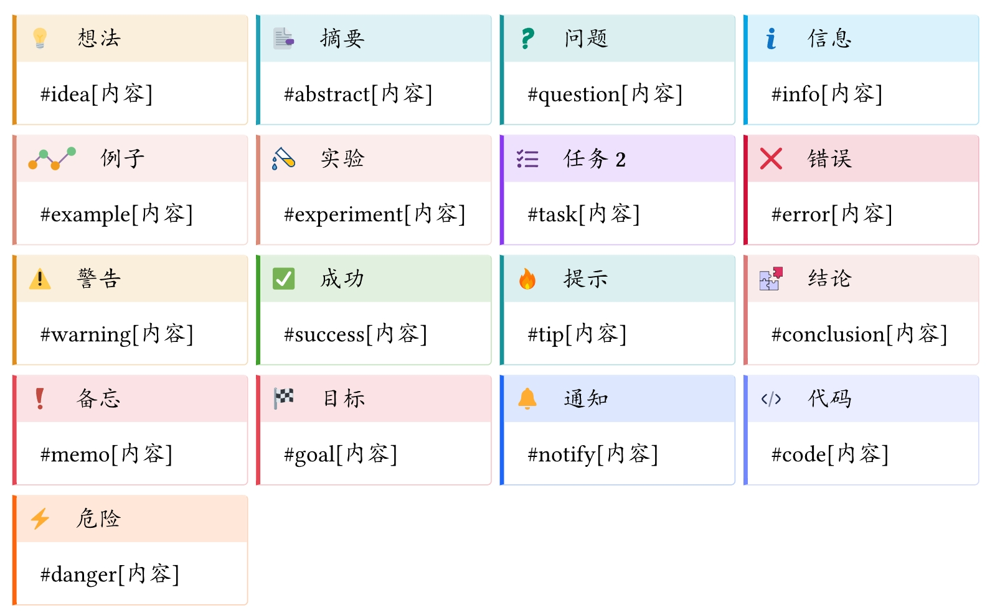
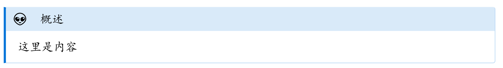
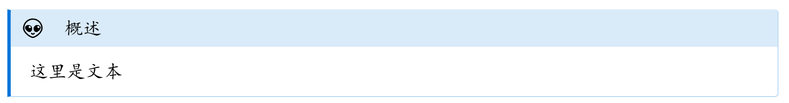

# 【Typst第三方包】彩色提示框gentle-clues
### 概述

gentle-clues提供简洁易用的提示框。内置多种样式，还可以轻松自定义。

### 用法

```
#set text(lang: "zh")                     // 设定文档语言为中文
#import "@preview/gentle-clues:1.2.0":*   // 导入包

#tip["这是一个提示"]     // 使用函数创建提示框

```



### 默认内置样式



### 自定义样式

#### 使用clue()函数

```
clue(
    icon:,            // 图标
    // ----------------- 标题设置 -----------------
    title:,                // 标题
    title-font:,           // 标题字体
    title-weight-delta:,   // 标题字体粗细
    // ----------------- 颜色设置 -----------------
    accent-color: rgb("#001f3f"),    // 主题色，进行整体风格设置
    header-color:,       // 标题区颜色
    body-color:,         // 正文区颜色
    // ----------------- 边框设置 -----------------
    border-color:,       // 边框颜色
    border-width:,       // 边框宽度
    radius: length,       // 边框圆角
    // ----------------- 其他设置 -----------------
    width: length,              // 整体宽度
    stroke-width: length,       // 左侧边线宽度
    content-inset: length,      // 正文区内边距
    header-inset: length,       // 正文区内边距
    headless: boolean,          // 是否在没有设定标题时显示
    breakable: boolean,         // 是否自动换行
    content: content,   // 内容
) = any;

```

```
#clue(
    icon: [#emoji.alien],    // 图标
    title: "概述",  // 标题
    accent-color: blue,      // 主题色
)[这里是内容]

```



进一步我们可以设定自己的函数来封装我们自定义的提示框：

```
#let alien_box(title:"概述",body) = clue(
    icon: [#emoji.alien],    // 图标
    title: title,  // 标题
    accent-color: blue,      // 主题色
)[#body]

```

```
#alien_box[这里是文本]

```


