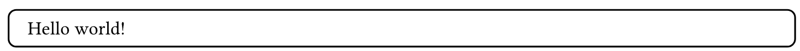
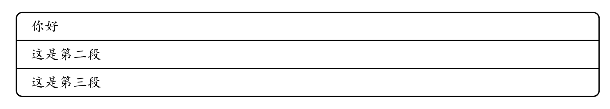
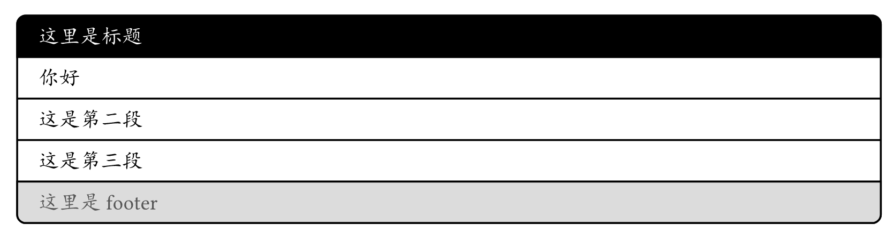
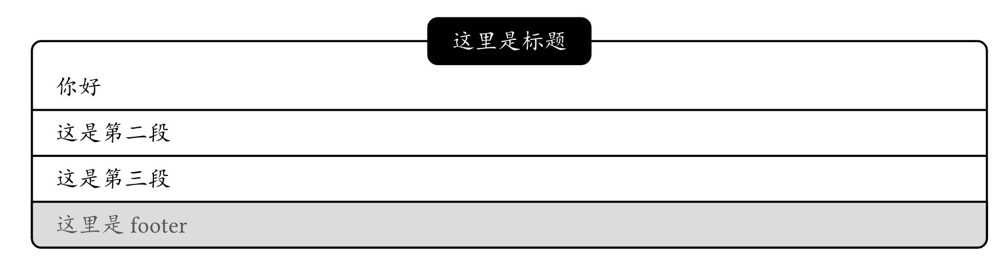
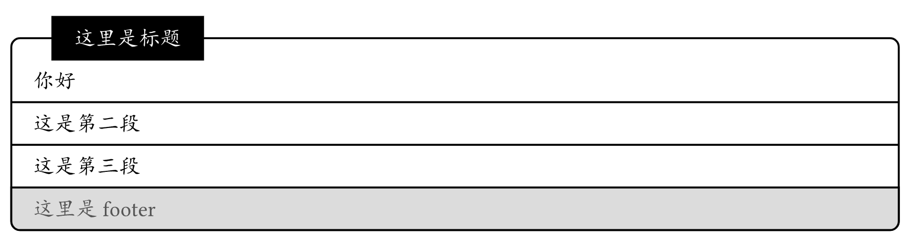
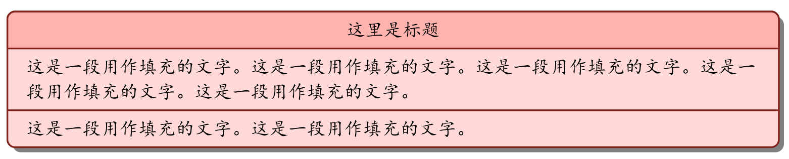
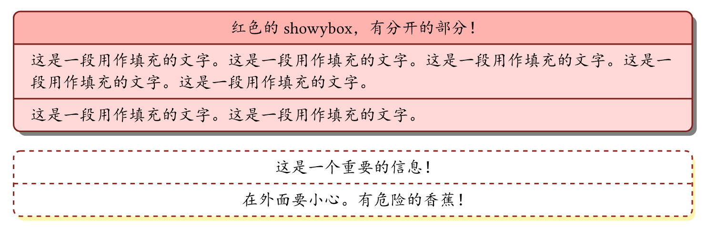

# 【Typst第三方包】高颜值盒子showybox
### 概述

Showybox可以创建另一种风格的圆角框区域，相比gentle-clues，它的风格更优雅，适合于更广泛的内容强调排版情景。

### 基础用法

```
#import "@preview/showybox:2.0.4": showybox    // 导入包

// 使用showybox函数
#showybox(
  [你好]
)

```

或者：`#showybox[Hello world!]`，显示为：



#### 显示多个内容块

`showybox()`函数可以接受多个内容块：

```
#showybox(
  [你好],
  [这是第二段],
  [这是第三段]
)

```

或者：`#showybox[你好][这是第二段][这是第三段]`，显示为：



#### 显示标题和页脚

```
#showybox(
  title:"这里是标题",      // 设定标题
  footer:"这里是footer",   // 设定页脚
  [你好],
  [这是第二段],
  [这是第三段]
)

```

效果如下：



### showybox()函数

为了进一步的使用强大的showybox，必须深入了解`showybox()`函数的参数。

`showybox()`函数是showybox包的核心，`showybox()`函数参数定义如下：

```
showybox(
  // ---------------- 基础设定 ----------------
  title: str = "",             // 标题
  footer: str = "",            // 页脚
  width: ratio = 100%,         // 宽度
  // ---------------- 具体样式设定 ----------------
  frame: dictionary,           // 框架属性
  title-style: dictionary,     // 标题样式
  body-style: dictionary,      // 正文样式
  footer-style: dictionary,    // 页脚样式
  sep: dictionary,             // 分隔符属性
  shadow: none  dictionary,    // 阴影
  breakable:bool,              // 设定showybox在到达页面末尾时是否会中断
  // ---------------- 内容 ----------------
  body,                        // 内容，可以是多个内容快
)

```

#### 框架属性

```
frame:(
    / ----------------- 边框样式 -----------------
    radius          // 边框的圆角半径，默认为5pt
    thickness       // 边线厚度，默认为1pt
    dash            // 边框样式，默认为solid
    / ----------------- 颜色设置 -----------------
    title-color     // 标题背景色,默认为black
    body-color      // 正文背景色,默认为white
    footer-color    // 页脚背景色,默认为luma(85)
    border-color    // 边框的颜色,默认为black
    / ----------------- 内边距设定 -----------------
    inset           // 标题、正文和页脚统一内边距，默认为x: 1em, y: 0.65em
    title-inset     // 标题内边距
    body-inset      // 正文内边距
    footer-inset    // 页脚内边距
)

```

#### 标题样式

```
title-style:(
  color    // 颜色，默认为white
  weight   // 粗细，默认为bold
  align    // 文本对齐方式，默认为left
  sep-thickness   // 标题和正文之间分割线的粗细，默认为 1pt
  boxed-style: none dictionary // 浮动框样式，默认为 none 
)

```

其中：
- `boxed-style`如果为`none`则显示为正常的标题区

- `boxed-style`如果设定为字典，则标题显示为浮动框形式

  

`boxed-style`的具体设定如下：

```
boxed-style:(
  anchor:(  // 锚点，决定浮动标题框的水平和垂直位置 
    y:top horizon bottom,          // 垂直锚点,默认为 horizon
    x:left start center right end  // 水平锚点,默认为 left
  ),
  offset:(  // 偏移值
    x:length,   // 水平偏移值，默认为 0pt
    y:length,   // 垂直偏移值，默认为 0pt
  )
  radius：   // 浮动标题框的圆角半径，默认为5pt
)

```

#### 正文样式

```
body-style:(
  color   // 正文文本颜色,默认为black
  align   // 正文文本对齐方式,默认为left
)

```

#### 页脚样式

```
footer-style:(
  color            // 页脚文本颜色，默认为luma(85)
  weight           // 页脚文本粗细，默认为regular
  align            // 页脚文本对齐方式，默认为left
  sep-thickness    // 正文和页脚之间分隔线的粗细，默认为1pt
)

```

#### 分隔线属性

```
sep:(
  thickness    // 分隔线的厚度，默认为1pt
  dash         // 分隔线的样式，默认为"solid"
  gutter       // 分隔线上方和下方的间距，默认为0.65em
)

```

#### 阴影属性

```
shadow:(
  color    // 阴影颜色，默认为 black ）
  offset：length dictionary, // 阴影偏移量，默认为4pt，可用字典分别设定x和y分量
)

```

### 设定标题为浮动框样式

通过设定`title-style`中的`boxed-style`为字典而非`none`，就可以让标题从默认形式转为浮动框形式。

```
#showybox(
  title:"这里是标题",
  footer:"这里是footer",
  title-style:(      // 设定标题样式
    boxed-style:(           // 浮动框样式
      anchor:(x:(center))   // 定位：水平居中
    )
  ),
  [你好],
  [这是第二段],
  [这是第三段]
)

```

效果如下：



我们还可以进一步的设定浮动框的样式：

```
#showybox(
  title:"这里是标题",
  footer:"这里是footer",
  title-style:(    // 设定标题样式
    boxed-style:(           // 浮动框样式
      anchor:(x:(start)),   // 定位：水平居右
      offset:(x:10pt),      // 水平向左偏移10pt
      radius:0pt,           // 消除圆角
    )
  ),
  [你好],
  [这是第二段],
  [这是第三段]
)

```

效果如下：



### 设定颜色和阴影

```
// 创建一个showybox
#showybox(
  frame: (     //边框样式
    border-color: red.darken(50%),  // 边框颜色
    title-color: red.lighten(60%),  // 标题区背景色
    body-color: red.lighten(80%)    // 正文区背景色
  ),
  title-style: (  //标题区样式
    color: black,       // 标题字色
    weight: "regular",  // 文字粗细
    align: center       // 文本对齐方式
  ),
  shadow: (     //阴影
    offset: 3pt,       // 阴影偏移量 ，也就是向坐下偏移(3,3)
  ),
  title: "这里是标题",  //标题
  lorem_zh(5),
  lorem_zh(2)
)

```

效果如下：



### 设定虚线效果

```
// 创建另一个showybox
#showybox(
  frame: (        //边框样式 
    dash: "dashed",
    border-color: red.darken(40%)
  ),
  body-style: (   //正文区样式
    align: center
  ),
  sep: (          //分隔符样式
    dash: "dashed"
  ),
  shadow: (       //阴影
	  offset: (x: 2pt, y: 3pt),
    color: yellow.lighten(70%)
  ),
  [这是一个重要的信息！],
  [在外面要小心。有危险的香蕉！]
)

```

效果如下：



#### 封装函数

可以看到showybox本身是一个需要高度参数定义，才能显现各种样式的包。所以很适合在它的基础上自己封装几个样式的函数，然后方便重复使用。
