### 简介

Codly提供增强的代码块 样式 ，包括显示行号，语言图标等高级效果。

Codly 的配套包`codly-languages`提供了多种语言图标和颜色。

### 使用

````
#import "@preview/codly:1.3.0": *            // 导入codly包
#import "@preview/codly-languages:0.1.7": *  // 导入codly配套包codly-languages
#show: codly-init.with()    // 初始化codly，每个文档只需执行一次

#codly(languages: codly-languages)  // 配置codly

//添加一个代码块，它就会自动正确显示
```rust
pub fn main() {
    println!("Hello, world!");
}
```

````

显示如下：

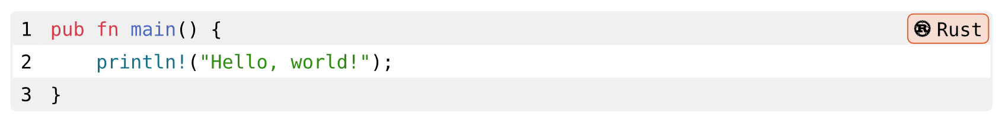

可以看到相比原始的 代码 块，codly的代码块样式好看不少，而且增加了语言类型和行号的显示。

### codly()完整定义

```
codly( Typst code
	enabled: true,    // 是否禁用codly
	offset: 0,        // 行号偏移，可以理解为起始行号
	offset-from: none,   // 从指定的代码块进行行号偏移
	range: none,      // 显示的行号范围，如(2,4)
	ranges: (),       // 显示的多个行号范围，如((2,2),(4,4))
	languages: (:),   // 语言设定，包括显示名称、图标和颜色
	
	radius: 0.32em,	     // 代码块边框的圆角度数
	inset: 0.32em,       // 每行的内边距
	fill: none,          // 代码块背景
	zebra-fill: luma(240),     // 间隔填充色
	stroke: 1pt + luma(240),   // 代码块边框的边线样式
    // ----------------- 语言名称框样式 -----------------
    display-name: true,   // 是否显示语言的名称
	display-icon: true,   // 是否显示语言的图标
	default-color: rgb("#283593"),   // 语言名称背景色
	lang-inset: 0.32em,
	lang-outset: (x: 0.32em, y: 0pt),
	lang-radius: 0.32em,
	lang-stroke: (lang) => lang.color + 0.5pt,
	lang-fill: (lang) => lang.color.lighten(80%),
	lang-format: codly.default-language-block,
    // ----------------- 行号样式 -----------------
	number-format: (number) => [ #number ],
	number-align: left + horizon,
	number-placement: "outside",
    
	smart-indent: false,     // 智能缩进
    smart-skip: true,        // 智能省略
	annotations: none,
	annotation-format: numbering.with("(1)"),
    // ----------------- 高亮样式 -----------------
	highlights: none,
	highlight-radius: 0.32em,
	highlight-fill: (color) => color.lighten(80%),
	highlight-stroke: (color) => 0.5pt + color,
	highlight-inset: 0.32em,
	highlight-outset: 0pt,
	highlight-clip: true,
    
	reference-by: line,
	reference-sep: "-",
	reference-number-format: numbering.with("1"),
	// ----------------- 页头 -----------------
    header: none,       // 顶部显示额外行，需要设定为内容块
	header-repeat: false,
	header-transform: (x) => x,
	header-cell-args: (),
    // ----------------- 页脚 -----------------
	footer: none,       // 底部显示额外行，需要设定为内容块
	footer-repeat: false,
	footer-transform: (x) => x,
	footer-cell-args: (),
    
	breakable: false,  // 是否能在换页时智能拆分
)

```

### 禁用和启用

可以使用`codly-disable()` 函数 暂时禁用codly，用`codly-enable()`函数再次启用codly。

````
#codly-disable()   // 暂时禁用codly
```typ
Example
*Hello, World!*
```

#codly-enable()    // 再次启用codly
```typ
Example
*Hello, World!*
```
````


效果如下：

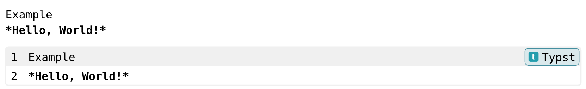

或者，你可以使用 `no-codly()` 函数在局部实现相同的禁用效果：

```
#no-codly[
  ```typ
  Example
  *Hello, World!*
  ]
```


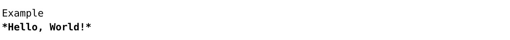

#### 显示header和footer

```
#codly(
  header: [这里是header],
  footer: [这里是footer],
)    // 不显示行号
```py
def fib(n):
  if n <= 1:
    return n
  else:
    return fib(n - 1) + fib(n - 2)
print

```

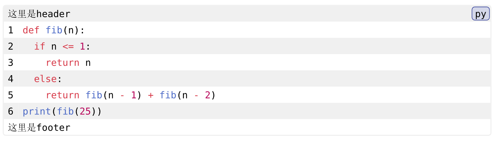

#### 智能缩进

默认情况下，Codly 启用了`智能缩进` ，这意味着 Codly 将自动 检测 代码块的缩进并相应地调整换行时的水平偏移量。可以使用 `smart-indent` 参数禁用此功能。

```
#codly(smart-indent: false)

```

#### 智能省略

````
#codly(
  smart-skip: true,
  ranges: ((2,2),(4,4))
)    // 不显示行号
```py
def fib(n):
  if n <= 1:
    return n
  else:
    return fib(n - 1) + fib(n - 2)
print(fib(25))
```
````

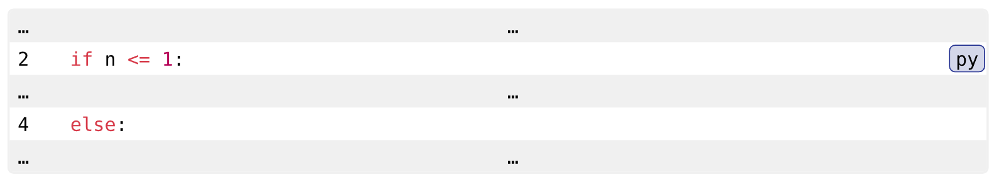

#### 设置语言选项

````
#codly(
  languages: (
    py:(        //  具体的语言
      name:[Python],   // 显示名称
      color:green,     // 背景和边框基础色
      icon:"🐍"       // 语言图标
    )
  )
)    // 不显示行号
```py
def fib(n):
  if n <= 1:
    return n
  else:
    return fib(n - 1) + fib(n - 2)
print(fib(25))
```

````

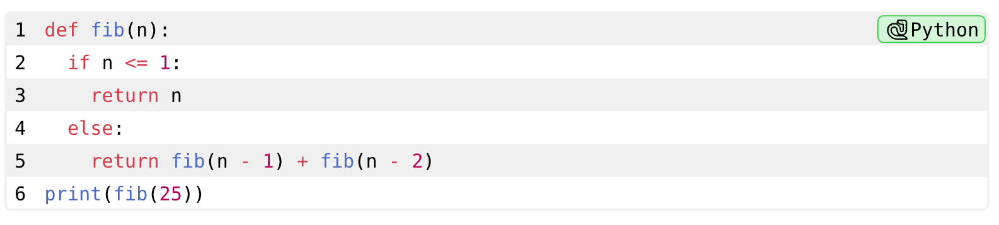

codly-lang包包含了许多语言的预定义设置，使用起来非常方便。自2024年11月19日起，该包已被codly的作者正式认可。

````
#import "@preview/codly-languages:0.1.7": *  // 导入codly配套包codly-languages

#codly(
  languages: codly-languages   // 使用codly-languages包的设定
)    // 不显示行号
```py
def fib(n):
  if n <= 1:
    return n
  else:
    return fib(n - 1) + fib(n - 2)
print(fib(25))
```

````

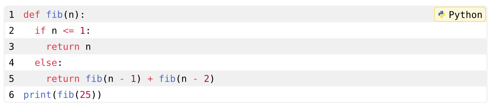

#### 引用代码块

Codly 提供了广泛的功能来引用代码块、线条、高亮和注释。这是通过以下方式完成的：

*   行速记 `@<label>：<line>`
*   高亮显示或批注标签 `@<highlight>`

```
#set text(lang: "zh")

#figure(
    caption: "样例代码"
)[
    ```typ
    Example
    *Hello, World!*
    ```
]<my-label>

我可以引用我的代码块 @my-label,或者引用它的某行 @my-label:2。

```
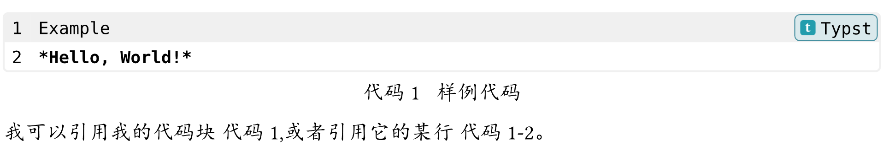
#### 设置行号偏移量

如果你想向代码块添加偏移量，但不选择行的子集，你可以使用 `codly-offset` 函数：

```
````typ
#codly(offset:5)
```typ
Example
*Hello, World!*
```
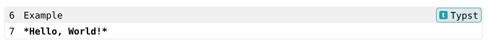

#### 设置相对于另一个代码块的行号偏移量

通过 `offset-from` 参数并为 “parent” 代码块指定 Typst `标签`来完成的：

````
```py
def fib(n):
  if n <= 1:
    return n
  return fib(n - l) + fib(n - 2)
```<fib-fn>   // 设定代码块的标签

在另一个代码块显示第5行
#codly(offset-from:<fib-fn>)   // 基于指定标签的代码块进行行数偏移
```py
fib(25)
```
````

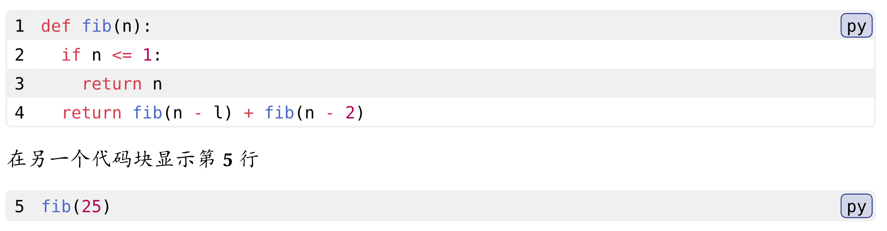

#### 选择行的子集

如果要选择行的子集，可以使用 `codly-range` 函数。通过将 start 设置为 1 并将 end 设置为 `none`，可以选择从代码块的开头到结尾的所有行。

````
````py
#codly-range(2, end: 2)    // 只显示第二行
```py
def fib(n):
  if n <= 1:
    return n
  return fib(n - l) + fib(n - 2)
fib(25)
```
````


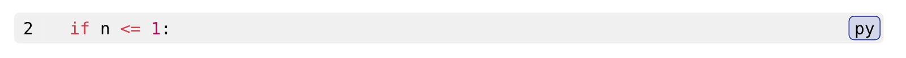

````
#codly-range(2, end: none)   // 第二行直到末尾
````
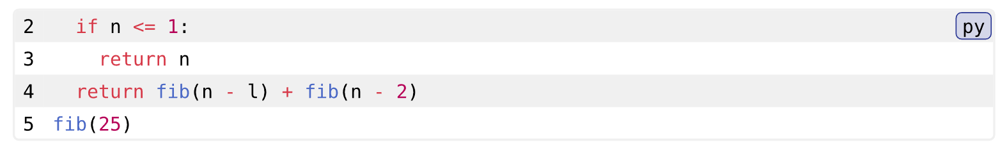

#### 添加 “skip”

您可以使用 `skips` 参数在行之间添加假的跳过：

````py
#codly(skips: ((5, 32)))  // 从第5行开始，跳过32行（也就是跳到37行）
```py
def fib(n):
  if n <= 1:
    return n
  return fib(n - l) + fib(n - 2)
fib(25)
```
````
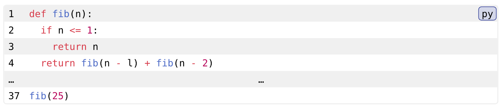

块中的代码将是相同的（除了添加的行包含 …字符），但行号将进行调整以反映跳过。

这可以使用 `skip-line` 和 `skip-number` 进行自定义，以自定义它的外观。

#### 添加 高亮显示

您可以使用 `highlights` 参数高亮显示行或行的指定部分：

````py
#codly(highlights: (
  (line: 4, start: 2, end: none, fill: red),
  (line: 5, start: 13, end: 19, fill: green, tag: "(a)"),
  (line: 5, start: 26, fill: blue, tag: "(b)"),
))
```py
def fib(n):
  if n <= 1:
    return n
  else:
    return fib(n - 1) + fib(n - 2)
print(fib(25))
```

````

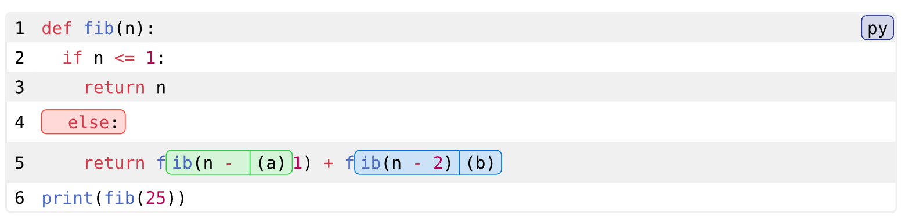

#### 添加注解

您可以使用 `annotations` 参数为行或多行创建侧边注解：

````
#codly(
  annotations: (
    (start: 2,end: 5,
      content: block(width: 5em,[函数体])
    ), 
    (start: 6,end: 6,
      content: block(width: 2em,[调用])
    ), 
  )
)
```py
def fib(n):
  if n <= 1:
    return n
  else:
    return fib(n - 1) + fib(n - 2)
print(fib(25))
```

````


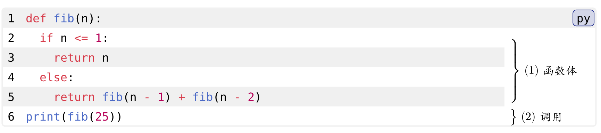

#### 其他设定

````
#codly(
  number-format: none,   // 不显示行号
  zebra-fill: none,      // 不显示间隔填充
  stroke: 1pt + red,     // 设定边线样式
  display-icon: false    // 不显示语言图标
)    // 不显示行号
```py
def fib(n):
  if n <= 1:
    return n
  else:
    return fib(n - 1) + fib(n - 2)
print(fib(25))
```
````
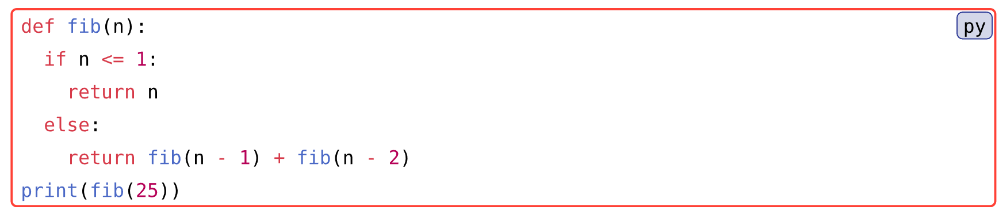

