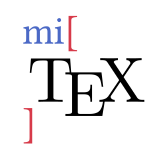

# 【Typst第三方包】Latex公式转Typst：MiTex
### 概述



LaTeX 对 Typst 的支持，由 Rust 和 WASM 提供支持。

MiTeX 将 LaTeX 代码处理成抽象语法树 （AST）。然后，它将 AST 转换为 Typst 代码，并通过 eval 函数将代码评估为 Typst 内容。

MiTeX 已被证明在大型项目中是实用的。它已经从 OI Wiki 正确转换了 32.5k 方程。相比 texmath，MiTeX 在该 wiki 项目中具有更好的显示效果和性能。它也更容易使用，因为将 MiTeX 导入 Typst 只是一行代码，而 texmath 是一个外部程序。

此外，MiTeX 不仅体积小 ，而且速度快 ！MiTeX 的大小仅为 185 KB 左右，而 texmath 的大小为 17 MB。下面显示了一个不严格但直观的比较。从 OI Wiki 转换 32.5k 方程，texmath 大约需要 109 秒，而 MiTeX WASM 只需要 2.28 秒，MiTeX x86 只需要 0.085 秒。

多亏了 @Myriad-Dreamin，他完成了最复杂的开发工作：开发用于生成 AST 的解析器。

### MiTeX 作为 Typst 封装
- 使用 `mitex-convert` 将 LaTeX 代码转换为字符串中的 Typst 代码。
- 使用 `mi` 在 Typst 中渲染内联 LaTeX 方程。
- 使用 `mitex(numbering: none, supplement: auto, ..)` 或 `mimath` 在 Typst 中渲染块 LaTeX 方程。
- 使用 `mitext` 在 Typst 中渲染 LaTeX 文本。

PS： `#set math.equation(numbering: "(1)")` 也适用于 MiTeX。

用法简单粗暴：

```
#import "@preview/mitex:0.2.5": *

#mitex(
    `\frac 1 2`
)

```

```
#import "@preview/mitex:0.2.5": *

#mitex(`
\begin{cases}
x = 2 \\
y = 2
\end{cases}
`)

```

```
#mitex-convert(`\sin x`)  // sin x

```

```
行内#mi(`x^2+y^2`)

```
