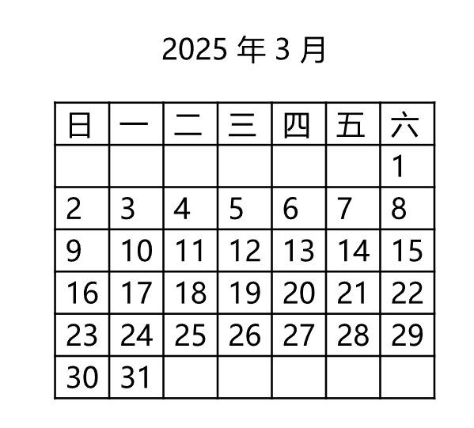
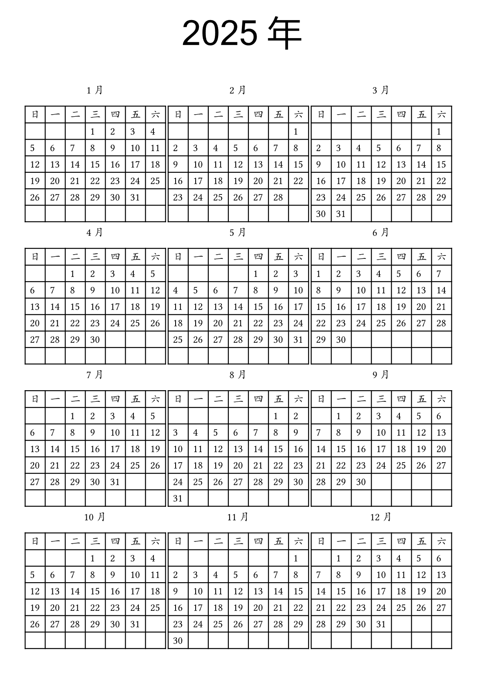

# 自定义模块mDateTime
### 用字符串构造datetime

Typst自带的`datetime`需要使用字典形式构造。我觉得不太好看，所以编写函数用字符串构造`datetime`。

#### 实现

```
// 日期函数
#let day(date_str) = {
  let(y,m,d) = date_str.split("-")
  return datetime(
    year:int(y),
    month:int(m),
    day:int(d),
  )
}

// 时间函数
#let time(time_str) = {
  let(h,m,s) = time_str.split(":")
  return datetime(
    hour:int(h),
    minute:int(m),
    second:int(s),
  )
}

// 日期时间函数
#let day_time(date_time_str) = {
  let(date_str,time_str) = date_time_str.split(" ")
  let(y,m,d) = date_str.split("-")
  let(h,mt,s) = time_str.split(":")
  return datetime(
    year:int(y),
    month:int(m),
    day:int(d),
    hour:int(h),
    minute:int(mt),
    second:int(s),
  )
}

```

使用也很简单，调用函数即可。

```
#day("2025-10-11")  // datetime(year: 2025，month:10，day: 11)
#time("12:09:08")   // datetime(hour:12，minute:9，second:8)
#day_time("2025-10-12 11:08:09")

```

### 月历和年历

发现自己很想用Typst搞日历，第三方包cineca的日历不持支中文，于是搜出几年前在Godot3.5编写的日期时间函数库，实现了Typst的版本，并制作了基于表格的月历和年历函数。

```
// 判断是否是闰年（leap year）
#let is_leap_year(year) = {
  let bol = false
	if calc.rem(year,4) == 0 {
    bol = true
    if calc.rem(year,100) == 0 {  // 年份是100的倍数
      if calc.rem(year,400) == 0 {  // 必须是400的整数倍
        bol = true
      } else {
        bol = false
      }
    }
  }
	return bol
}

// 返回某年的某月共有多少天	
#let get_month_day_count(year,month) = {
  let day_count = 0
  if month == 2 {
    if is_leap_year(year){ //闰年
			day_count = 29
    } else {
      day_count = 28
    }		
  } else if month in (1,3,5,7,8,10,12) { // 大月
    day_count = 31
  } else if month in (4,6,9,11){         // 小月
    day_count = 30
  }
	return day_count
}

// 返回某年共有多少天	
#let get_year_day_count(year) = {
  let day_count = 0
	for i in range(12){
    day_count += get_month_day_count(year,i+1)
  }
	return day_count
}


// 获取某年某月第一天星期几(数字)
#let get_first_weekday(year,month) = {
  let d = str(year) + "-" + str(month) + "-01"
  return day(d).weekday()
}

// 获取某年某月第一天星期几(汉字)
#let get_first_weekday_name(year,month) = {
  import "@preview/a2c-nums:0.0.1": int-to-cn-num
  let w = get_first_weekday(year,month)
  if w in range(1,7) {
    return int-to-cn-num(w)
  } else {
    return "日"
  }
}

// 获取月历数据序列
#let get_month_list(year,month) = {
  let w = get_first_weekday(year,month)   // 本月第一天周几
  let m = get_month_day_count(year,month) // 本月天数
  let s = 42 - m // 剩余填充
  let list = ()
  // 填充前空白
  if w in range(1,7) {
    for i in range(1,w+1) {
      list.push([])
    }
    s -= w
  }
  // 填充日数
  for i in range(1,m+1) {
    list.push([#i])
  }
  // 填充后空白
  for i in range(1,s) {
    list.push([ \ ])
  }
  return list
}

// 显示月历
#let show_month(
  year,month,
  show_year:true
) = {
  [
    #box[
      #align(center)[#if show_year [#year 年] #month 月]
      #table(
        columns:7,
        [日],[一],[二],[三],[四],[五],[六],
        ..get_month_list(year,month)
      )
    ]
  ]
}

// 显示某年的所有月份
#let show_months(year) = {
  align(center)[#text(36pt,font: "Microsoft Sans Serif")[#year 年]]
  for i in range(1,13) {
    show_month(year,i,show_year: false)
  }
}

```

你可以使用`show_month`显示某年某月的月历：

```
#show_month(2025,3)   // 显示2025年3月的月历
#show_months(2025)    // 显示2025年整年的月历

```





### 期间

两个`datetime`相减，或者使用`duration()`函数构造，可以创建一个`duration`，它代表时间差或持续的一段时间。

```
duration(
    seconds: int,
    minutes: int,
    hours: int,
    days: int,
    weeks: int,
) -> duration

```

#### 求两个日期之间的差值

```
#(day("2025-6-1") - day("2025-5-1")).days()    \\ 31d
#(day("2025-6-1") - day("2025-5-1")).hours()   \\ 744h
#(day("2025-6-1") - day("2025-5-1")).seconds() \\ 2678400s

```

#### 倒计时

可以用duration来创建倒计时。

### 完整代码

我将完整代码保存为`mDateTime.typ`，并在使用时用import形式导入：

```
#import "mDateTime.typ":*

```

完整代码如下：

```
// 日期函数
#let day(date_str) = {
  let(y,m,d) = date_str.split("-")
  return datetime(
    year:int(y),
    month:int(m),
    day:int(d),
  )
}

// 时间函数
#let time(time_str) = {
  let(h,m,s) = time_str.split(":")
  return datetime(
    hour:int(h),
    minute:int(m),
    second:int(s),
  )
}

// 日期时间函数
#let day_time(date_time_str) = {
  let(date_str,time_str) = date_time_str.split(" ")
  let(y,m,d) = date_str.split("-")
  let(h,mt,s) = time_str.split(":")
  return datetime(
    year:int(y),
    month:int(m),
    day:int(d),
    hour:int(h),
    minute:int(mt),
    second:int(s),
  )
}

// 判断是否是闰年（leap year）
#let is_leap_year(year) = {
  let bol = false
	if calc.rem(year,4) == 0 {
    bol = true
    if calc.rem(year,100) == 0 {  // 年份是100的倍数
      if calc.rem(year,400) == 0 {  // 必须是400的整数倍
        bol = true
      } else {
        bol = false
      }
    }
  }
	return bol
}

// 返回某年的某月共有多少天	
#let get_month_day_count(year,month) = {
  let day_count = 0
  if month == 2 {
    if is_leap_year(year){ //闰年
			day_count = 29
    } else {
      day_count = 28
    }		
  } else if month in (1,3,5,7,8,10,12) { // 大月
    day_count = 31
  } else if month in (4,6,9,11){         // 小月
    day_count = 30
  }
	return day_count
}

// 返回某年共有多少天	
#let get_year_day_count(year) = {
  let day_count = 0
	for i in range(12){
    day_count += get_month_day_count(year,i+1)
  }
	return day_count
}


// 获取某年某月第一天星期几(数字)
#let get_first_weekday(year,month) = {
  let d = str(year) + "-" + str(month) + "-01"
  return day(d).weekday()
}

// 获取某年某月第一天星期几(汉字)
#let get_first_weekday_name(year,month) = {
  import "@preview/a2c-nums:0.0.1": int-to-cn-num
  let w = get_first_weekday(year,month)
  if w in range(1,7) {
    return int-to-cn-num(w)
  } else {
    return "日"
  }
}

// 获取月历数据序列
#let get_month_list(year,month) = {
  let w = get_first_weekday(year,month)   // 本月第一天周几
  let m = get_month_day_count(year,month) // 本月天数
  let s = 42 - m // 剩余填充
  let list = ()
  // 填充前空白
  if w in range(1,7) {
    for i in range(1,w+1) {
      list.push([])
    }
    s -= w
  }
  // 填充日数
  for i in range(1,m+1) {
    list.push([#i])
  }
  // 填充后空白
  for i in range(1,s) {
    list.push([ \ ])
  }
  return list
}

// 显示月历
#let show_month(
  year,month,
  show_year:true
) = {
  [
    #box[
      #align(center)[#if show_year [#year 年] #month 月]
      #table(
        columns:7,
        [日],[一],[二],[三],[四],[五],[六],
        ..get_month_list(year,month)
      )
    ]
  ]
}

// 显示某年的所有月份
#let show_months(year) = {
  align(center)[#text(36pt,font: "Microsoft Sans Serif")[#year 年]]
  for i in range(1,13) {
    show_month(year,i,show_year: false)
  }
}

```
