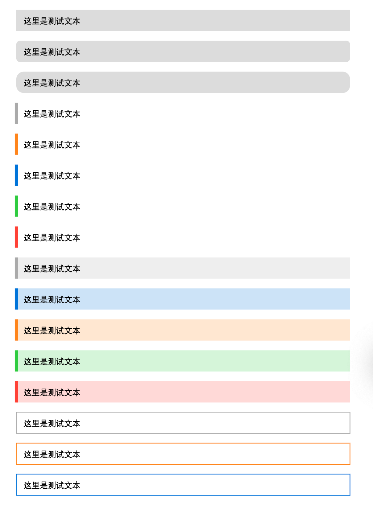
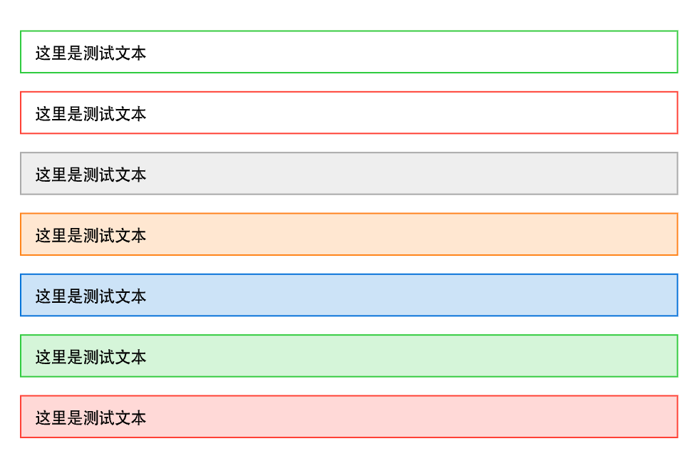
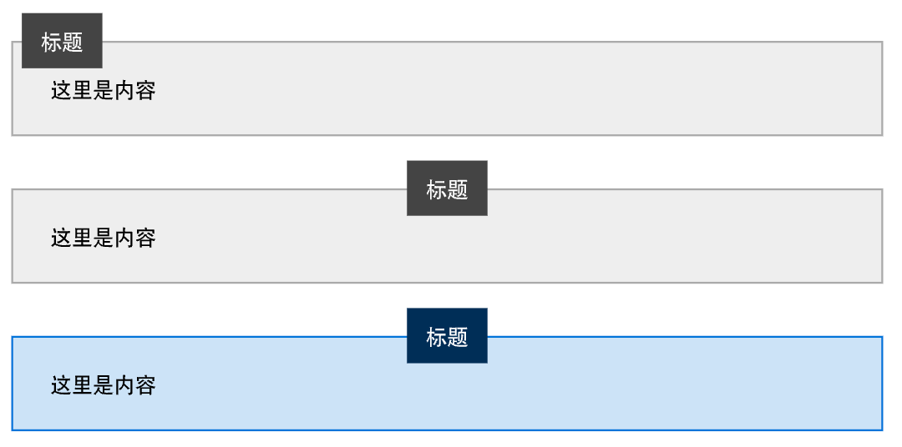

# 【Typst】自定义彩色盒子
### 理论基础

#### 使用with

使用with可以在不用搞函数的情况下，申明一些基于内部图形函数的元素。

你可以继续在他们基础上用with创建变体，或者在使用时用为他们设定不一样的参数

```
#let blue_box = rect.with(fill:rgb("#afe6f8"),inset: 10pt,width: 100%)


#let red_box = blue_box.with(fill:red)


#red_box(stroke: (left:4pt+orange))[123]

```

### 基于with的自定义彩色盒子

```
// 基础样式盒
#let mbox = rect.with(fill:luma(220),inset: 10pt,width: 100%)

// 圆角框
#let r5_box = mbox.with(radius: 5pt)
#let r10_box = mbox.with(radius: 10pt)


// 只有左侧边线
#let l4_gray = mbox.with(stroke: (left:4pt+gray),fill:none)
#let l4_orange = l4_gray.with(stroke: (left:4pt+orange))
#let l4_blue = l4_gray.with(stroke: (left:4pt+blue))
#let l4_red = l4_gray.with(stroke: (left:4pt+red))
#let l4_green = l4_gray.with(stroke: (left:4pt+green))


// 左侧边线 + 浅色填充
#let l4_gray_box = mbox.with(stroke: (left:4pt+gray),fill:gray.lighten(80%))
#let l4_orange_box = mbox.with(stroke: (left:4pt+orange),fill:orange.lighten(80%))
#let l4_blue_box = mbox.with(stroke: (left:4pt+blue),fill:blue.lighten(80%))
#let l4_red_box = mbox.with(stroke: (left:4pt+red),fill:red.lighten(80%))
#let l4_green_box = mbox.with(stroke: (left:4pt+green),fill:green.lighten(80%))


// 四面边框 + 无填充
#let bd_gray = mbox.with(stroke:gray,fill:none)
#let bd_orange = bd_gray.with(stroke:orange)
#let bd_blue = bd_gray.with(stroke:blue)
#let bd_red = bd_gray.with(stroke: red)
#let bd_green = bd_gray.with(stroke: green)

#let bd_gray_box = mbox.with(stroke:gray,fill:gray.lighten(80%))
#let bd_orange_box = mbox.with(stroke:orange,fill:orange.lighten(80%))
#let bd_blue_box = mbox.with(stroke:blue,fill:blue.lighten(80%))
#let bd_red_box = mbox.with(stroke:red,fill:red.lighten(80%))
#let bd_green_box = mbox.with(stroke:green,fill:green.lighten(80%))

```

```
#let t = [这里是测试文本]

#mbox[#t]
#r5_box[#t]
#r10_box[#t]

#l4_gray[#t]
#l4_orange[#t]
#l4_blue[#t]
#l4_green[#t]
#l4_red[#t]

#l4_gray_box[#t]
#l4_blue_box[#t]
#l4_orange_box[#t]
#l4_green_box[#t]
#l4_red_box[#t]

#bd_gray[#t]
#bd_orange[#t]
#bd_blue[#t]
#bd_green[#t]
#bd_red[#t]

#bd_gray_box[#t]
#bd_orange_box[#t]
#bd_blue_box[#t]
#bd_green_box[#t]
#bd_red_box[#t]

```





### 带标题的框

```
// 带标题的框
#let title_box(title,body,base_color:gray,align:top) = [

  #block(inset:(top: 15pt))[
    // 正文区带边框盒子
    #mbox(
      inset: (top:20pt,rest: 20pt),
      stroke: base_color,
      fill: base_color.lighten(80%)
    )[#body]
    // 标题
    #let ddx = 5pt
    #if align == center {
      ddx = 0pt
      align = top+center
    }
    #place(align,dy:-15pt,dx:ddx)[
      #mbox(width:auto,fill: base_color.darken(60%))[
        #text(white)[#title]
      ]
    ]
  ]
]

```


