# 【Typst】绘图包CeTZ
### 简介

该包提供了一种使用类似于Processing的API绘制画布的方法，但使用TikZ的相对坐标和锚。您也不必担心意外地在其他内容上绘制，因为画布将自动调整大小。记住：向上是积极的！

名称CeTZ是“CeTZ，ein Typst Zeichenpaket”（德语意为“CeTZ，一个Typst绘图包”）的递归首字母缩写。

### 使用

```
#import "@preview/cetz:0.3.0"

#cetz.canvas({
  import cetz.draw: *
  // 绘图代码
})

```

请注意，绘制函数是在`canvas`块的范围内导入的。建议这样做，因为CeTZ的一些绘图函数可能会覆盖Typst的函数，例如`line`。

#### 画布canvas()

设置用于绘图的画布。

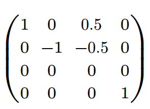

**参数**

```
canvas(
    length: length ratio ,    // 指定单位坐标的实际长度，默认: 1cm
    debug: bool ,             // 是否调试模式，调试模式下显示每个元素的边界框，默认: false
    background: none color ,  // 画布背景颜色，默认: none
    body: none array element  // 画布内容
) -> content

```

`element`，一种代码块，其中调用了draw.typ中的函数。

```
#cetz.canvas(
  length: 4cm,  // 单位长度
  debug: true,  // debug
  {
  import cetz.draw: *
  // 绘图代码
  circle((0,0))  // 绘制单位圆
})

```

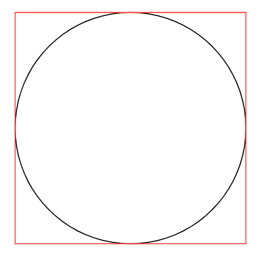

```
circle((0,0))      // 绘制单位圆
line((0,0),(1,1))  // 绘制线段

```

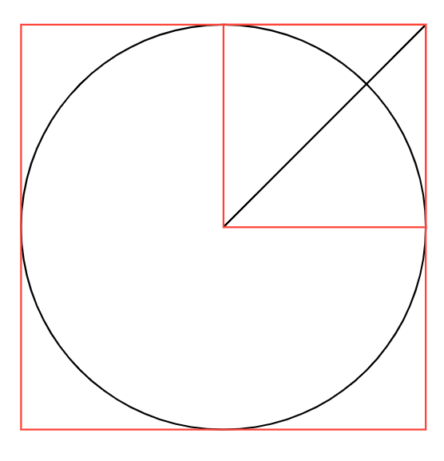

可以看出，cetz的画布canvas：
- 采用原点`(0,0)`，水平向右为x轴正方向，垂直向上为y轴正方向的坐标系。
- 使用单位长度，而不是带单位（比如mm、cm、pt等）具体长度值，而单位长度`length`可以设为任意具体长度（默认1cm）
- 画布会根据绘制内容自动调整大小，只显示绘制了内容的最小区域
### 使用前一坐标连续绘制

使用`()`将采取上一绘制元素的终点坐标，从而实现连续绘制效果：

```
line((0,0), (1, 1))
line((),(1,2))          // 起点为上一线段终点
circle((),radius: 0.1)  // 圆心为上一线段终点

```

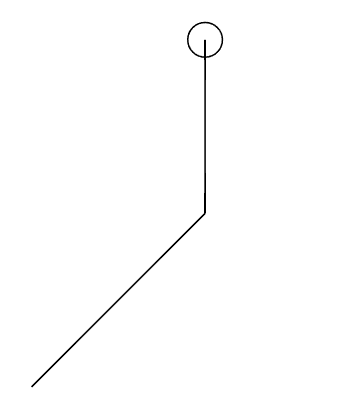

如果没有上一终点，则`()`默认为`(0,0)`。

#### 相对前一坐标绘制

```
circle((0, 0), stroke: blue)
circle((rel: (1, 0)), stroke: red)  // 相对于上一图元终点或锚定点的相对坐标绘制

```

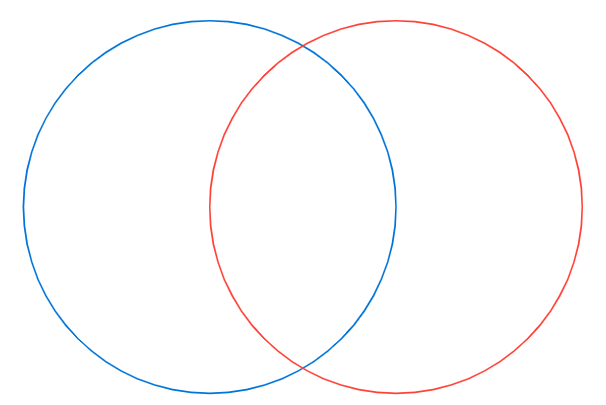

换成线段后可以看到确实是基于line的终点：

```
line((),(1,0))
circle((rel: (1, 0)), stroke: red) // 相对于上一图元终点或锚定点的相对坐标绘制

```

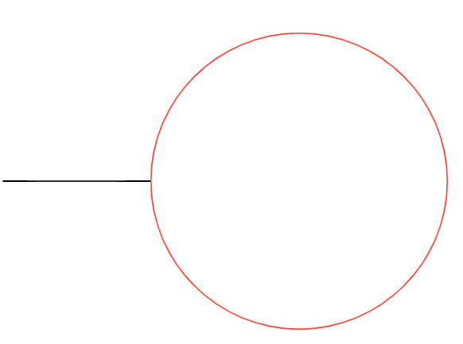

```
line((),(1,0),name: "l1")
circle((rel: (1, 0),to:"l1.mid"), stroke: red) // 以l1中点作为原点，偏移(1, 0)位置画圆

```

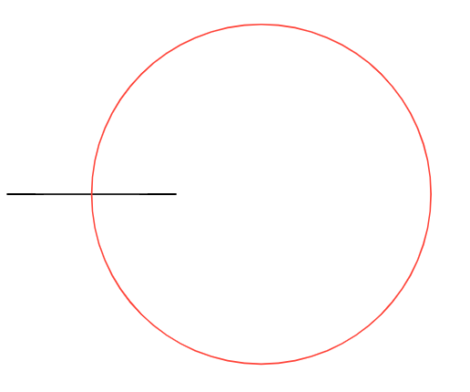

### 极坐标形式

```
line((0,0),(angle:45deg,radius:1))  // 终点极坐标形式

```

或者直接采用简写形式：

```
line((0,0),(45deg,1))               // 终点极坐标形式

```

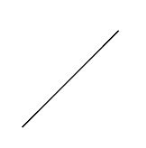

```
line((0,0),(angle:45deg,radius:1)) 
line((),(angle:-45deg,radius:1))  
line((),(0,0))

```

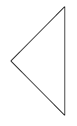

```
// 使用极坐标绘制正多边形
let steps = 3        // 多边形边数
let start_angle = 90 // 起始角度
let ang = 360/steps  // 间隔角度
let points = ()      // 顶点数组

// 求取顶点
for i in range(steps) {
points.push((eval(str(ang*i+start_angle) + "deg"),1))
}

line(..points,close: true)  // 绘制

```

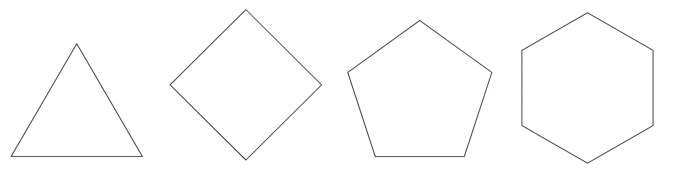

### 样式设置

cetz的图元样式主要涉及填充和描边，并且设定方式十分灵活：

```
// 方法1：直接在绘制的图元中以参数形式设定
circle((0,0),fill:red,stroke:none)

// 方法2：在绘制前使用fill()或stroke()函数设定
fill(red)
stroke(none)
circle((0,0))

// 方法3：在绘制前使用set-style()函数设定
set-style(stroke: blue, fill: red)
circle((0,0))

```

其中：
- `fill()`、`stroke()`和`set-style()`函数的样式设定可以认为是在画布中全局的设定，图元内部的参数形式设定可以认为是局部设定
- 全局设定直到遇到下一次全局修改才会变化，而局部设定可以局部覆盖全局设定的样式。


stroke的细节设定与Typst中一致：

```
stroke(
  paint: auto color gradient pattern,  // 描边颜色
  thickness: auto length,              // 描边粗细
  cap: auto str,                       // 描边末端的渲染方式
  join: auto str,                      // 拐角渲染方式
  dash: none auto str array dictionary,  // 虚线样式
  miter-limit: auto float,               // 
) -> stroke

```

你也可以设定渐变填充和虚线边线等：

```
stroke(
      (
        paint:blue,
        thickness:2pt,
        dash:"dashed"
      )
    )
  fill(gradient.linear(..color.map.crest))
  circle((0,0))

```

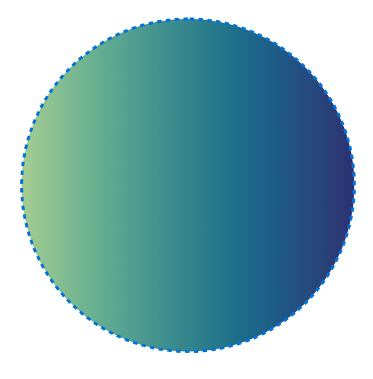

### 圆circle(）

```
circle(
    position: coordinate ,  // 圆心位置
    radius: number array    // 半径，默认：1，(x,y)形式指定椭圆半径
    name: none string ,     // 名称
    anchor: none string ,   // 锚点,默认“center”
    fill: color none        // 填充颜色，默认: none
    stroke: none auto length color dictionary stroke // 描边设置，默认: 1pt + luma(0%)
)

```

```
circle((0,0))  // 绘制一个单位圆
circle((0,-2), radius: (0.75, 0.5))   // 绘制一个椭圆

```
- `fill`和`stroke`基本上是所有图元都有的样式。
- `anchor`是`CeTZ`内部独特的相对定位方式“锚点”，`name`用来命名图元，并辅助“锚点”定位。
#### 锚定位anchor

anchor用于定位相对于图元的位置，有两种用法：
- 方法1：给上一图元指定`anchor`参数，然后相对上一图元的锚定位置进行下一图元的绘制
- 方法2：给上一图元指定`name`参数，然后在后续绘制图元上指定具名图元的anchor后在指定锚定位置进行绘制
```
// anchor的第一种用法
circle((0,0), anchor: "west")  // 绘制单位圆，设定锚定位置在“西”

fill(red)
stroke(none)
circle((0,0), radius: 0.1)     // 以上一图元的锚定位置为原点绘制半径为0.1单位长度的圆

```

等价的第二种形式：

```
circle((0,0), name: "c1")  // 绘制单位圆，命名为“c1”

fill(red)
stroke(none)
circle("c1.west", radius: 0.1)  // 以名为“c1”的图元的“西”锚定位置为原点绘制半径为0.1单位长度的圆

```

绘制效果：

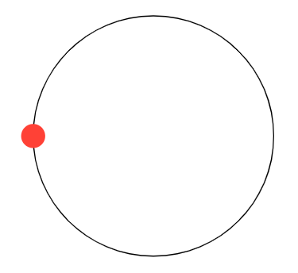

##### 方位锚点

```
circle((0,0), name: "c1")

fill(red)
stroke(none)
circle("c1.north", radius: 0.1)  // 正北(上)
circle("c1.east", radius: 0.1)   // 正东(右)
circle("c1.south", radius: 0.1)  // 正南(底)
circle("c1.west", radius: 0.1)   // 正西(左)

fill(blue)
circle("c1.north-east", radius: 0.1)  // 东北(左上)
circle("c1.south-east", radius: 0.1)  // 东南(右下)
circle("c1.south-west", radius: 0.1)  // 西南(左下)
circle("c1.north-west", radius: 0.1)  // 西北(左上)

fill(green)
circle("c1.center", radius: 0.1)  // 圆心(中)

```

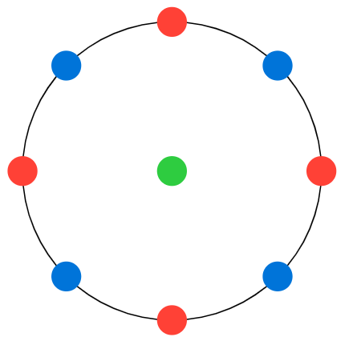

##### 角度锚点

```
ircle((0,0), name: "c1")  // 绘制单位圆，设定锚定位置在“西”

stroke(none)
circle("c1.0deg", radius: 0.1,fill:red.darken(0%))    // 0°
circle("c1.30deg", radius: 0.1,fill:red.darken(25%))  // 30°
circle("c1.45deg", radius: 0.1,fill:red.darken(50%))  // 45°
circle("c1.90deg", radius: 0.1,fill:red.darken(100%)) // 90°

```

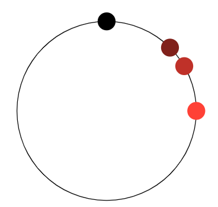

```
circle((0,0), name: "c1") 

fill(red)
stroke(none)
circle("c1.0rad", radius: 0.1)     // 0弧度
circle("c1.1rad", radius: 0.1)     // 1弧度
circle("c1.1.57rad", radius: 0.1)  // 1.57弧度

```

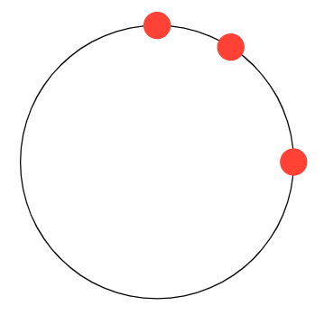

```
circle((0,0), name: "c1")

fill(red)
stroke(none)
circle("c1.0", radius: 0.1)     // 0弧度
circle("c1.1", radius: 0.1)     // 1弧度
circle("c1.1.57", radius: 0.1)  // 1.57弧度

```

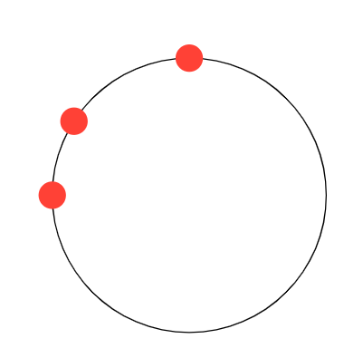

##### 路径锚点

```
circle((0,0), name: "c1") 

fill(red)
stroke(none)
circle("c1.start", radius: 0.1)             // 起点
circle("c1.mid", radius: 0.1)               // 中点
circle("c1.end", radius: 0.05,fill:black)   // 终点

```

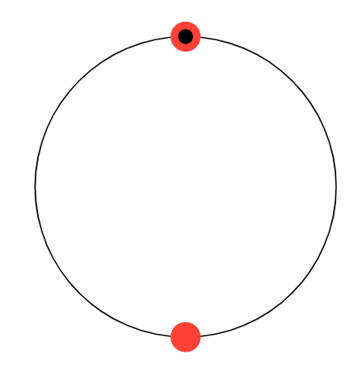

```
circle("c1.0%", radius: 0.1,fill:red)      // 整个路径起始处
circle("c1.25%", radius: 0.1,fill:green)   // 整个路径1/4处
circle("c1.50%", radius: 0.1,fill:blue)    // 整个路径1/2处
circle("c1.80%", radius: 0.1,fill:yellow)  // 整个路径0.85处

```

#### 三点定圆

```
=circle-through(
    a: coordinate ,   // 点1坐标
    b: coordinate ,   // 点2坐标
    c: coordinate ,   // 点3坐标
    name: none string ,
    anchor:none string ,
    ..style: style
)

```

绘制一个经过三个坐标点的圆。

```
let (a, b, c) = ((0,0), (2,-.5), (1,1))
line(a, b, c, close: true, stroke: gray)
circle-through(a, b, c, name: "c")
circle("c.center", radius: .05, fill: red)

```

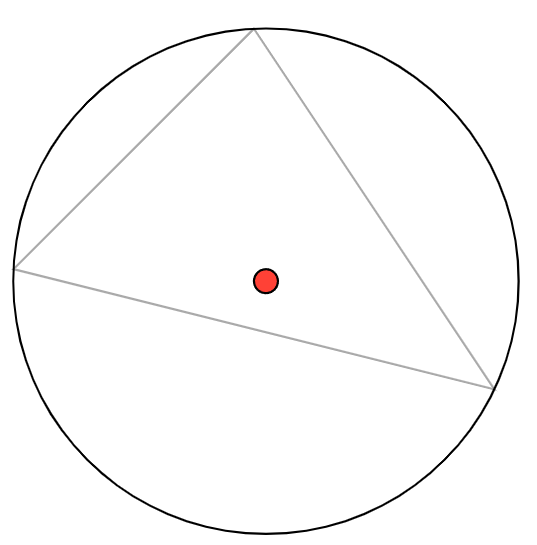

### 圆弧arc()

```
arc(
    position: coordinate , // 圆心位置
    start: auto angle ,    // 弧线起始的角度
    stop: auto angle ,     // 弧线结束的角度
    delta: auto angle ,    // 增量角度
    name: none string ,
    anchor: none string ,
    radius: number or array，  // 半径，(xr,yr)形式可建立椭圆弧
    mode: string,        // 绘制模式："OPEN"、"CLOSE"、"PIE"
    update-position: bool // 是否将当前画布位置更新至圆弧终点（锚点"arc-end"）。默认: true
)

```

#### 绘制模式
- “OPEN”模式：不绘制额外线条，仅显示弧线；
- “CLOSE”模式：会从弧线起点到终点绘制一条线，形成弓形；
- “PIE”模式：则从弧线起点和终点分别向原点绘制线条，形成扇形。
```
arc((0,0), start: 45deg, stop: 135deg)
arc((0,-0.5), start: 45deg, delta: 90deg, mode: "CLOSE")
arc((0,-1), stop: 135deg, delta: 90deg, mode: "PIE")

```

请注意，三个角度参数（start、stop和delta）中必须设置其中两个。当前位置`()`将更新为圆弧终点坐标（锚点`<font style="color:rgb(0,0,0);">arc-end</font>`）。

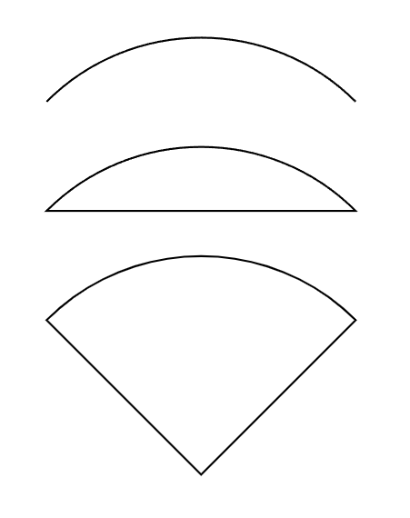

#### 锚点

支持边界和路径锚点。
- arc-start 弧线曲线起始位置（默认值）。
- arc-end 弧线曲线结束位置。
- arc-center 弧线曲线中点位置。
- center 弧线中心点（该位置随弧线闭合状态变化）。
- chord-center 起止点间弦线中心位置。
- origin 弧线所属圆的圆心。
#### 三点定弧

```
arc-through(
 a: coordinate ,  // 圆弧（或椭圆弧）起点
 b: coordinate ,  // 圆弧（或椭圆弧）中间经过点
 c: coordinate ,  // 圆弧（或椭圆弧）终点
 name: none string ,
 ..style: style
)

```

```
arc-through((0,1), (1,1), (1,0))

```

### 路径line()

CeTZ中的`line()`和Typst中原生的`line()`是不一样的，它更像是Typst中的`path()`，可以接受两个及两个以上的坐标点，并绘制路径。

```
line(
 coordinates:(),   // 路径坐标点集合，至少两个
 close: bool ,     // 是否闭合路径，默认：false
 name: none string
 ..style: style
)

```

#### 锚点

```
let r = 0.2  // 圆的半径

line((0,0),(5,0),name:"l1")

fill(red)
circle("l1.start",radius: r)  // 起点
circle("l1.mid",radius: r)    // 中点
circle("l1.end",radius: r)    // 终点

```

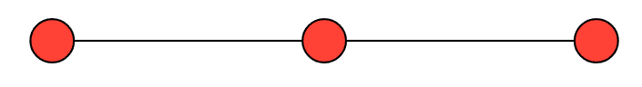

```
line((0,0),(5,0),name:"l1")
  
fill(red)
circle("l1.0%", radius: 0.1,fill:red)      // 整个路径起始处
circle("l1.25%", radius: 0.1,fill:green)   // 整个路径1/4处
circle("l1.50%", radius: 0.1,fill:blue)    // 整个路径1/2处
circle("l1.80%", radius: 0.1,fill:yellow)  // 整个路径0.85处
circle("l1.100%", radius: 0.1,fill:black)  // 整个路径结束处

```

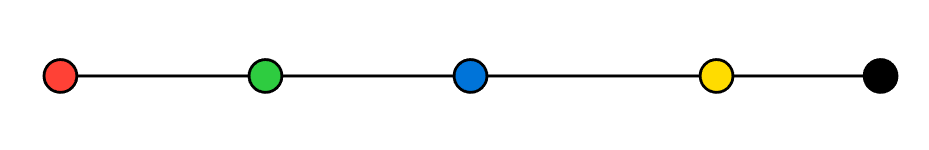

```
line((0,0),(5,0),name:"l1")
  
fill(red)
circle("l1.0", radius: 0.1,fill:red)  // 路径偏移0单位长度
circle("l1.1", radius: 0.1,fill:red)  // 路径偏移1单位长度
circle("l1.2", radius: 0.1,fill:red)  // 路径偏移2单位长度
circle("l1.3", radius: 0.1,fill:red)  // 路径偏移3单位长度
circle("l1.4", radius: 0.1,fill:red)  // 路径偏移4单位长度
circle("l1.5", radius: 0.1,fill:red)  // 路径偏移5单位长度

```

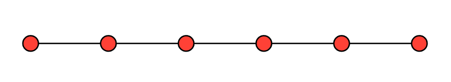

#### 绘制图元之间的连线

```
circle((1,2), radius: .5, name: "a")
rect((2,1), (rel: (1,1)), name: "b")
line("a", "b")  // 绘制图元a和b的连线

// 绘制a、b的中心点
fill(orange)
stroke(none)
circle("a.center",radius: .05)
circle("b.center",radius: .05)

```

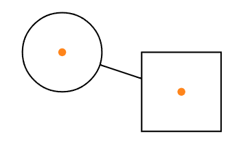

若首末坐标以具有"默认"锚点的元素名称给出，则使用该元素边框与给定首末两点连线的交点作为坐标。这种方法适用于在两个元素边框之间绘制连接线。

### 网格grid()

```
grid(
    from: coordinate ,    // 起点坐标
    to: coordinate ,      // 终点坐标
    steps: number tuple dictionary, // 间隔，默认1
    help-lines: bool,     // 若为真，强制将描边样式设为gray+0.2pt
    name: none string ,
    ..style: style
)

```
- steps：网格线间距。数值1表示在x轴和y轴方向每1个长度单位绘制一条网格线。若提供包含x和y键的字典或元组，则按各轴单独设置步长
```
grid((0,0), (2,2),name: "g")

// 绘制网格的起点
stroke(none)
circle((0,0),radius: .1,fill:orange,name:"a")  // 起点
circle((2,2),radius: .1,fill:black,name:"b")   // 终点

stroke(1pt)
line("a","b")  // 起点到终点的连线

```

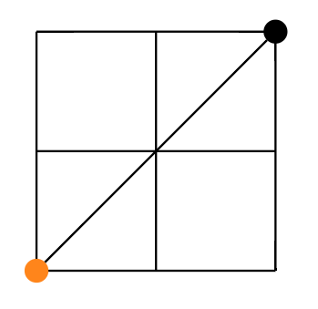

### 内容content()

```
content(
    ..args-style: coordinate content style ,
    angle: angle coordinate ,  // 旋转角度，默认：0deg
    padding: number dictionary，  // 内边距
    frame: string none,     // 框架类型：none、"rect"或"circle"
    anchor: none string ,
    name: none string
)

```

将Typst内容定位在画布上。请注意，内容本身并未被变换，仅其位置发生了改变。

```
grid((0,0), (2,2),name: "g",help-lines:true)

// 在指定位置显示内容
content((0,0), [(0,0)])
content((2,2), [(2,2)])

```

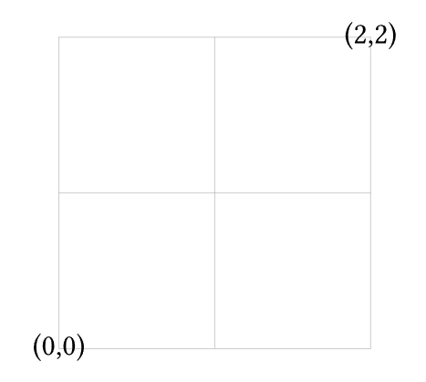

```
grid((0,0), (2,2),name: "g",help-lines:true)

  content(
    (0,0),(2,2),  // 两个坐标指定一个矩形区域
    box(
      stroke: 1pt+black,
      width: 100%,
      height: 100%
    )[
      #set text(80pt)
      #align(center+horizon)[
        中
      ]
    ]
  )

```

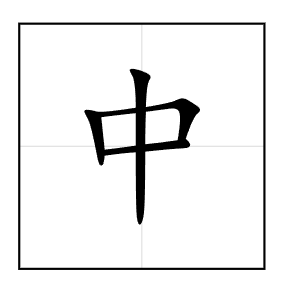

```
grid((0,0), (2,2),name: "g",help-lines:true)

  line((0,0),(2,2),name: "l1")

  content(
    ("l1.start",50%,"l1.end"),  // 起点，偏移值，终点
    angle: "l1.end",  // 旋转角度，默认：0deg，可以指定点，自动计算起点到该点的角度
    [
      #box(fill: white)[
        #set text(10pt)
        这里是文字
      ]
    ]
  )

```

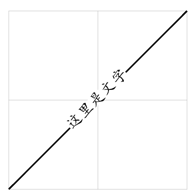

### 矩形rect()

```
rect(
    a: coordinate ,   // 起点坐标
    b: coordinate ,   // 终点坐标
    radius: number ratio dictionary,   // 圆角设定
    name: none string ,
    anchor: none string ,
    ..style: style
)

```

```
grid((0,0), (2,2),name: "g",help-lines:true)

rect((0,0),(1,1),fill:orange)
rect((.5,0.5),(rel:(1,1)),fill:red)

```

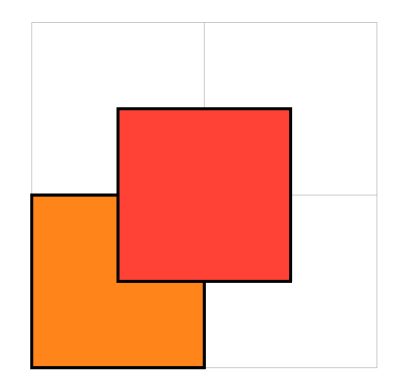

```
grid((0,0), (2,2),name: "g",help-lines:true)

rect((.5,0.5),(rel:(1,1)),fill:red,radius: 5pt)

```

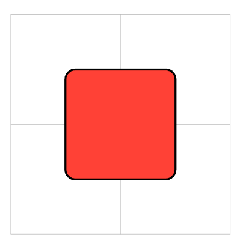

### 贝塞尔曲线

```
bezier(
    start:coordinate ,  // 起点坐标
    end: coordinate ,   // 终点坐标
    ctl1: coordinate ,   // 起始控制点
    ctl2: coordinate ,   // 结束控制点
    ..style: style ,
    name: none string
)

```

前两个位置参数被视为三次贝塞尔曲线的控制点，其中第一个是起始控制点，第二个是终止控制点。若提供单个控制点则可绘制二次贝塞尔曲线。命名参数用于样式设定。

#### 绘制二次贝塞尔曲线

```
// 背景网格
grid((0,0), (2,-2),name: "g",help-lines:true)

// 设定顶点和控制点
// 前两个坐标分别是起点和终点
// 第三个坐标是控制点，设定三个坐标就是二次贝塞尔曲线
let (a,b,c) = ((0,0),(2,0),(1,1)) 


// 绘制顶点和控制点连线
line(a,c,b,stroke:(paint:orange,dash:"dashed"))

// 绘制二次贝塞尔
bezier(a,b,c)

// 绘制顶点
set-style(
circle:(fill:white,stroke:1pt+red)
)
circle(a,radius: .05)
circle(b,radius: .05)
circle(c,radius: .05)

// 绘制文本
content((a,0.1,(0,-1)),[a])
content((b,0.15,(rel:(0,-1))),[b])
content((c,0.2,(rel:(0,1))),[c])

```

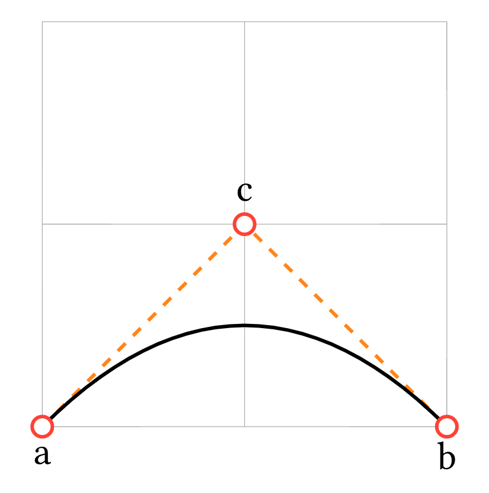

#### 绘制三次贝塞尔曲线

```
// 背景网格
grid((0,0), (2,-2),name: "g",help-lines:true)

// 设定顶点和控制点
// 前两个坐标分别是起点和终点
// 第三、四个坐标是控制点，设定四个坐标就是三次贝塞尔曲线
let (a, b, c, d) = ((0, -1), (2, -1), (.5, -2), (1.5, 0))

// 绘制顶点和控制点连线
line(a,c,d,b,stroke:(paint:orange,dash:"dashed"))

// 绘制贝塞尔
bezier(a,b,c,d)

// 绘制顶点
set-style(
circle:(fill:white,stroke:1pt+red)
)
circle(a,radius: .05)
circle(b,radius: .05)
circle(c,radius: .05)
circle(d,radius: .05)

// 绘制文本
content((a,0.15,(rel:(-1,0))),[a])
content((b,0.15,(rel:(1,0))),[b])
content((c,0.1,(rel:(0,-1))),[c])
content((d,0.2,(rel:(0,1))),[d])

```

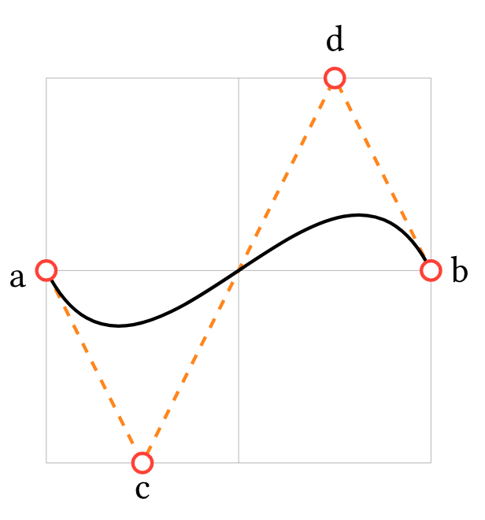

#### 三点定贝塞尔

```
bezier-through(
    start: coordinate ,        // 起点
    pass-through: coordinate , // 经过点
    end: coordinate ,          // 终点
    name: none string ,
    ..style: style
)

```

```
// 背景网格
grid((0,1), (2,-1),name: "g",help-lines:true)

// 设定起点、经过点、终点
let (a, b, c) = ((0, 0), (1, 1), (2, -1))


// 三点定贝塞尔
bezier-through(a, b, c, name: "bz")

// 绘制经过和控制点连线
line(a, "bz.ctrl-0", stroke:(paint:orange,dash:"dashed"))
line(c, "bz.ctrl-1", stroke:(paint:orange,dash:"dashed"))

// 绘制顶点
set-style(
circle:(fill:white,stroke:1pt+red)
)
circle(a,radius: .05)
circle(b,radius: .05)
circle(c,radius: .05)
circle("bz.ctrl-0",radius: .05)
circle("bz.ctrl-1",radius: .05)

// 绘制文本
content((a,0.15,(rel:(-1,0))),[a])
content((b,0.15,(rel:(0,1))),[b])
content((c,0.1,(rel:(0,-1))),[c])

```

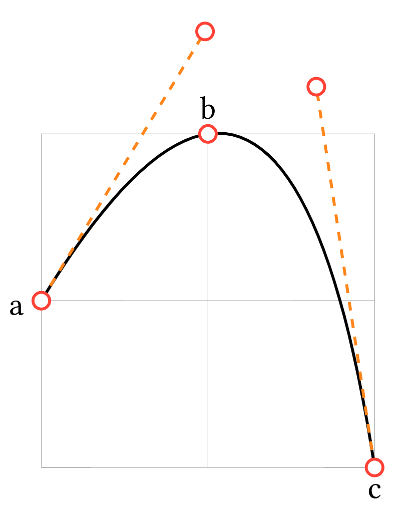

### Catmull-Rom曲线

```
catmull(
    ..pts-style: coordinate style ,
    close: bool ,    // 是否闭合
    tension: float,  // 张力,默认0.5，越大，曲线的弯曲程度越小。
    name: none string
)

```

绘制一条穿过一组点的Catmull-Rom曲线。

```
// 背景网格
grid((0,1), (3,-1),name: "g",help-lines:true)

// 设定经过点
let (a, b, c, d) = ((0,0), (1,1), (2,-1), (3,0))


// 绘制经过点的Catmull-Rom曲线
catmull(a,b,c,d, tension: .4, stroke: blue)

// 绘制顶点
set-style(
circle:(fill:white,stroke:1pt+red)
)
circle(a,radius: .05)
circle(b,radius: .05)
circle(c,radius: .05)
circle(d,radius: .05)

// 绘制文本
content((a,0.15,(rel:(-1,0))),[a])
content((b,0.15,(rel:(0,1))),[b])
content((c,0.1,(rel:(0,-1))),[c])
content((d,0.15,(rel:(1,0))),[d])

```

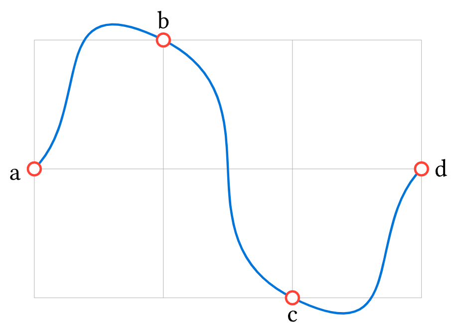

### Hobby曲线

```
hobby(
    ..pts-style: coordinate style ,
    ta: auto array ,
    tb: auto array ,
    omega: tuple float,
    close: bool ,
    name: none string
)

```
- ta：从点(n)到点(n+1)的出口张力。给定数值必须比点数少一
- tb：从点(n)到点(n+1)的传入张力。给定的数值必须比点数少一。
- omega：曲线在每个端点处的弯曲程度。当曲率接近零时，样条曲线在端点附近趋近于直线；当曲率接近一时，则趋近于圆弧。
```
// 背景网格
grid((0,1), (3,-1),name: "g",help-lines:true)

// 设定经过点
let (a, b, c, d) = ((0, 0), (1, 1), (2, -1), (3, 0))


// 绘制经过点的Catmull-Rom曲线
hobby(a, b, c, d, omega: 0, stroke: blue)

// 绘制顶点
set-style(
circle:(fill:white,stroke:1pt+red)
)
circle(a,radius: .05)
circle(b,radius: .05)
circle(c,radius: .05)
circle(d,radius: .05)

// 绘制文本
content((a,0.15,(rel:(-1,0))),[a])
content((b,0.15,(rel:(0,1))),[b])
content((c,0.1,(rel:(0,-1))),[c])
content((d,0.15,(rel:(1,0))),[d])

```

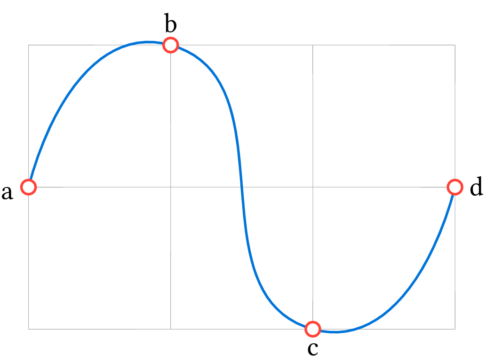

### merge-path()

```
merge-path(
    body: elements ,
    close: bool ,
    name: none string ,
    ..style: style
)

```

通过连接各元素路径来合并两条或更多路径。锚点和视觉样式（如描边与填充）将不被保留。当某元素的路径起始点与前一个元素路径的终点不重合时，系统会自动在两点间绘制直线以确保最终路径的连续性。此时需特别注意各元素路径的绘制方向。

```
// 背景网格
grid((0,0), (1,1),name: "g",help-lines:true)

// 绘制合并路径
merge-path(
  fill:orange,
  {
    line((0, 0), (1, 0))
    bezier((), (0, 0), (1,1), (0,1))
  }
)

```

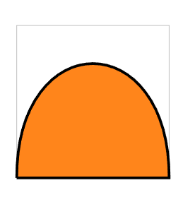

### 求图形之间的交点

计算多条路径之间的交点，并为每个交点创建一个锚点。所有生成的锚点将按数字顺序命名，从0开始。例如，调用intersections(“a”, …)将根据交点的数量生成锚点"a.0"、“a.1”、“a.2"直至"a.n”。

```
// 背景网格
grid((-1,-1), (1,1),name: "g",help-lines:true)

let o = (0,0)  // 坐标系原点

// 求交点
intersections(
  "i",{
    circle(o)
    line((-1,-1),(1,1))
  }
)

// 绘制交点
set-style(
circle:(fill:white,stroke:1pt+red)
)
circle("i.0",radius: .05)
circle("i.1",radius: .05)
circle(o,radius: .05)

// 绘制文本
content(("i.0",0.2,(rel:(-1,0))),[i.0])
content(("i.1",0.2,(rel:(0,1))),[i.1])
content((o,0.25,(rel:(1,-1))),[(0,0)])

```

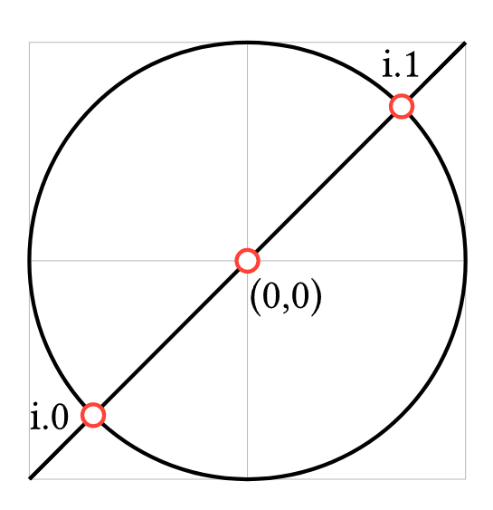

```
// 背景网格
grid((-1,-1), (1,1),name: "g",help-lines:true)

let o = (0,0)  // 坐标系原点

// 求交点
intersections(
  "i",{
    circle(o)
    line((-1,-1),(1,1))
    line((-1,1),(1,-1))
    line((-1.5,0),(1.5,0))
  }
)


set-style(
circle:(fill:white,stroke:1pt+red)
)
// 绘制坐标系原点
circle(o,radius: .05)

// 遍历交点
for-each-anchor("i", (name) => {
  circle("i." + name, radius: .05)
  content(("i." + name,0.2,(rel:(-1,0))),[i.#name])
})

// 绘制文本
content((o,0.25,(rel:(1,-1))),[(0,0)])

```

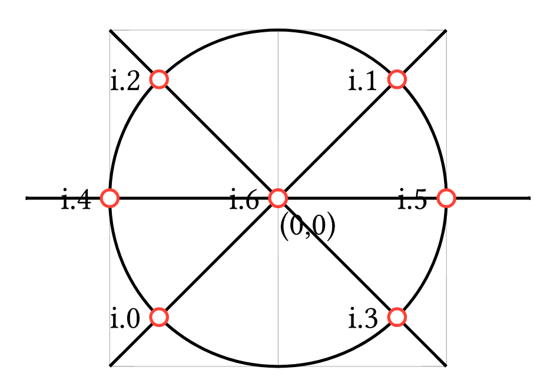

### 隐藏

```
hide(
    body: element , // 一个或多个需要隐藏的元素
    bounds: bool    // 默认，false
)

```
- `bounds`若为真，调整画布大小时需遵循隐藏元素的边界框。
```
// 背景网格
grid((-1,-1), (2,3),name: "g",help-lines:true)

let o = (0,0)  // 坐标系原点
let b = (1,2)  // 第二圆圆心

// 求交点
set-style(radius: .5)
intersections("i", {
circle(o, name: "a")
circle(b, name: "b")
// 使用隐藏线查找边界交点
hide(line("a.center", "b.center"))
})
line("i.0", "i.1")


line(o, "i.0",stroke:(paint:blue,dash:"dashed"))
line(b, "i.1",stroke:(paint:blue,dash:"dashed"))

set-style(
circle:(fill:white,stroke:1pt+red)
)
// 绘制坐标系原点
circle(o,radius: .05)
circle(b,radius: .05)
circle("i.0",radius: .05,fill:red)
circle("i.1",radius: .05,fill:red)


// 绘制文本
content((o,0.25,(rel:(1,-1))),[o(0,0)])
content((b,0.25,(rel:(1,1))),[b(1,2)])
content(("i.0",0.2,(rel:(1,0.5))),[i.0])
content(("i.1",0.2,(rel:(1,-1.5))),[i.1])

```

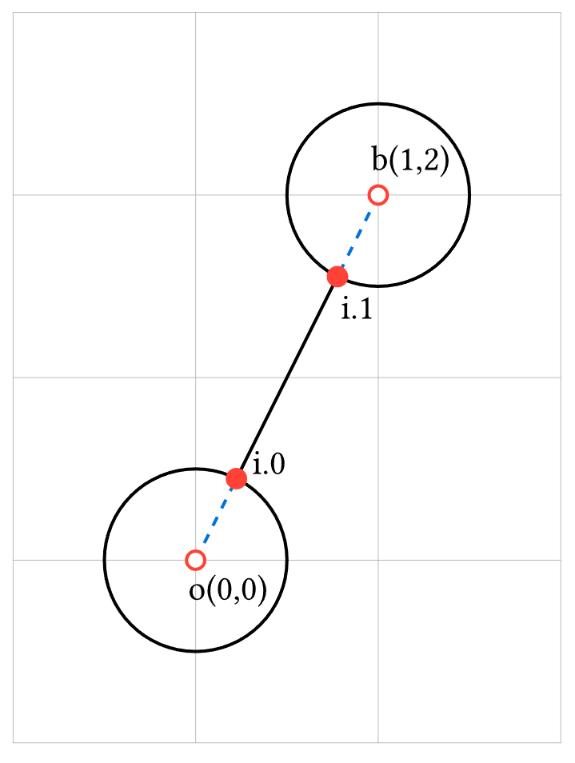

### 群组group

将多个元素组合为一个群组。该元素作为作用域存在，所有状态变更（如变换与样式调整）仅作用于群组内元素。群组外的元素不会受到群组内部变更的影响。

```
group(
    body: elements function ,  // 群组内的元素
    name: none string ,
    anchor: none string ,
    padding: none number array dictionary， // 内边距
    ..style: style
)

```
- padding：在组边界框周围添加多少内边距。none表示不添加内边距。数字表示所有边均等添加内边距。数组遵循类似CSS的内边距格式：(y, x)、(top, x, bottom) 或 (top, right, bottom, left)。

支持边框和路径锚点。但这些锚点是基于组内所有子元素的轴对齐包围盒创建的。

您可以在该组范围内使用锚点元素为组添加自定义锚点，详情请参阅锚点说明。此外，由于组外无法访问命名子元素的锚点，您可以通过复制锚点元素从命名子元素复制锚点。

默认锚点为"center"，但可以通过使用锚点元素放置名为"default"的新锚点来覆盖此设置。

组内命名元素也可作为字符串锚点访问，具体参见第4.6节。

#### 为群组创建新锚点

在group内部，可以用anchor()函数创建新的锚点。

```
anchor(
    name: string ,
    position: coordinate
)

```

为当前群组创建新锚点。该元素仅限在群组内部使用，否则将引发系统崩溃。新建锚点可通过仅使用锚点名称作为坐标在群组内部进行访问。

```
// 背景网格
  grid((-1,-1), (1,1),name: "g",help-lines:true)

  let o = (0,0)  // 坐标系原点

  // 求交点
  group(name: "g", {
    circle((0,0))
    anchor("x", (.4, .1))
  })

  set-style(
  circle:(fill:white,stroke:1pt+red)
  )
  // 绘制坐标系原点
  circle(o,radius: .05)
  circle("g.x",radius: .05) // 绘制锚点


  // 绘制文本
  content((o,0.25,(rel:(1,-1))),[o(0,0)])
  content(("g.x",0.25,(rel:(1,1))),[g.x])

```

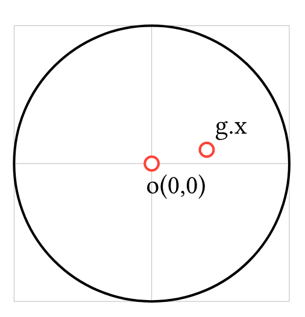

#### 拷贝锚点

将多个锚点从一个元素复制到当前群组中。在群组外使用时将引发异常。\n被复制的锚点可通过与锚点元素创建的锚点相同的方式进行访问。

```
copy-anchors(
    element: string ,
    filter: auto array
)

```
- filter：当设置为auto时，所有锚点将被复制到群组。也可以提供一个锚点名称数组，这样只有元素内且在列表中的锚点才会被复制。
#### **set-ctx**

```
set-ctx(
    callback: function    // 一个接受上下文字典并仅返回新字典的函数
)

```

一种高级元素，允许您修改当前画布上下文。上下文对象保存着画布的状态，例如元素字典、当前变换矩阵、群组和画布单位长度。以下字段被视为稳定参数：
- length（length：画布的单位长度，以typst长度单位表示
- transform（cetz.matrix）：当前的4x4变换矩阵
- debug（bool）：调试模式
```
// 设定自定义变换矩阵
set-ctx(ctx => {
    let mat = ((1, 0, .5, 0),
    (0, 1, 0, 0),
    (0, 0, 1, 0),
    (0, 0, 0, 1))
    ctx.transform = mat
    return ctx
})
circle((z: 0), fill: red)
circle((z: 1), fill: blue)
circle((z: 2), fill: green)

```

#### get-ctx

```
get-ctx(
    callback: function // 一个接受上下文字典并能返回元素的函数
)

```

一种高级元素，允许您通过回调读取当前画布上下文，并基于该上下文返回元素。

```
// 打印画布的变换矩阵
get-ctx(ctx => {
    content((), [#repr(ctx.transform)])
})

```

#### **for-each-anchor**

遍历元素的所有命名锚点，并为每个锚点调用回调函数。

```
for-each-anchor(
    name: string ,        // 要遍历锚点的元素名
    callback: function ,  // 回调函数
    exclude: array        // 排除的锚点
)

```

```
// Label nodes anchors
rect((0, 0), (2,2), name: "my-rect")
for-each-anchor("my-rect", exclude: ("start", "mid", "end"),
(name) => {
 content((), box(inset: 1pt, fill: white, text(8pt, [#name])),
angle: -30deg)
})

```

#### **on-layer**

```
on-layer(
 layer: float integer ,
 body: elements function
)

```

将元素放置在特定图层上。

图层决定了元素在绘制队列中的位置。较低图层会先于较高图层绘制。

图层可用于在其他元素后方或前方绘制，即使这些元素的创建时间有先后之分。例如在文字后方绘制背景时，仍可使用文字计算所得的边界框来定位背景位置。

```
// Draw something behind text
set-style(stroke: none)
content((0, 0), [This is an example.], name: "text")
on-layer(-1, {
 circle("text.north-east", radius: .3, fill: red)
 circle("text.south", radius: .4, fill: green)
 circle("text.north-west", radius: .2, fill: blue)
})

```

### 箭头设定

标记是箭头尖端，可以添加到支持标记样式键的基于路径的元素的末尾，也可以使用标记绘制功能直接绘制。标记是通过将名称作为字符串来指定的，并且有几个选项可以自定义它们。您可以指定一个名称数组，使其在一行中具有多个标记，字典也可以在数组中用于每个标记的样式。

```
mark(
    symbol：none string array dictionary,   // 两端的箭头，默认: none
    start：none string array dictionary,    // 起始端箭头，默认: none，可覆盖symbol设置
    end：none string array dictionary,      // 末端箭头，默认: none，可覆盖symbol设置
    length：number,   // 箭头横向长度,默认：5.67pt
    width: number,    // 箭头纵向宽度,默认： 4.25pt
    inset: number,    // ？？，默认：:1.42pt
    scale: float,     // 缩放系数，默认：1
    sep: number,      // 多个标记之间沿其路径的距离,默认：2.83pt
    flex: boolean,    // 在bezier和hobby等曲线上使用箭头时，如果为true，则标记将指向曲线的割线。如果为false，则使用标记尖端处的切线。默认：true
    position-samples: integer, // 默认：30，仅适用于在bezier和hobby等曲线上使用标记的情况。用于计算曲线位置的最大采样数。数值越大，结果越好，但可能会减慢编译速度。
    pos: number ratio,  // 默认：none，替代标记沿路径的位置。一个数字将使其移动一个绝对距离，而一个比率将是相对于路径长度的距离。请注意，这可能会在未来被删除，而不是采用不同的方法。
    offset: number ratio,  // 默认：none，与pos类似，但它移动标记的位置，而不是覆盖它。
    slant: ratio,  // 默认：0%，标记相对于箭头的轴倾斜多少。0%表示没有倾斜，100%倾斜45度。
    harpoon: boolean,  // 默认：false，如果为true，则只绘制标记的上半部分。
    flip: boolean,  // 默认：false，如果为true，标记将沿其轴翻转。
    reverse:boolean,  // 默认：false，反转标记的方向。
    xy-up: vector,   // 默认： (0, 0, 1)，绘制二维标记时使用的“上”方向。
    z-up: vector,    // 默认： (0, 1, 0)，绘制三维标记时使用的“上”方向。
    shorten-to: integer auto none,   // 默认：none，当给出多个标记时，要将路径缩短到哪个标记。自动将缩短到最后一个标记，无将缩短到第一个标记（有效地禁用路径缩短）。可以给定一个整数来选择标记的索引。
    transform-shape: bool,  // 默认：true,当错误标记不受当前变换的影响时，将在变换路径后放置标记。
)

```

```
set-style(
    mark:(
        symbol:none,
        start:">",
        end:"o"
    )
)
line((0,0),(5,0))

```

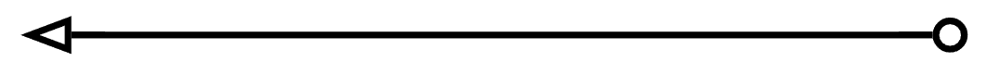

#### 支持的箭头类型

|**名称**|**简写**|**形状**|
|--|--|--|
|triangle|>, < (反向)|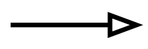|
|stealth||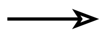|
|bar||
|ellipse||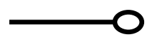|
|circle|o|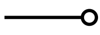|
|bracket|], [ (反向)|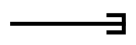|
|diamond||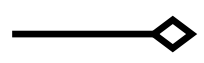|
|rect|[]|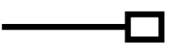|
|hook||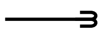|
|straight||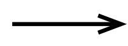|
|barbed||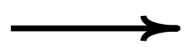|
|plus|+|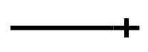|
|x|x|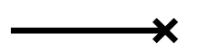|
|star|*|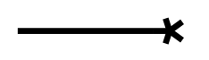

### 变换

```
rotate(45deg)
line((0,0),(5,0))

```

```
// 外圈矩形
rect((0, 0), (2, 2))
// 内圈矩形
translate(x: .5, y: .5)
rect((0, 0), (1, 1))

```

```
// Y轴缩放
scale(y: 50%)
circle((0,0))

```

```
// 矩形
rect((0,0), (2,2), name: "r")
// 将原点移动到r的north锚点处
set-origin("r.north")
circle((0, 0), radius: .1)

```

```
circle((), radius: .25)
move-to((1,0))  // 移动到(1,0)
circle((), radius: .15)

```

```
set-viewport(
    from: coordinate ,
    to: coordinate ,
    bounds: vector  // 描述视口内部宽度、高度和深度的视口边界向量,默认(1,1,1)
)

```

```
rect((0,0), (2,2))
set-viewport((0,0), (2,2), bounds: (10, 10))
circle((5,5))

```

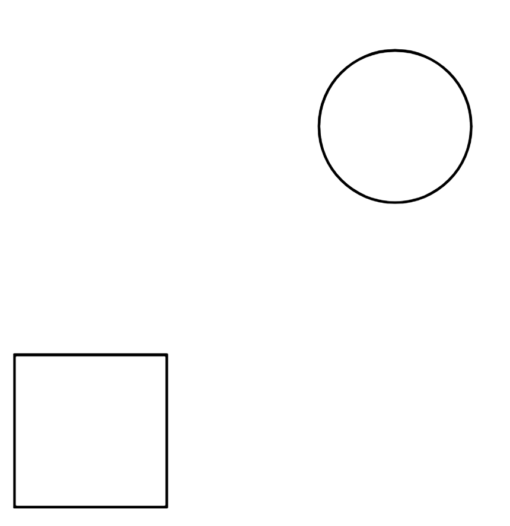
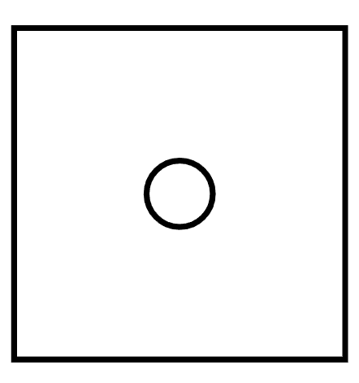

### 投影

#### 正交投影

这是一个变换矩阵，通过给定参数使元素围绕x轴、y轴和z轴旋转。默认设置为等轴测投影（x≈35.264°，y=45°）。

```
ortho({<!-- -->
    on-xz({<!-- -->
        rect((-1,-1), (1,1))
    })
})

```

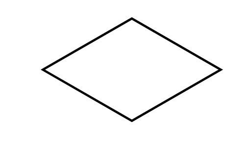

```
on-xy({
    rect((-1, -1), (1, 1))
})

```

```
on-xz({
    rect((-1, -1), (1, 1))
})

```

```
on-yz({
    rect((-1, -1), (1, 1))
})

```

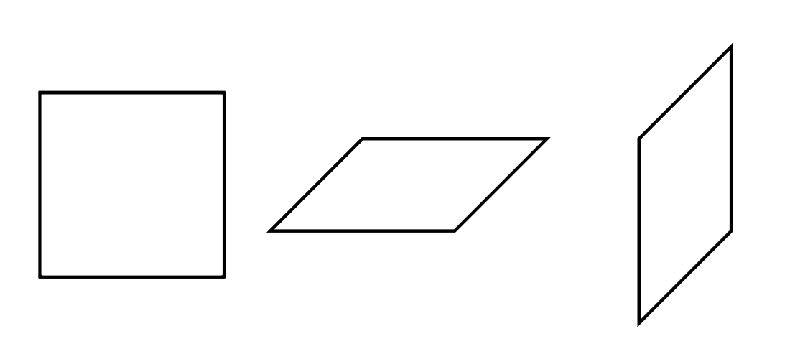

### 坐标系

坐标是绘制图像的画布上的位置。它们以字典形式呈现，以下小节将定义每个系统的键值对。某些系统采用更隐式的数值数组形式，CeTZ会尝试根据元素类型推断所属系统。

### 切线

该系统可计算与图形相切的点。具体而言，给定一个几何元素和某点，从该点引出一条直线使其"接触"该元素（更规范地说，与该元素相切）。直线与图形的接触点即为该坐标系所指向的位置。

```
(
    element:str,        // 切线点所在元素
    point:coordinate,   // 切线经过点的点
    solution:int        // 多个解时选择第几个解
)

```

计算给定形状的切线需要特殊算法。当前算法通过假设中心锚点与顶部锚点之间的距离（参见第2.2节）作为圆的半径来实现这一计算。

```
// 绘制圆c1和点c2
    circle((),name: "c1")
    circle((2,2),radius: .1,name: "c2",fill:black)
    
    // 求切线点
    set-style(fill:orange)
    let t1 = (element:"c1",point:"c2",solution:1)
    let t2 = (element:"c1",point:"c2",solution:2)

    // 绘制切线
    set-style(
        line:(
            stroke:(dash:"dashed")
        )
    )
    line("c2",t1)
    line("c2",t2)

    // 绘制切点
    // c1和c2的切线点1
    circle(t1,radius: .1)
    // c1和c2的切线点2
    circle(t2,radius: .1)

    // 绘制文本
    content("c1",[c1])
    content((2.5,2),[c2])
    content((t1,0.4,(rel:(-1,1))),[t1])
    content((t2,0.4,(rel:(1,-1))),[t2])

```

### 垂直线

可用于找到通过某点𝑝的垂直线与通过另一点𝑞的水平线的交点。

水平线：坐标

水平线所经过的坐标。

垂直线：坐标

垂直线所经过的坐标。

您可以使用隐式语法：(水平坐标, “-|”, 垂直坐标) 或 (垂直坐标, “|-”, 水平坐标)。

### 插值法

用于在给定距离值的情况下，对坐标a和b进行线性插值。若该值为数值，则位置将位于从a指向b的绝对距离处；亦可提供比例值作为a与b之间的相对距离。

还可指定角度参数以表达更广义的含义：“首先考虑从a到b的连线，然后将该线段绕点a旋转指定角度。此时线段两端点分别为a和某点c，后续计算将使用该点c。”

### 向量加法

```
circle((0, 0), name: "c")
fill(red)
circle((v => cetz.vector.add(v, (0, -1)), "c.west"), radius: 0.3)

```
